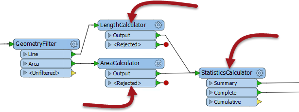

# 输入和输出端口

同样，像普通的FME转换器一样，定制转换器有许多输入和输出端口：

这些输入和输出端口由自定义转换器定义本身中的输入/输出对象定义：

## 重命名端口

首先要知道的是，可以重命名这些输入/输出对象，以便适当地命名转换器端口。您可以双击该对象，从上下文菜单中选择“重命名”，或按F2，以重命名该对象。

例如，这里用户将输入端口从StringConcatenator\_Input重命名为Input。

重命名输入和输出端口对于使自定义转换器对象更清晰，并帮助用户了解应该连接到端口的数据非常有用。

例如，编辑后转换器可能如下所示：

|  副驾驶Transformer说...... |
| :--- |
|  用户只需将端口重命名为Input和Output即可。但是，将输入端口重命名为“Strings”，“Lines”或“Raster”（例如）有助于指导转换器的其他用户作为输入所需的数据。  同样，可以重命名输出端口以说明将出现的数据类型; 例如“Contours”，“Labels”，“Concatenated”等。 |

## 添加或删除端口

除了重命名端口之外，还可以将新端口添加到自定义转换器。

为此，只需单击选项卡以显示自定义转换器的定义，然后从画布上下文（右键单击）菜单或菜单栏中选择Transformer Input（或Output）：

例如，这里用户添加了端口来处理两个输入数据流，并有两个输出端口（一个用于所需输出，另一个用于处理“坏”要素：

这意味着主画布中的每个自定义转换器实例现在都有一个额外的输入端口，如下所示：

|  Vector小姐说...... |
| :--- |
|  以下是一些问题。  问）哪一个不是使用自定义转换器的理由？    [1.使我的内容在快速添加中可用](http://52.73.3.37/fmedatastreaming/Manual/QAResponse2017.fmw?chapter=13&question=1&answer=1&DestDataset_TEXTLINE=C%3A%5CFMEOutput%5CQAResponse.html)  [2.使用循环等高级功能](http://52.73.3.37/fmedatastreaming/Manual/QAResponse2017.fmw?chapter=13&question=1&answer=2&DestDataset_TEXTLINE=C%3A%5CFMEOutput%5CQAResponse.html)  [3.以简单的方式重新使用内容块](http://52.73.3.37/fmedatastreaming/Manual/QAResponse2017.fmw?chapter=13&question=1&answer=3&DestDataset_TEXTLINE=C%3A%5CFMEOutput%5CQAResponse.html)  [4.清理和整理主工作空间画布](http://52.73.3.37/fmedatastreaming/Manual/QAResponse2017.fmw?chapter=13&question=1&answer=4&DestDataset_TEXTLINE=C%3A%5CFMEOutput%5CQAResponse.html)     问）考虑这部分工作空间。如果我选择用箭头突出显示的三个转换器，并创建自定义转换器，默认情况下它将具有多少输入和输出端口？      [1.一个输入和一个输出端口](http://52.73.3.37/fmedatastreaming/Manual/QAResponse2017.fmw?chapter=13&question=2&answer=1&DestDataset_TEXTLINE=C%3A%5CFMEOutput%5CQAResponse.html)  [2.一个输入和两个输出端口](http://52.73.3.37/fmedatastreaming/Manual/QAResponse2017.fmw?chapter=13&question=2&answer=2&DestDataset_TEXTLINE=C%3A%5CFMEOutput%5CQAResponse.html)  [3.两个输入和两个输出端口](http://52.73.3.37/fmedatastreaming/Manual/QAResponse2017.fmw?chapter=13&question=2&answer=3&DestDataset_TEXTLINE=C%3A%5CFMEOutput%5CQAResponse.html)  [4.两个输入和三个输出端口](http://52.73.3.37/fmedatastreaming/Manual/QAResponse2017.fmw?chapter=13&question=2&answer=4&DestDataset_TEXTLINE=C%3A%5CFMEOutput%5CQAResponse.html)  |

