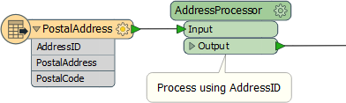
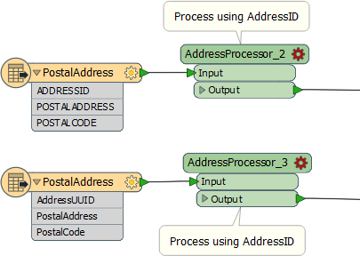
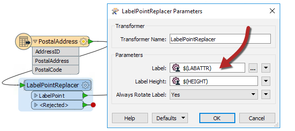
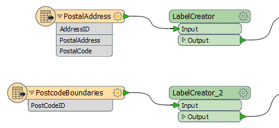

# 模式处理

属性处理是自定义转换器中最容易被误解的组件之一。这是因为允许重复使用内容会产生后果，而这些后果对于工作空间作者来说并不总是显而易见的。

简而言之，重用自定义转换器的能力意味着它可能在模式与自定义转换器设计不匹配的地方使用。

|  副驾驶Transformer说...... |
| :--- |
|  我能想出的最好的比喻是：我有一台笔记本电脑。我可以在家里和办公室里使用它。我也可以在海外使用它。制造商考虑了电源的差异（110v与240v），计算机将同时工作。它设计得很好。  以同样的方式，定制转换器的作者必须意识到如果在预期区域之外使用它可能适用的限制，并尝试适应它们。模式是一个关键考虑因素。 |

## 处理属性模式

要考虑的模式的一部分是自定义转换器可用的属性集。

例如，在此工作空间中，自定义转换器使用名为AddressID的属性作为关键字段对传入数据执行处理：

但是，如果该转换器重复并在别处使用，则无法保证AddressID将存在：

这些情况都被标记为“不完整”; 第一个模式具有ADDRESSID（不是AddressID）和另一个AddressUUID。如果没有FME的帮助，最终用户需要编辑转换器定义来修复这些问题。

因此，存在某种形式的机制来防止这种类型的不匹配模式的问题是至关重要的。

实际上，有两种方法可以处理：FME可以自动处理模式，或者工作空间作者可以手动处理它。

在查看这些解决方案之前，让我们来看看类似的问题......

## 处理用户参数

除了属性之外，要处理的模式的另一部分是用户参数。

例如，LabelPointReplacer转换器具有用户参数，允许用户输入标签内容和高度：

现在让我们假设LabelPointReplacer合并到一个自定义转换器中，并且该转换器在工作空间的几个地方使用：

属性没有问题，因为转换器没有使用任何属性。

但是自定义转换器的两个实例都使用相同的用户参数，并且用户可能不希望为每个实例输入相同的值。我们需要一种机制让用户输入不同的值。

与属性模式一样，有一种处理这些的自动方法; 你需要注意它才能做出一些调整。

