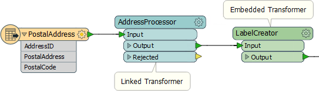
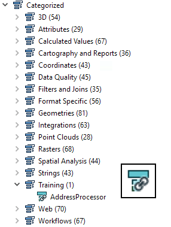

# 自定义转换器类型

自定义转换器有两种类型。

一个**嵌入式**转换器是一个只存在于工作空间本身。其定义存储（嵌入）在工作空间文件中，并且不可用于任何其他工作空间。

一个**链接**转换器是一个存在一个工作空间之外。它的定义存储在自己的文件中，并且可供任何其他工作空间使用，该工作空间通过链接引用它。

在工作空间画布上，嵌入式转换器以绿色标识，而链接转换器以青色标记：

|  副驾驶Transformer 说...... |
| :--- |
|  重要的是要知道可以在工作空间内更改转换器类型。您可以将嵌入式自定义转换器从嵌入式切换为链接，并将链接的自定义转换器切换为嵌入式。 |

## 链接与嵌入式转换器

两种类型的转换器都可以在FME工作空间中使用，并且每种类型都有各种优点和缺点。

**嵌入式转换器**

嵌入式转换器可能更容易理解，不需要外部文件，并且它们的定义嵌入到工作空间中。它们对于整理工作空间特别有用，但也适用于采用并行处理等高级功能。

但是，嵌入式转换器的内容共享和重用并不那么简单。自定义转换器不能轻易与其他用户共享，除非它们被赋予相同工作空间的副本，并且在多个用户之间维护一致的定义并不容易。

**链接的转换器**

链接转换器可能有点难以理解和管理。它们作为工作空间之外的文件（.fmx）存在，这不太方便，并且当用于使用诸如循环之类的高级功能时，它们可能更复杂。

但是，链接的自定义转换器更容易编辑（打开.fmx文件而不是.fmw文件），并且更容易在用户之间共享。该文件不仅可以提供给任何FME作者使用，而且任何数量的作者实际上都可以将他们的FME指向同一个自定义转换器文件。

共享同一文件很有用，因为对定义所做的任何更改都会自动传播到使用它的所有工作空间。

|  副驾驶Transformer说...... |
| :--- |
|  与嵌入式转换器一样，链接转换器也会出现在转换器库和“快速添加”对话框中。另请注意，他们有一个特殊图标表示您即将使用链接版本，而不是嵌入版本：     |

