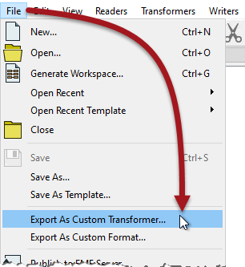
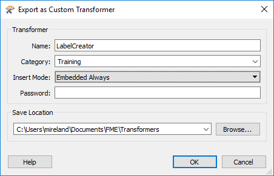
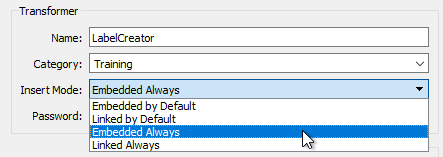
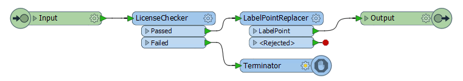

# 创建链接式转换器

所有自定义转换器都以嵌入式版本开始。要创建链接版本，将从工作空间导出自定义转换器。

通过单击嵌入式定义的画布选项卡并从菜单栏中选择“文件”&gt;“导出为自定义转换器”，可以轻松完成此操作：

|  副驾驶Transformer 说...... |
| :--- |
|  最好在导出之前调试自定义转换器，因为“以断点运行”工具在导出的转换器中不起作用，只在嵌入式中有效。 |

此时会打开一个对话框，您可以在其中确认转换器名称和类别，以及一些其他参数，包括保存位置：

让我们看看一些不同的选择：

## 名称和类别

很明显它们是什么 - 与最初创建转换器时相同的字段 - 但有趣的是，您可以使用与原始版本不同的名称/类别来保存它。

## 插入模式

“插入模式”参数指定如何使用自定义转换器。_它是一个重要的参数，当我作为一个自定义转换器的作者为其他工作空间的作者创建它时。_

有四种不同的模式：

如果我以**嵌入**模式导出自定义转换器，则意味着在其工作空间中使用此转换器的作者会发现它已嵌入（而不是指向文件的链接）。

如果我选择*默认嵌入(Embedded By Default)* ，则表示作者可以选择将转换器链接起来。如果我选择*始终嵌入(Embedded Always)* ，则意味着作者不得不在嵌入模式下使用该自定义转换器。

类似地，如果我以**链接**模式导出我的自定义转换器，则意味着在其工作空间中使用此转换器的作者发现它被链接到文件（而不是嵌入）。

如果我选择*Linked By Default* ，则表示作者仍可以选择将转换器嵌入。如果我选择*Linked Always*,这意味着作者不得不在链接模式下使用该自定义转换器。

### 使用哪种模式

当使用转换器的人对FME经验不足时，**始终嵌入**是一个不错的选择。他们更容易管理，如果他们做出改变，他们不会影响其他人。如果定制转换器供个人使用（即不作为一组共享），嵌入式也是一个不错的选择。

当定制转换器要在一组用户之间共享时，**始终链接**是一个不错的选择。由于它是链接的，因此如果更改了转换器定义，用户将始终接收更新，并且由于定义是共享的，因此它将成为应用于所有用户的标准。

只有当最终用户具有FME经验且能够理解后果时，才建议使用“默认”设置并允许类型切换。

## 密码

密码字段允许您对自定义转换器进行密码保护。这使得它不受未经授权人员编辑的影响。此外，文件内容（非常温和地）加密，因此无法通过在文本编辑器中打开源文件来复制它们。

这使得作者可以制作可供购买的转换器，而不必担心他们的作品将被复制或编辑。当然，如果您想进行编辑，请务必不要忘记或丢失密码！

### 许可

虽然不是导出对话框的一部分，但值得一提的是许可和密码。自定义转换器可以获得许可，以便在没有正确的注册码的情况下无法使用它们。当您想要限制访问权限（可能在您自己的组织内）或者您想要像其他任何软件项目那样许可转换器时（或许您将其用于一般销售给用户），这是有益的。

为作者提供了一个特殊的转换器 - _LicenseChecker_和许可证生成器工具来实现这样的设置：

例如，这里使用LicenseChecker来保护自定义转换器。如果转换器已获得许可，那么它将按预期工作。如果没有许可，那么它将终止。当然，这个定制转换器没有多大意义 - 让许可证保护它 - 因为它里面只有一个FME转换器，但你明白了这个用法。

有关获取自定义转换器许可证的更多信息，请与[**Safe Software支持团队**](http://www.safe.com/support)联系。

## 保存位置

FME有一个特定的安装文件夹，可以在其中保存自定义转换器文件。如果自定义转换器保存在此文件夹中，则它在Workbench中可用，并且可以与任何其他转换器一样使用。如果将其保存在其他位置，则除非在工具&gt; FME选项&gt;默认路径下设置该路径，否则FME将无法找到它。

|  Vector小姐说...... |
| :--- |
|  以下是您要调查的问题：您可以嵌套自定义转换器吗？也就是说，你可以把一个自定义转换器放在另一个里吗？    [1.是的，没有限制](http://52.73.3.37/fmedatastreaming/Manual/QAResponse2017.fmw?chapter=13&question=5&answer=1&DestDataset_TEXTLINE=C%3A%5CFMEOutput%5CQAResponse.html)  [2.是的，但是您只能嵌套相同类型的转换器（链接或嵌入式）](http://52.73.3.37/fmedatastreaming/Manual/QAResponse2017.fmw?chapter=13&question=5&answer=2&DestDataset_TEXTLINE=C%3A%5CFMEOutput%5CQAResponse.html)  [3.是的，但是您无法嵌套链接式自定义转换器](http://52.73.3.37/fmedatastreaming/Manual/QAResponse2017.fmw?chapter=13&question=5&answer=3&DestDataset_TEXTLINE=C%3A%5CFMEOutput%5CQAResponse.html)  [4.是的，但只有一个级别的嵌套](http://52.73.3.37/fmedatastreaming/Manual/QAResponse2017.fmw?chapter=13&question=5&answer=4&DestDataset_TEXTLINE=C%3A%5CFMEOutput%5CQAResponse.html) |

