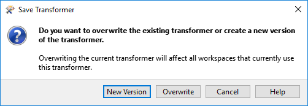
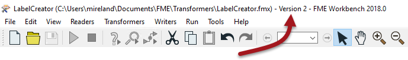
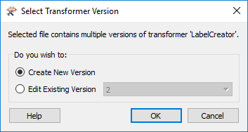
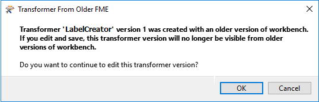
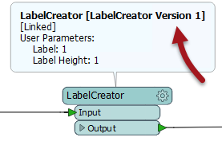
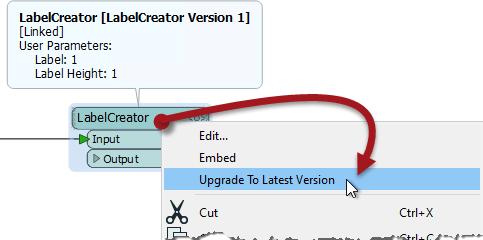
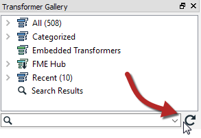

# 自定义转换器版本控制

FME包括功能性，以便链接的自定义转换器可以作为多个版本存在。每次编辑自定义转换器定义时，都可以保存新版本。

这样，单个fmx文件可以包含同一个自定义转换器的多个版本。

## 为什么要使用版本控制？

对自定义转换器进行版本控制的一个优点是您拥有以前版本的记录，因此可以在需要时恢复到之前的版本。例如，某些最近的编辑可能不正确，您需要切换回在编辑之前存在的定义。

但是，更重要的优势涉及FME版本和新功能。

例如，可以更新在FME2017中创建并由许多用户共享的自定义转换器，以使用FME2018中的新操作。如果该自定义转换器已进行版本控制，则2017版本仍可供尚未更新到该版本FME的用户使用; 更新其FME的用户也可以更新其自定义转换器以利用新的更新。

## 创建版本化自定义转换器

当您打开未版本化的自定义转换器定义文件并稍后尝试保存编辑时，将打开一个对话框，询问您要执行的操作：

两个版本控制选项是_覆盖_现有版本或创建_新版本_。

基本上，系统会询问您是否实施版本控制。单击新版本将转换器版本化并将编辑保存为版本2。请注意，创建新版本不会创建单独的fmx文件; 相反，它在同一个fmx文件中创建一个单独的转换器版本。

Workbench中的标题栏说明了自定义转换器文件的版本号：

如果在“保存转换器”对话框中选择“覆盖”，则转换器将保持未版本化。

## 编辑特定的转换器版本

每当最初在Workbench中打开版本化的自定义转换器时，系统会提示您要编辑哪个版本，或者是否只想从新版本开始：

这样你就可以：

* 创建新版本以进行编辑
* 继续编辑现有版本
* 对旧版本进行编辑（当该版本与特定FME版本绑定时特别有用）

每次单击“保存”按钮时，请务必注意不要创建新版本。仅当对话框提示您“创建新版本”时才会创建新版本。要强制创建新版本，您需要关闭并重新打开该文件，这会导致出现“选择转换器版本”对话框。

每个版本的自定义转换器都记录了上次编辑的FME版本。您可以选择对最近在旧版FME中编辑的转换器进行编辑，但是您将收到一条警告消息：

这里的版本1是使用FME2017创建的，作者正在尝试在FME2018中编辑它。如果它们继续这样做，转换器的版本1将不再适用于FME2017。

|  大副 Transformer说...... |
| :--- |
|  有时候你可能会对这些对话框感到困惑（好吧，我就是）所以让我直截了当地说：  首次导出自定义转换器时，你没有得到“选择版本”对话框（因为转换器仍然是无版本的）而且你没有获取“保存版本”对话框（因为为什么在刚刚导出此转换器时创建新版本？）  下次打开定义（fmx文件）时，再次无法获取“选择版本”对话框（因为它仍然是未版本控制的） ），但保存更改时将获得“保存版本”对话框，允许您对转换器进行版本控制。  从那时起，当您打开fmx文件时（因为转换器现在已经过版本化），您将始终获得“选择版本”对话框，但出于同样的原因，您在保存编辑时将永远不会获得“保存版本”对话框。 |

## 更新转换器版本

如果打开显示转换器版本的选项（工具&gt; FME选项&gt;转换器&gt;显示转换器版本），则每个链接的自定义转换器将在摘要注释中显示其版本号：

当FME检测到新版本可用时 - 即作者已编辑并将其保存为新版本 - 然后上下文菜单中会出现一个选项以允许更新新版本：

选择升级意味着摘要注释将显示最新版本号。

|  大副 Transformer说...... |
| :--- |
|  FME仅在首次启动Workbench时检查新版本。如果Workbench已打开并且您希望检查新的自定义转换器版本，则可以通过单击Transformer Gallery窗口上的刷新按钮强制FME进行检查：   |

|  Vector小姐说...... |
| :--- |
|  您有一个带有链接式自定义转换器（版本1）的工作空间。该转换器的作者进行了一系列编辑并将其更新到版本4.您认为升级选项对工作空间中的自定义转换器有何影响？  [1.将其升级到版本2](http://52.73.3.37/fmedatastreaming/Manual/QAResponse2017.fmw?chapter=13&question=6&answer=1&DestDataset_TEXTLINE=C%3A%5CFMEOutput%5CQAResponse.html) [2.将其升级到版本3](http://52.73.3.37/fmedatastreaming/Manual/QAResponse2017.fmw?chapter=13&question=6&answer=2&DestDataset_TEXTLINE=C%3A%5CFMEOutput%5CQAResponse.html) [3.将其升级到版本4](http://52.73.3.37/fmedatastreaming/Manual/QAResponse2017.fmw?chapter=13&question=6&answer=3&DestDataset_TEXTLINE=C%3A%5CFMEOutput%5CQAResponse.html) [4.这取决于您和作者使用的FME版本](http://52.73.3.37/fmedatastreaming/Manual/QAResponse2017.fmw?chapter=13&question=6&answer=4&DestDataset_TEXTLINE=C%3A%5CFMEOutput%5CQAResponse.html) |

