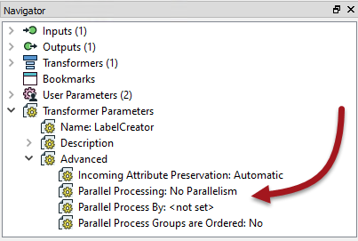
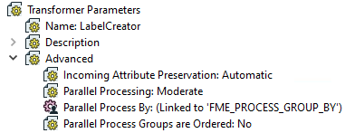
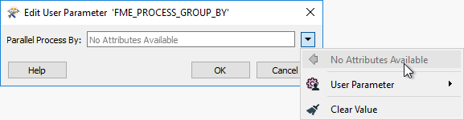
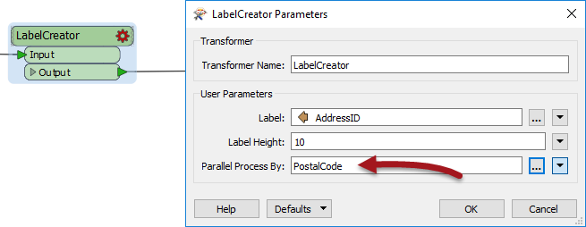
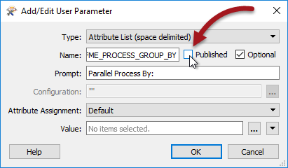
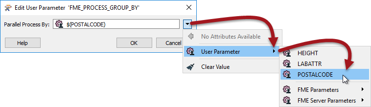

# 自定义转换器和并行处理

并行处理是一种通过一次运行多个操作作为一组独立的进程来提高高端机器性能的方法。

一些FME转换器具有实现并行处理的参数，但是所有自定义转换器也具有执行此操作的机制。

## 激活并行处理

每个自定义转换器都有一组参数 - 位于“导航”窗口中 - 明确与并行处理相关。在这里，您可以确定并行处理的级别，以及定义将作为单独进程转换的数据组的属性：

默认情况下，这些设置不执行并行处理。但是，当作者设置并行级别时，Parallel Process By参数将变为活动状态，并自动创建用户参数：

## 定义一个组

并行处理组由属性值定义; 但是，由于并行处理在自定义转换器中的工作方式，您不能仅仅双击此参数并选择要使用的属性。

而是发布此参数以供最终用户访问它。

如果作为作者，我不希望最终用户设置分组，那么我可以做的是找到已发布的参数，编辑其定义，并取消设置已发布的设置：

要自己设置，然后暴露我想要使用的属性，并将其用户参数应用于Parallel Process By参数：

|  副驾驶Transformer说...... |
| :--- |
|  你在使用栅格数据吗？    栅格在FME中是一个奇怪的现象，因为大多数转换对数据的改动很小。例如，RasterResampler实际上不会重新采样数据; 它只是将其标记为重新采样。在写入数据时执行实际重新采样。    一方面，这对性能很有帮助。这意味着 - 例如 - 如果您重新采样然后剪切一些栅格数据，FME知道仅重新采样落在剪辑边界内的数据，因为其余的最终将被丢弃。    另一方面，它确实意味着并行处理对性能的影响不大，因为大多数工作都发生在写模块中。这就是为什么很少有栅格转换具有并行处理选项的原因，以及为什么它不值得在自定义转换中进行。 |

