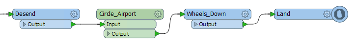
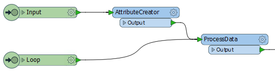
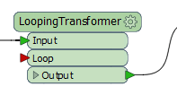
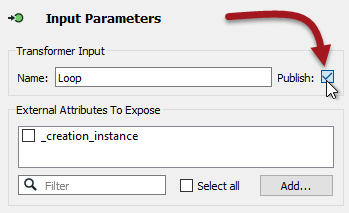
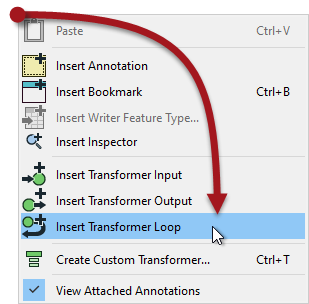
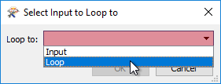
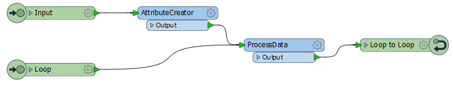
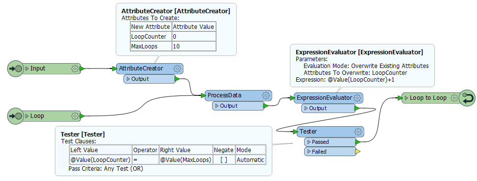
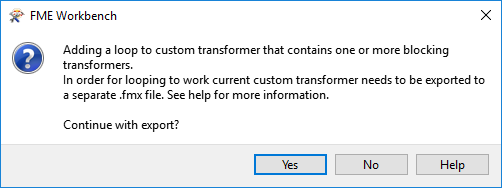
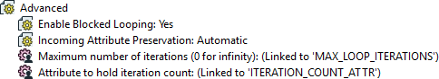

# 循环

循环是一种执行重复转换器一部分的进程的方式。

## 什么是循环？

循环是一种允许重复执行操作的编程结构。

通常这用于进行迭代; 在这里一个进程重复以逐渐将进程缩小到期望的结果。通常，循环与条件相关联; 即，动作继续，直到满足某个条件。

在FME中，循环仅允许在自定义转换器内。

|  副驾驶Transformer说...... |
| :--- |
|  我经常在飞行时进入循环。我必须一次又一次地绕机场（动作），直到我有通关（条件）。飞往伦敦的用户将理解我的意思！ |

## 为什么要使用循环？

如您所知，FME一次处理一个要素。因此，在创建循环时，每个要素都将围绕循环**单独**发送。

但是，循环的本质是每次迭代都略有不同。如果结果没有什么不同，为什么还要一次又一次地重复相同的动作呢？

因此，值得一提的是，循环的每次迭代都必须获取新数据（例如，从列表中读取另一个条目）或使用前一循环的结果重复相同的进程。

_**注意：**_ _在以下屏幕截图中，处理部分是标记为“ProcessData”的单个转换器，以便给出如何创建循环的一般视图。实际上，这个进程必须对数据做一些值得执行的事情。_

|  大副Transformer说...... |
| :--- |
|  它说明了我知道的，但你只使用一个循环来重复自定义转换器内的动作。一次性动作应该在循环之外进行。例如，这是我的着陆顺序：   “向下滚动”部分位于盘旋循环之外，因为我不想每次在机场上空时升高/降低车轮。那将是非常低效的。 |

## 设置自定义转换器回路

自定义转换器中的循环需要两个组件：循环的起点和终点。

### 循环起点

循环的开始由输入端口对象标识。虽然它可以与用于输入要素的输入端口相同，但不一定是这种情况。例如，这里有一个输入端口用于进入的要素，另一个用于循环的开始：

这允许循环点不是自定义转换器的开头。

默认情况下，第二个输入端口也出现在转换器本身上，如下所示：

如果你不需要这个，那么你只需要在输入端口的参数中“取消发布”它：

### 循环终点

循环的结尾由Loop对象标识。您可以通过从自定义转换器中的画布上下文菜单中选择它来插入一个：

放置循环对象时，系统会询问您将循环到哪个输入对象：

然后循环完成：

当然，这个例子是一个无限循环。该操作被重复，但还没有测试停止它的条件。。FME不会让无限循环永远运行 - 它会识别问题并阻止它 - 但我们应该设置一些东西来强制结束。

### 循环条件

我们可以测试两种一般类型的条件。首先，我们可以循环一定次数。其次，我们可以循环直到满足特定条件。

这是一个自定义转换器循环一定次数：

请注意，我们有一个属性，它是我们循环次数的计数器（_LoopCounter_），以及一个告诉我们要执行的最大循环次数的属性（_MaxLoops_）。

在每个循环中，计数器属性递增1.当_LoopCounter &lt;MaxLoops时_，我们循环返回并再次处理数据。当_LoopCounter = MaxLoops时_，我们退出转换器。

与简单的迭代计数不同，另一种方法是测试数据质量的一种特定度量。例如，通过移动顶点来调整表示政治边界的多边形（动作），直到CircularityCalculator转换器返回0.5或更大的值（条件）。

|  大副Transformer说...... |
| :--- |
|  有关在FME工作空间中循环的优秀实际示例，请查看[**此客户案例**](http://www.fme.ly/LoopExample)。  在该示例中，用户使用循环来放置树（动作）直到达到特定密度（条件）。请注意，循环不依赖于特定计数器 - 它会持续到满足所需的数据质量。 |

## 循环和转换器类型

您应该已经知道，一次操作一个要素的转换器称为基于要素，而一次操作多个要素的转换器称为基于组。

我们也可以称呼循环为“基于要素”，因为它一次只处理一个要素。不幸的是，这意味着在（基于要素的）自定义转换器循环中使用基于组的转换器并不是一项简单的任务。

如果您尝试在嵌入式自定义转换器内创建一个循环，当它包含基于组的FME转换器时，则会收到错误消息。基于组的转换器仅允许在链接式自定义转换器的循环内。这是有技术原因的，我们现在就不讨论了。

这是您将收到的错误消息：

因此，在链接式自定义转换器定义中，您将看到一个名为Enable Blocked Looping的特定参数（在Navigator窗口中）：

设置为Yes时，将暴露其他参数以设置迭代次数，并设置将保存该值的属性。请注意如何关闭正在循环的自定义转换器的并行处理（删除参数），并且插入模式自动更改为“仅链接”。

|  Vector小姐说...... |
| :--- |
|  关于循环的这些陈述中哪一个是真的？    [1.循环仅允许在自定义转换器内](http://52.73.3.37/fmedatastreaming/Manual/QAResponse2017.fmw?chapter=13&question=7&answer=1&DestDataset_TEXTLINE=C%3A%5CFMEOutput%5CQAResponse.html) [2. 没有条件的循环将继续进行，直到手动停止](http://52.73.3.37/fmedatastreaming/Manual/QAResponse2017.fmw?chapter=13&question=7&answer=2&DestDataset_TEXTLINE=C%3A%5CFMEOutput%5CQAResponse.html) [3.测试条件内置于循环终点参数](http://52.73.3.37/fmedatastreaming/Manual/QAResponse2017.fmw?chapter=13&question=7&answer=3&DestDataset_TEXTLINE=C%3A%5CFMEOutput%5CQAResponse.html) [4.允许嵌套循环（循环内的循环）](http://52.73.3.37/fmedatastreaming/Manual/QAResponse2017.fmw?chapter=13&question=7&answer=4&DestDataset_TEXTLINE=C%3A%5CFMEOutput%5CQAResponse.html) |

