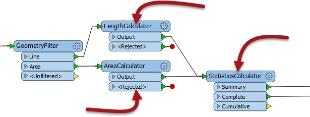
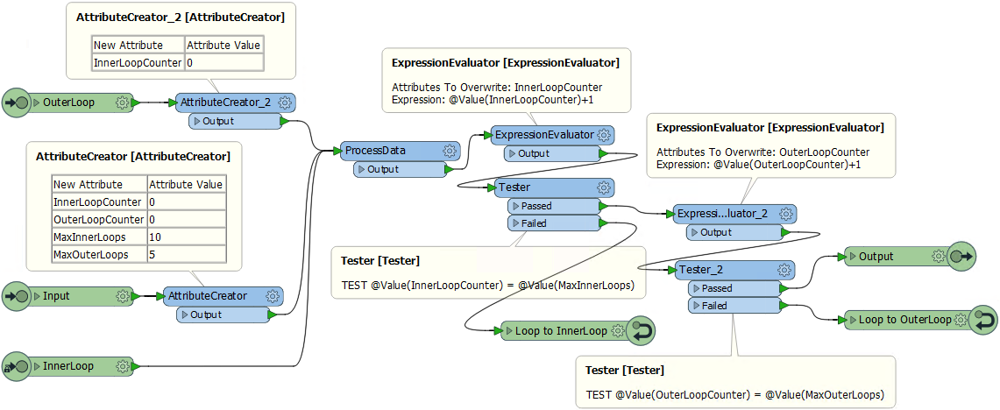

# Q + A答案

以下是本章问题的答案。

|  Vector小姐说...... |
| :--- |
|  以下哪一项不是使用自定义转换器的理由？    1.使我的内容在快速添加中可用  2.使用循环等高级功能  3.以简单的方式重用内容块  4.清理和整理主工作空间画布    不可否认它在快速添加中可用，但那是没有特定的原因来创建自定义转换器。您在“快速添加”中需要它的原因是您可以重复使用内容（答案＃3）。 |

---

<table>
  <thead>
    <tr>
      <th style="text-align:left">Vector小姐说......</th>
    </tr>
  </thead>
  <tbody>
    <tr>
      <td style="text-align:left">
        
考虑这部分工作空间。如果我选择用箭头突出显示的三个转换器，并创建自定义转换器，默认情况下它将具有多少输入和输出端口？
           
           
        

        

           
           1.一个输入和一个输出端口
           2.一个输入和两个输出端口
           3.两个输入和两个输出端口
           4.两个输入和三个输出端口
           
           它将有两个输入和两个输出端口，证明FME将在需要的地方自动创建多个端口。有两个输入，因为有两个连接进入转换器组，两个输出，因为有两个连接离开转换器组（尽管在StatisticsCalculator上有三个输出端口，只有两个是连接的）。

      </td>
    </tr>
  </tbody>
  </table>
  
  ---
  
|  Vector小姐说...... |
| :--- |
|  为什么你认为我们将CSMapReprojector转换器从我们的自定义转换器中移出（在练习中）？    这是因为CSMapReprojector不是该进程的重要部分，并且在所有情况下都不需要。只有当坐标系与我们的区域测量不兼容时，我们才需要它。出于这个原因，我们将它从自定义转换器中删除 - 但是可能在使用设置中添加一个注释，表示数据需要在特定的坐标系中才能使用此自定义转换器。 |

---

|  Vector小姐说...... |
| :--- |
|  如果您将参数从“处理已发布参数”更改为其他可能的值“手动修复（高级）”，您认为会发生什么？根据您的想法选择尽可能多的答案：    1.默认情况下，工作空间不会运行，因为在自定义转换器中没有可用的属性  2.将无法从主画布中选择要使用的属性  3.作者需要通过在其定义中暴露属性来手动修复自定义转换器  4.除非暴露的属性也被发布，否则自定义转换器将无法在不同的模式上工作    是的，当参数设置为手动时，它真的意味着手动！所有这四个都是正确的，这意味着如果你不让FME为你处理属性参考，你将会削减你的工作。 |

---

|  Vector小姐说...... |
| :--- |
|  你可以嵌套自定义转换器吗？也就是说，你可以把一个自定义转换器放在另一个里面吗？    1.是的，没有限制  2.是的，但你只能嵌套相同类型的转换器（链接或嵌入式）  3.是的，但你不能嵌套链接式自定义转换器 4.是的，但只有一个级别的嵌套    是的你可以将任何类型的自定义转换器嵌入到任何其他类型的自定义转换器中，以实现多层嵌套。 |

---

|  Vector小姐说...... |
| :--- |
|  您有一个带有链接式自定义转换器（版本1）的工作空间。该转换器的作者进行了一系列编辑并将其更新到版本4.您认为升级选项对工作空间中的自定义转换器有何影响？    1.将其升级到版本2  2.将其升级到版本3  3.将其升级到版本4  4.这取决于您和作者使用的FME版本    它将自定义转换器升级到与您正在使用的FME版本兼容的最新版本。如果您使用相同版本的FME，那么它会将自定义转换器升级到版本4。但是如果您使用不同版本的FME，那么它可能是版本2或3（或者可能根本没有可用的更新！） |

---

|  Vector小姐说...... |
| :--- |
|  关于循环的这些陈述中哪一个是真的？    1.循环仅允许在自定义转换器内  2.没有条件的循环将继续处理，直到手动停止  3.测试条件内置于循环终点参数中  4.允许嵌套循环（循环内的循环）    是的，循环仅适用于自定义转换器。无限循环不会永远持续下去（FME会在一段时间后停止它）。需要使用转换器（如Tester）来检查条件。并且嵌套循环是允许的。以下是嵌套循环自定义转换器的屏幕截图：          请注意，现在有两个计数属性（每个循环一个）。每当第二（外部）循环计数器递增时，第一（内部）循环计数器被重置为零。  |

