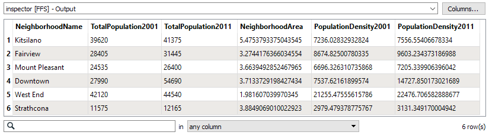
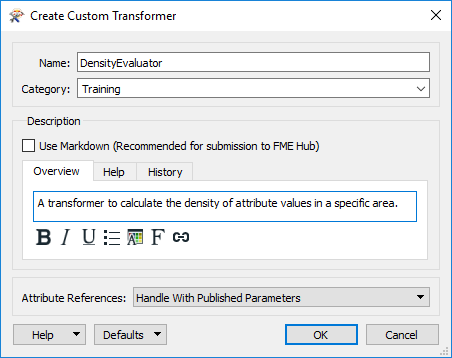
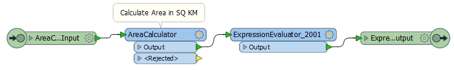
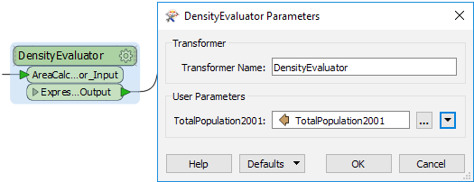

# 练习：创建自定义转换器

|  练习1 |  创建自定义转换器 |
| :--- | :--- |
| 数据 | 社区（谷歌KML） |
| 总体目标 | 从工作空间中创建自定义转换器 |
| 演示 | 基本定制变压器创建 |
| 启动工作空间 | C:\FMEData2018\Workspaces\DesktopAdvanced\CustomTransformers-Ex1-Begin.fmw |
| 结束工作空间 | C:\FMEData2018\Workspaces\DesktopAdvanced\CustomTransformers-Ex1-Complete.fmw |

一位同事--FME的新成员 - 创建了一个工作空间，用于计算温哥华市社区的人口密度，并希望该技术可以重复用于其他项目。

您提到自定义转换器作为一种可实现它的方式，现在将向她展示如何将此工作空间转换为计算已知空间中项目的平均密度的通用解决方案。

  
**1）启动Workbench**  
首先打开同事的工作空间： C:\FMEData2018\Workspaces\DesktopAdvanced\CustomTransformers-Ex1-Begin.fmw

您可能希望运行工作空间并检查输出以查看其能做什么以及是如何做的。基本上，它计算了2001年和2011年的人口密度（每平方公里人数）：

  
**2）创建自定义转换器**  
自定义转换器的关键组件是AreaCalculator和ExpressionEvaluator转换器。如果检查工作空间，您将看到两个ExpressionEvaluators（一个用于2001年，一个用于2011），但我们不需要在自定义转换器中包含两个。

因此，选择AreaCalculator转换器和ExpressionEvaluator\_2001（第一个ExpressionEvaluator），右键单击它们，然后选择上下文菜单选项_Create Custom Transformer_（或者只需按Ctrl + T）。

在“创建自定义转换器”对话框中，输入新自定义转换器的名称，类别和说明。转换器的一个好名字是DensityEvaluator。

|  大副ransformer说...... |
| :--- |
|  你不能称它为DensityCalculator; FME已经有其中之一！ |

确保将“属性引用”参数设置为“处理已发布的参数”（稍后详细介绍），然后单击“确定”：

现在将创建自定义转换器。

  
**3）检查自定义转换器**  
在DensityEvaluator选项卡和主选项卡之间来回翻转，以查看自定义转换器的构造方式以及它如何放置在工作空间本身中。

返回主选项卡，检查自定义转换器的参数。

主要参数是由FME自动创建以接受要处理的属性的参数。您将看到它自动预设为TotalPopulation2001属性。

  
**4）运行工作空间**  
保存工作空间，然后运行工作空间，以确保输出未更改。但请注意，这只是这个自定义转换器的开始，我们应该在尝试在其他场景中重用它之前将其整理（使其更通用）。

|  Vector小姐说...... |
| :--- |
|  为什么你认为我们将CSMapReprojector转换器从我们的自定义转换器中移出？[有任何想法吗？](http://52.73.3.37/fmedatastreaming/Manual/QAResponse2017.fmw?chapter=13&question=3&answer=1&DestDataset_TEXTLINE=C%3A%5CFMEOutput%5CQAResponse.html) |

<table>
  <thead>
    <tr>
      <th style="text-align:left">恭喜</th>
    </tr>
  </thead>
  <tbody>
    <tr>
      <td style="text-align:left">
        
通过完成本练习，您已学会如何：

        <ul>
          <li>从一系列现有转换器创建自定义转换器</li>
          <li>在自定义转换器中自动处理属性引用</li>
        </ul>
      </td>
    </tr>
  </tbody>
</table>