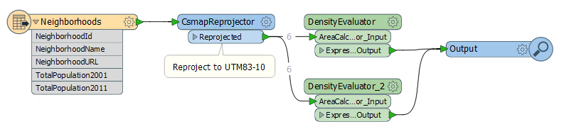
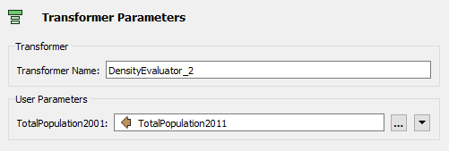
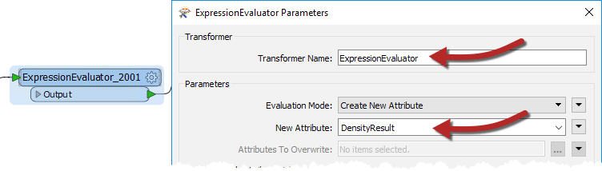
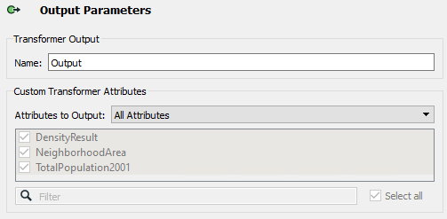
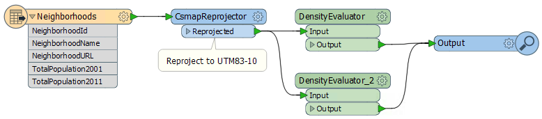

# 练习：编辑自定义转换器

|  练习2 |  编辑自定义转换器 |
| :--- | :--- |
| 数据 | 社区（谷歌KML） |
| 总体的目标 | 使用从工作空间创建的自定义转换器 |
| 演示 | 基本自定义转换器的重复使用和编辑 |
| 启动工作空间 | C:\FMEData2018\Workspaces\DesktopAdvanced\CustomTransformers-Ex2-Begin.fmw |
| 结束工作空间 | C:\FMEData2018\Workspaces\DesktopAdvanced\CustomTransformers-Ex2-Complete.fmw |

一位同事--FME的新成员 - 创建了一个工作空间，用于计算温哥华市社区的人口密度，并认为该技术可以重复用于其他项目。

我们已将她的工作空间转换为自定义转换器作为执行此操作的方式，现在需要显示如何多次使用它并对其定义应用编辑。

  
**1）启动Workbench**  
继续练习1中的工作空间，或打开工作空间：C:\FMEData2018\Workspaces\DesktopAdvanced\CustomTransformers-Ex2-Begin.fmw

  
**2）复制自定义转换器**  
请注意，我们开始有两个ExpressionEvaluators，现在有一个ExpressionEvaluator和一个自定义转换器。让我们放置自定义转换器的另一个实例来代替ExpressionEvaluator。

单击ExpressionEvaluator\_2011并按删除键将其删除。

单击DensityEvaluator自定义转换器，然后按Ctrl + D（或右键单击&gt;复制）以创建它的副本。这与放置新实例的效果相同，但速度更快。如果需要，您可以通过“快速添加”或“转换器库”执行相同的任务。

将第二个DensityEvaluator并行连接到工作流程中，而不是串行连接：

  
**3）设置自定义转换器参数**  
通过创建自定义转换器的第二个实例，我们已经开始重新使用我们的内容，这很棒。但是，第二个实例当前正在处理错误的数据。

检查第二个DensityEvaluator的参数，并将population参数设置为TotalPopulation2011（而不是2001）：

  
**4）运行工作空间**  
运行工作空间并检查输出以确保正确处理数据。

转换器输出的一个明显问题是，无论正在处理什么数据，结果都会被放入名为PopulationDensity2001的属性中。

这是没有用的; 例如，2011年的结果也会得到相同的名称，就像我们使用这个转换器的任何其他场景一样。我们应该通过使输出名称更通用来改进这一点。

  
**5）编辑自定义转换器**  
单击标签为DensityEvaluator的选项卡，将画布切换为自定义转换器定义。检查ExpressionEvaluator\_2001参数。将转换器名称更改为ExpressionEvaluator，因为我们处理的不仅仅是2001数据。然后将New Attribute参数的名称更改为DensityResult：

如果再次运行工作空间，您会注意到DensityResult是自定义转换器的两个实例输出的属性; 即一个编辑修复了它们！

  
**6）重命名端口**  
我们应该做的另一个编辑是自定义转换器的端口名称。目前他们不是很雅致。

仍然，在DensityEvaluator选项卡中，单击自定义转换器定义中的输入端口对象（当前标记为AreaCalculator\_Input）。检查其参数并将名称更改为Input。

现在重复输出端口对象的过程，将其重命名为Output。

单击Main选项卡以检查主画布并确认已进行的更改：

<table>
  <thead>
    <tr>
      <th style="text-align:left">恭喜</th>
    </tr>
  </thead>
  <tbody>
    <tr>
      <td style="text-align:left">
        
通过完成本练习，您已学会如何：

        <ul>
          <li>使用自定义转换器的多个实例</li>
          <li>使自定义转换器通用于任何地方</li>
          <li>重命名自定义转换器中的输出端口</li>
        </ul>
      </td>
    </tr>
  </tbody>
</table>