# 练习：自定义转换器和已发布参数

|  练习3 |  自定义转换器和已发布参数 |
| :--- | :--- |
| 数据 | 社区（谷歌KML） |
| 总体的目标 | 编辑自定义转换器以使用已发布的参数 |
| 演示 | 已发布的参数和自定义转换器 |
| 启动工作空间 | C:\FMEData2018\Workspaces\DesktopAdvanced\CustomTransformers-Ex3-Begin.fmw |
| 结束工作空间 | C:\FMEData2018\Workspaces\DesktopAdvanced\CustomTransformers-Ex3-Complete.fmw C:\FMEData2018\Workspaces\DesktopAdvanced\CustomTransformers-Ex3-Complete-Advanced.fmw |

一位同事 - 在我们的帮助下 - 创建了一个自定义转换器，用于计算特定区域的密度。但是，我们需要进一步努力使其更具通用性 - 并扩展其功能。

此转换器是使用自动模式处理参数创建的，工作空间已经正确处理模式。因此，在某种程度上我们不必担心 - 但我们可以做出改进。

  
**1）启动Workbench**  
继续练习2中的工作空间，或打开工作空间：C:\FMEData2018\Workspaces\DesktopAdvanced\CustomTransformers-Ex3-Begin.fmw

请注意，目前有两个自定义转换器实例。两者都生成一个具有相同名称的属性（DensityValue）。如果自定义转换器的用户可以定义该属性的名称应该是什么，将会很有帮助。让我们设置转换器以允许它。

|  副驾驶 Transformer说...... |
| :--- |
|  这就是为什么 - 到目前为止 - 我们已经在并行流中使用了两个转换器。如果我们在同一个流中将它们串联起来，那么第二个自定义转换器的结果将覆盖第一个自定义转换器的结果。 |

单击标签为DensityEvaluator的选项卡，将画布切换为自定义转换器定义。检查ExpressionEvaluator的参数。接下来，在New Attribute（DensityResult）中单击向下箭头，然后选择User Parameter&gt; Create User Parameter：

[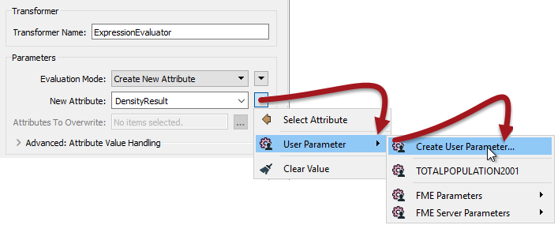](https://github.com/safesoftware/FMETraining/blob/Desktop-Advanced-2018/DesktopAdvanced5CustomTransformers/Images/Img5.209.Ex3.CTCreateUserParameter.png)

出现提示时，单击“确定”接受默认设置。返回主选项卡并检查每个自定义转换器实例的参数。应该有选项来设置要输出的属性的名称：

[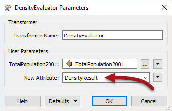](https://github.com/safesoftware/FMETraining/blob/Desktop-Advanced-2018/DesktopAdvanced5CustomTransformers/Images/Img5.210.Ex3.CTCreatedUserParameter.png)

您现在可以移动实例，使它们按顺序连接（而不是并行），并将两个输出属性名称更改为不同的（PopulationDensity2001和PopulationDensity2011）：

[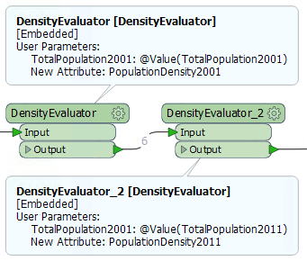](https://github.com/safesoftware/FMETraining/blob/Desktop-Advanced-2018/DesktopAdvanced5CustomTransformers/Images/Img5.211.Ex3.CTonCanvasSeries.png)

|  副驾驶Transformer说...... |
| :--- |
|  乍一看，似乎我们只是简单地将自定义转换器恢复到我们开始的位置。在某种程度上，这是真的。然而，重点是我们现在已经有了一个可以在其他情况下工作的解决方案（即计算人口密度以外的其他方案）。 |

  
**2）设置参数提示**  
查看自定义转换器参数，我们还可以看到要分析的属性的提示称为“TotalPopulation2001”。显然，这不是很通用。

返回DensityEvaluator选项卡并浏览Navigator窗口以查找相关的已发布参数。右键单击该参数，然后选择“编辑定义”。

[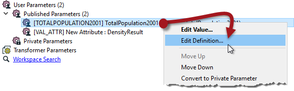](https://github.com/safesoftware/FMETraining/blob/Desktop-Advanced-2018/DesktopAdvanced5CustomTransformers/Images/Img5.212.Ex3.CTNavigatorEditParamDefinition.png)

在打开的对话框中，将参数Name设置为_DensityAttribute_，将提示设置为_要分析的属性_：

[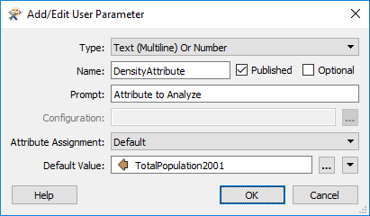](https://github.com/safesoftware/FMETraining/blob/Desktop-Advanced-2018/DesktopAdvanced5CustomTransformers/Images/Img5.213.Ex3.CTEditParamDefinition.png)

单击“确定”关闭对话框。返回主选项卡并检查自定义转换器参数以证明标签更改有效，并运行工作空间以显示输出仍然正确：

[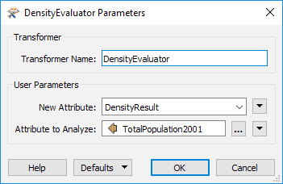](https://github.com/safesoftware/FMETraining/blob/Desktop-Advanced-2018/DesktopAdvanced5CustomTransformers/Images/Img5.214.Ex3.CTParametersUpdated.png)

|  大副Transformer说...... |
| :--- |
|  这是因为我们选择自动处理模式，我们只需更改此用户参数名称，而不必担心它的使用位置。FME将在必要时处理名称更改。 |

  
**3）实现单位选择**  
此工作空间正在计算每平方公里土地的项目数（在本练习中，为人员）。这适用于原始场景，但是，此转换器的其他用途可能会发现不同的单位会更有用。

因此，我们将为用户实现一个参数，以便他们能够选择需要的单位。

在DensityEvaluator选项卡中，浏览Navigator窗口并右键单击标记为“用户参数”的条目。选择“创建用户参数”选项。

在“添加/编辑用户参数”对话框中，设置以下参数：

| 类型 | 别名选择（Choice with Alias） |
| :--- | :--- |
| 名称 | 密度单位（DensityUnits） |
| 提示 | 密度单位： |

取消选中标记为Optional的checkbox参数，因为用户必须选择一个值。

[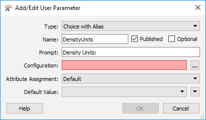](https://github.com/safesoftware/FMETraining/blob/Desktop-Advanced-2018/DesktopAdvanced5CustomTransformers/Images/Img5.215.Ex3.CTCreateParamDefinition.png)

现在单击Configuration参数右侧的\[...\]按钮。这将打开一个对话框，在其中定义用户可供选择的选项。在此对话框中输入两个条目

| 显示名称 | 值 |
| :--- | :--- |
| 平方米 | 1 |
| 平方公里 | 0.000001 |

为了节省你的计数，小数点后有五个零：

[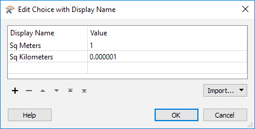](https://github.com/safesoftware/FMETraining/blob/Desktop-Advanced-2018/DesktopAdvanced5CustomTransformers/Images/Img5.216.Ex3.CTCreateParamUnitsDefinition.png)

单击“确定”关闭该对话框。

返回“添加/编辑用户参数”对话框集：

| 属性分配 | 关闭 |
| :--- | :--- |
| 默认值 | 平方公里 |

然后单击“确定”关闭此对话框并添加已发布的参数。

|  大副Transformer 说...... |
| :--- |
|  随意添加您想要的任何其他单位。这个坐标系的单位是米，这就是为什么它的值为1.所以其他单位需要是它的一小部分; 例如，平方英里将是0.0000003861。 |

  
**4）实现参数**  
现在我们已经定义了一个用户可以设置单位的已发布参数，但我们仍然需要在自定义转换器中应用它。

检查AreaCalculator转换器的参数。对于“乘数”字段，单击下拉箭头并选择新定义的用户参数DensityUnits：

[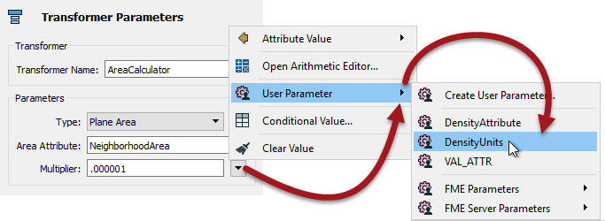](https://github.com/safesoftware/FMETraining/blob/Desktop-Advanced-2018/DesktopAdvanced5CustomTransformers/Images/Img5.217.Ex3.CTUsingUserParameter.png)

回到主画布后，自定义转换器现在有一个参数供最终用户选择输出密度单位：

[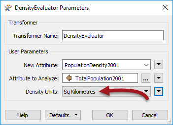](https://github.com/safesoftware/FMETraining/blob/Desktop-Advanced-2018/DesktopAdvanced5CustomTransformers/Images/Img5.218.Ex3.CTExposedUserParameter.png)

通过使用不同单位运行工作空间进行实验，以证明更改已正确实施。请注意，由于“属性分配”设置为“关闭”，因此最终用户无法选择属性。

|  高级练习 |
| :--- |
|  即时不需要这种人口密度计算，这种转换器的另一个有用功能是能够对密度计算应用加权。如果您有时间，请执行以下步骤进行设置。  加权将来自传入属性，这意味着我们需要能够在自定义转换器的模式中处理此问题。 |

  
**5）添加RandomNumberGenerator**  
我们的源数据没有任何我们可以合理用于加权输出的字段。因此，返回主画布选项卡并添加RandomNumberGenerator转换器以生成测试属性：

[](https://github.com/safesoftware/FMETraining/blob/Desktop-Advanced-2018/DesktopAdvanced5CustomTransformers/Images/Img5.219.Ex3.RandomNumberGeneratorOnCanvas.png)

检查RandomNumberGenerator的参数对话框，并且为了本练习的目的，设置：

| 最小值 | 0.1 |
| :--- | :--- |
| 最大价值 | 1 |
| 小数位 | 1 |
| 结果属性 | WeightedAttribute |

  
**6）在自定义转换器中暴露属性**  
现在我们有一个属性，我们需要在自定义转换器中暴露它，以便使用它。

返回定义转换器的DensityEvaluator选项卡。检查输入端口对象的参数。勾选WeightingAttribute属性：

[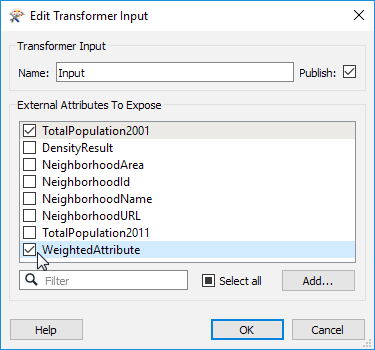](https://github.com/safesoftware/FMETraining/blob/Desktop-Advanced-2018/DesktopAdvanced5CustomTransformers/Images/Img5.220.Ex3.CTExposeAttribute.png)

这将导致属性在自定义转换器定义中暴露。

它还将导致创建用户参数。在Navigator窗口中找到该参数（应该称为WEIGHTEDATTRIBUTE），右键单击它并选择Edit Definition。

勾选“Optional”字段，因为这不是强制性的（用户可能没有用于对结果进行加权的属性）：

[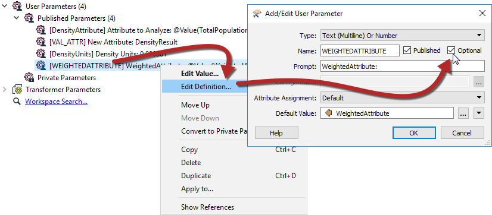](https://github.com/safesoftware/FMETraining/blob/Desktop-Advanced-2018/DesktopAdvanced5CustomTransformers/Images/Img5.221.Ex3.CTExposeParameter.png)

  
**7）Duplicate ExpressionEvaluator**  
现在我们可以在自定义转换器中使用该属性。

制作现有ExpressionEvaluator的副本，并将其并行连接到当前的ExpressionEvaluator。然后事先将Tester放入Passed端口转到一个ExpressionEvaluator并且Failed端口转到另一个：

[](https://github.com/safesoftware/FMETraining/blob/Desktop-Advanced-2018/DesktopAdvanced5CustomTransformers/Images/Img5.222.Ex3.CTWithWeightingTransformers.png)

  
**8）设置Tester**  
检查Tester参数并测试WeightedAttribute&gt; 0的位置

[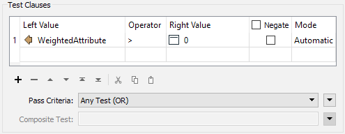](https://github.com/safesoftware/FMETraining/blob/Desktop-Advanced-2018/DesktopAdvanced5CustomTransformers/Images/Img5.223.Ex3.CTWithWeightingTesterSetup.png)

  
**9）调整方程**  
现在属性在自定义转换器中暴露，我们可以在方程中使用它来计算密度。检查连接到Tester：Passed端口的ExpressionEvaluator转换器的参数。

将等式更改为：

```text
@value（TotalPopulation2001）/（@值（NeighborhoodArea）* @值（WeightedAttribute））
```

即将现有的NeighborhoodArea属性乘以WeightedAttribute并将括号放在表达式的该部分周围。

保存参数更改并运行工作空间以检查结果。记住 - 结果每次都会有所不同，因为我们在运行时随机生成加权属性！

尝试选择主画布中的加权属性，以及不选择它。如果未选择任何属性，则要素应通过Failed端口，并且计算中不使用加权：

[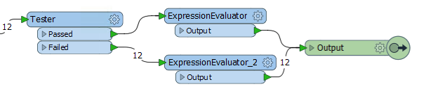](https://github.com/safesoftware/FMETraining/blob/Desktop-Advanced-2018/DesktopAdvanced5CustomTransformers/Images/Img5.224.Ex3.CTNoWeightAttrSelected.png)

|  副驾驶Transformer说...... |
| :--- |
|  看起来很奇怪 - 特别是对于有经验的用户 - 我们会在表达式中使用该属性，而不是已发布的参数。但这是FME如何自动处理此行为的全部内容。它避免了作者需要知道已发布的参数以及如何使用它们，并使用隐藏的功能在必要时用已发布的参数替换该属性。 |

<table>
  <thead>
    <tr>
      <th style="text-align:left">恭喜</th>
    </tr>
  </thead>
  <tbody>
    <tr>
      <td style="text-align:left">
        <p>通过完成本练习，您已学会如何：</p>
        <ul>
          <li>在自定义转换器中发布FME参数</li>
          <li>在自定义转换器中创建新的用户参数</li>
          <li>在自定义转换器中暴露属性</li>
          <li>在自定义转换器中使用暴露的属性</li>
        </ul>
      </td>
    </tr>
  </tbody>
</table>
