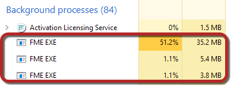
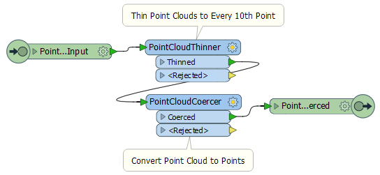
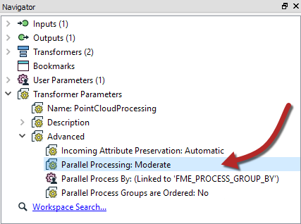
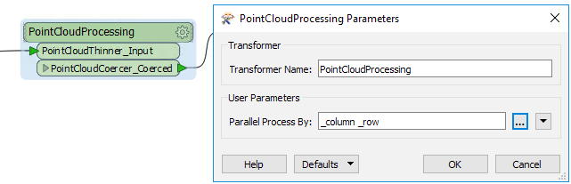
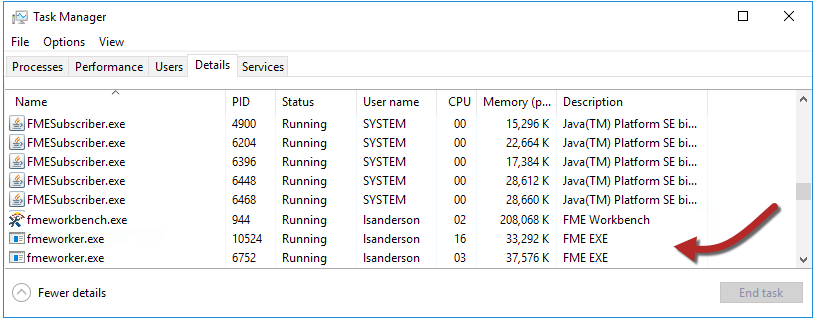

# 练习：自定义转换器和并行处理

|  练习5 |  自定义转换器和并行处理 |
| :--- | :--- |
| 数据 | 3D点云（ASPRS激光雷达数据交换格式（LAS）） |
| 总体的目标 | 创建自定义转换器来并行处理数据 |
| 演示 | 自定义转换器和并行处理 |
| 启动工作空间 | C:\FMEData2018\Workspaces\DesktopAdvanced\CustomTransformers-Ex5-Begin.fmw |
| 结束工作空间 | C:\FMEData2018\Workspaces\DesktopAdvanced\CustomTransformers-Ex5-Complete.fmw |

该市最近开始收集点云数据，现在已准备好与不同部门共享。您被要求创建一个解决方案，将点云转换为其他部门可以使用的矢量格式。

您可以快速创建一个很好的工作空间，可以很好地平铺和细化数据，因此目标数据集在大小方面不会太大。

但是......工作空间运行时间比你想要的要长。因为它将每天运行，所以使用并行处理加速转换将是有用的。

由于所使用的转换器都没有并行处理参数，因此您必须创建一个自定义变换器来执行此操作。

  
**1）打开工作空间**  
打开工作空间C：\ FMEData2018 \ Workspaces \ DesktopAdvanced \ CustomTransformers-Ex5-Begin.fmw。

如您所见，此工作空间处理一些传入的点云数据。检查数据以查看我们正在处理的内容。如果按原样运行工作空间，则大约需要三分钟。为了使它运行得更快，可以增加PointCloudThinner中的Thinning Interval参数（比如说25）。

打开操作系统的任务管理器（进程管理器）工具。运行工作空间。您将看到三个FME引擎进程正在运行（fme.exe），第一个是进程的FME引擎，另外两个只是使用FME 64位时运行的后台引擎。如果您使用的是32位，则只能看到一个引擎：

|  大副Transformer说...... |
| :--- |
|  您还将看到一个fmeworkbench.exe进程，该进程是运行Workbench接口的进程。这不负责处理工作空间; 这两个是完全独立的过程。 |

  
**2）创建自定义转换器**  
现在选择PointCloudThinner和PointCloudCoercer转换器并将它们变成自定义转换器。

重要的是你不要包括Tiler转换器，因为这会创建我们将用作并行过程的方法。

您可以将转换器称为PointCloudProcessing。您选择的属性引用处理无关紧要。

转换器定义应如下所示：

  
**3）设置并行处理**  
在导航器窗口（自定义转换器定义）中，找到并展开自定义转换器高级参数部分。

双击Parallel Processing参数进行设置。将处理级别设置为“中等”。

单击“确定”关闭对话框，您将注意到现在已发布“并行处理依据”参数。

  
**4）设置Process By**  
返回主画布并检查自定义转换器实例的参数。选择\_column和\_row作为Parallel Process By的属性：

这意味着\_column和\_row（即每个瓦片）的每个唯一组合将在单独的进程下运行，每个核心处理器最多只能有一个进程。

  
**5）运行工作空间**  
再次打开任务管理器或进程监视器窗口，运行工作空间。一旦完成瓦片化并且开始处理工作空间的其余部分，您将注意到许多FME工作进程（fmeworker.exe）：

在中等模式下，每个核心最多可以看到一个fmeworker进程。这次转换应该 - 在内存足够的系统资源的情况下 - 在更快的时间内完成。

|  警告 |
| :--- |
|  绝对不要在“断点模式”下运行它。如果这样做，并行处理将无法正常工作！ 在Run菜单下设置Run with Breakpoints时，您处于断点模式 - 无论您是否设置了断点！  同样，请不要在启用要素缓存的情况下运行此功能。确保未选中“运行”菜单下的“使用要素缓存运行”。 |

  
**6）并行处理级别的实验**  
如果您有时间，请使用不同的处理级别重新运行工作空间，例如Aggressive。它的运行速度是否比中等处理级别快？如果没有，为什么会这样？调整瓦片的数量会使它变得更好还是更糟？

<table>
  <thead>
    <tr>
      <th style="text-align:left">恭喜</th>
    </tr>
  </thead>
  <tbody>
    <tr>
      <td style="text-align:left">
        
通过完成本练习，您已学会如何：

        <ul>
          <li>在自定义转换器中创建和使用并行处理</li>
          <li>通过任务管理器确认FME正在启动工作进程</li>
        </ul>
      </td>
    </tr>
  </tbody>
</table>