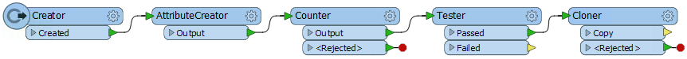
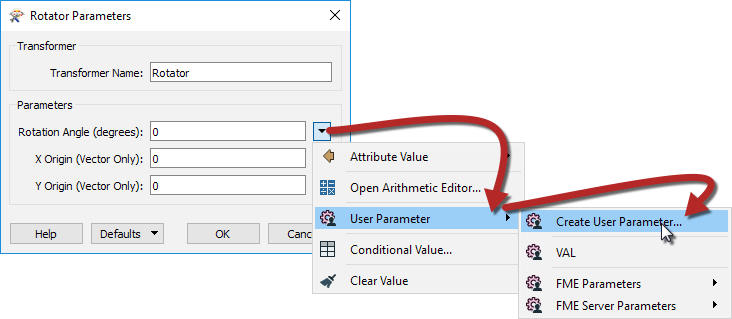
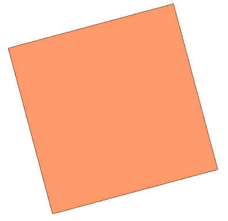
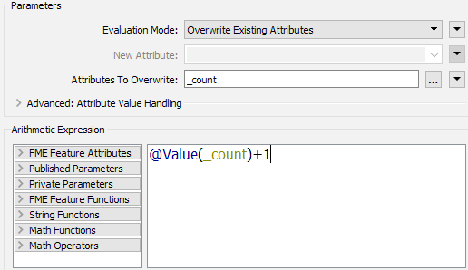
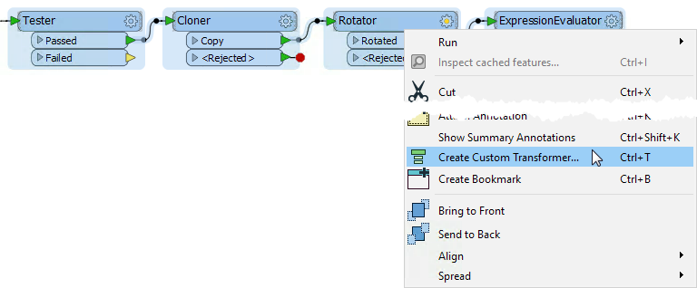
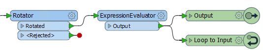
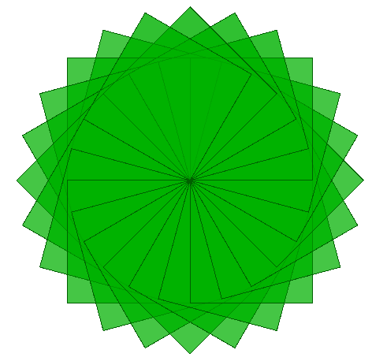

# 练习：循环

|  练习6 |  在自定义转换器中循环 |
| :--- | :--- |
| 数据 | 无 |
| 总体的目标 | 创建自定义转换器以创建循环作品 |
| 演示 | 自定义转换器和循环 |
| 启动工作空间 | C:\FMEData2018\Workspaces\DesktopAdvanced\CustomTransformers-Ex6-Begin.fmw |
| 结束工作空间 | C:\FMEData2018\Workspaces\DesktopAdvanced\CustomTransformers-Ex6-Complete.fmw  C:\FMEData2018\Workspaces\DesktopAdvanced\CustomTransformers-Ex6-Complete-Advanced.fmw |

市场人员已经要求您在FME上创建的Twitter上发布一些有趣的图像。您决定使用循环中新发现的技能创建一些抽象艺术，而不是创建地图。

如果您创建了一些很棒的东西，可以在Twitter [@SafeSoftware](https://twitter.com/safesoftware?lang=en)上与我们分享！

  
**1）启动Workbench**  
启动FME Workbench并打开起始工作空间CustomTransformers-Ex6-Begin.fmw。

[](https://github.com/safesoftware/FMETraining/blob/Desktop-Advanced-2018/DesktopAdvanced5CustomTransformers/Images/Img5.243.Ex6.InitialWorkspace.png)

如果你运行这个工作空间，除了你将得到一个正方形之外没有任何惊心动魄的事情

  
**2）添加Rotator转换器**  
在Cloner转换器添加旋转转换器后。我们将使用它来旋转我们的方块。在参数中，为旋转角度（度）创建新用户参数，并输入15作为默认值。

[](https://github.com/safesoftware/FMETraining/blob/Desktop-Advanced-2018/DesktopAdvanced5CustomTransformers/Images/Img5.244.Ex6.RotatorPublishedParam.png)

  
**3）保存并运行转换**  
运行启用了要素缓存的转换并检查Rotator的输出：

[](https://github.com/safesoftware/FMETraining/blob/Desktop-Advanced-2018/DesktopAdvanced5CustomTransformers/Images/Img5.245.Ex6.RotatorOutput.png)

除了轻微的旋转外，它看起来似乎什么也没发生。这是因为我们需要创建一个循环来让每个方块做一些不同的事情。

  
**4）创建自定义转换器**  
首先，我们需要在**创建自定义转换器**之前添加ExpressionEvaluator。添加ExpressionEvaluator并将其连接到Rotator：Rotated输出端口。在参数中，将“评估模式”更改为“覆盖现有属性”，并将“要覆盖的属性”设置为\_count。然后输入以下表达式：

```text
@value（_count）+1
```

此表达式将计算每个正方形，但每次都会将计数加1。我们将使用此计数来停止循环：

[](https://github.com/safesoftware/FMETraining/blob/Desktop-Advanced-2018/DesktopAdvanced5CustomTransformers/Images/Img5.246.Ex6.ExpressionEvaluator.png)

现在选择Tester，Cloner，Rotator和ExpressionEvaluator转换器并创建一个新的自定义转换器，将其命名为Looper。在Looper选项卡中，双击Tester\_Input端口并将其重命名为Input。

[](https://github.com/safesoftware/FMETraining/blob/Desktop-Advanced-2018/DesktopAdvanced5CustomTransformers/Images/Img5.247.Ex6.CreateCustomTransformer.png)

  
**5）添加输出和循环端口**  
接下来，我们需要创建循环和输出端口。让我们先创建循环。通过右键单击画布并选择“插入转换器循环”来创建循环，它将自动创建Loop To到输入。单击“确定”，然后将其连接到ExpressionEvaluator：输出端口。

[](https://github.com/safesoftware/FMETraining/blob/Desktop-Advanced-2018/DesktopAdvanced5CustomTransformers/Images/Img5.248.Ex6.LoopToRotator.png)

通过右键单击画布并选择“插入转换器输出”来创建输出端口。将其连接到ExpressionEvaluator：输出端口。

  
**6）暴露角度参数**  
在主选项卡中，打开Looper自定义转换器参数。设置旋转角度（度）以创建新用户参数。默认值将自动设置为我们已创建的角度参数。

  
**7）运行转换**  
运行带有提示符运行的转换并输入不同的参数值以更改您的作品，然后检查输出。更改一些已发布的参数值再次运行它。

[](https://github.com/safesoftware/FMETraining/blob/Desktop-Advanced-2018/DesktopAdvanced5CustomTransformers/Images/Img5.249.Ex6.FinalOutput.png)

|  高级练习 |
| :--- |
|  您可以通过在Looper自定义转换器之后添加FeatureColorSetter来更改您作品的颜色。为配色方案创建一个新的用户参数，并为填充颜色也创建一个，以便在每次运行时自定义您的作品。 您也可以尝试在Creator中的更改形状。 |

<table>
  <thead>
    <tr>
      <th style="text-align:left">恭喜</th>
    </tr>
  </thead>
  <tbody>
    <tr>
      <td style="text-align:left">
        <p>通过完成本练习，您已学会如何：</p>
        <ul>
          <li>在自定义转换器中创建循环对象</li>
          <li>在自定义转换器中创建和增加循环计数器</li>
          <li>使用循环计数器循环自定义转换器中的内容</li>
          <li>从自定义转换器中暴露已发布的参数</li>
        </ul>
      </td>
    </tr>
  </tbody>
</table>