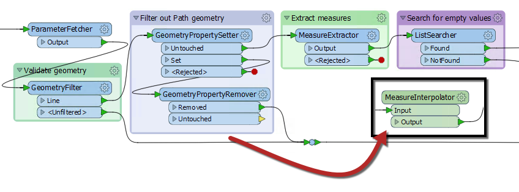
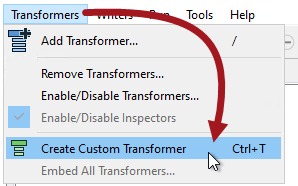
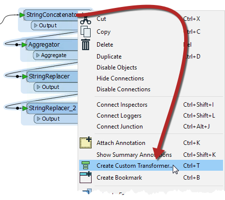
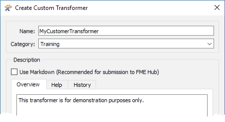
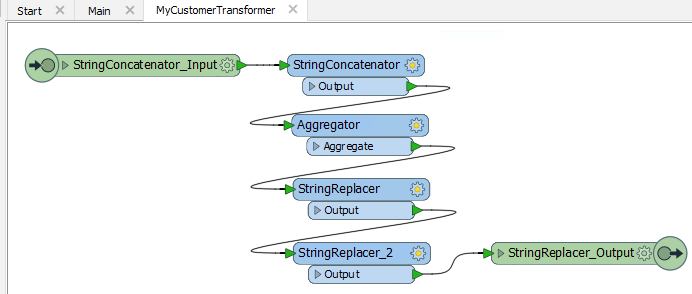
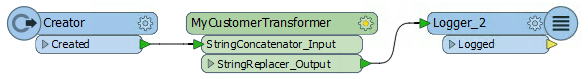
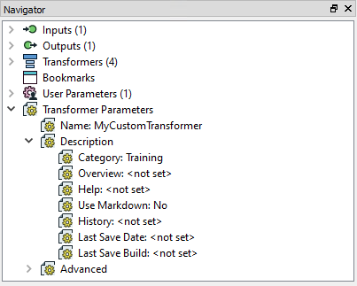
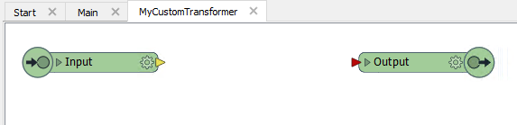

# 自定义转换器

自定义转换器是无论在基础或高级应用中都是非常强大的工具。

## 什么是自定义转换器？

自定义转换器是一系列标准转换器压缩成单个转换器。任何现有的转换器序列都可以变成自定义转换器。

MeasureInterpolator是FME Hub上的自定义转换器。

### 自定义转换器用途

在众多功能中，自定义变换器有助于：

* 重用内容
* 封装在单个对象中的一系列转换器可以在整个工作空间中重用，并与同事共享。
* 采用先进的功能
* 使用自定义转换器可以使用其他功能，例如循环和并行处理
* 整洁的工作空间
* 通过压缩内容块，工作空间画布变得不那么混乱。但如果使用可折叠书签这一点就不太重要了

|  副驾驶Transformer说...... |
| :--- |
|  欢迎参加有关自定义转换器的Safe Software培训章节。我将成为您所涉及的所有功能的向导。正如您所看到的，自定义转换器是在FME中执行最佳实践的出色工具，既可以加速您的项目，又可以减少Workbench画布中的混乱。 |

## 创建自定义转换器

可以从头开始创建自定义转换器 - 即，您从一个空的自定义转换器开始并向其中添加内容 - 或者可以从现有的转换器序列创建。

通过从画布上下文（右键单击）菜单中选择“创建自定义转换器”或从菜单栏中选择“转换器”&gt;“创建自定义转换器”来创建自定义转换器。此功能的快捷键是Ctrl + T.

如果在发出“创建自定义转换器”命令时选择了许多现有转换器，则它们会自动添加到新的自定义转换器中; 否则，除了输入和输出端口之外，新的自定义转换器被创建为空。

在这里，用户正在基于一系列现有的转换器创建新的自定义转换器：

新的自定义转换器将预先安装这四个转换器。

## 命名自定义转换器

所有自定义转换器都需要名称和（可选）类别和说明。创建新的自定义转换器时，会自动显示一个用于定义这些对话框的对话框。

可以将类别设置为匹配任何现有类别的FME转换器或您自己的自定义类别。

另请注意“使用扩展描述”参数。这允许您输入有关自定义转换器的额外信息，例如使用要求，开发历史记录以及法律条款和条件; 在支持使用富文本的字段中。

当您打算与工作同事或客户共享自定义转换器时，这些字段尤为重要。

## 新自定义转换器

新创建的自定义转换器如下所示：

请注意，它出现在Workbench画布上的新选项卡下，由包含其他输入和输出对象的原始转换器组成。

当您单击Main选项卡时，要返回到主画布视图，原始转换器现在已被自动连接到现有工作空间的自定义转换器对象替换：

这种自定义转换器的外观和行为与任何标准FME转换器相同; 具有输入和输出端口（与自定义转换器选项卡中的输入/输出对象匹配）以及参数对话框。

## 编辑自定义转换器

要编辑自定义转换器的内容，只需单击该转换器的选项卡即可。这将打开转换器定义，您可以使用与在主画布中相同的方式编辑内容。

在“导航”窗口中，工作空间的部分标记为“工作空间参数”，自定义转换器具有“转换器参数”：

这是可以编辑之前输入的信息 - 名称，类别，描述等的地方。

|  副驾驶Transformer说...... |
| :--- |
|  如果从头开始创建自定义转换器，没有选择任何原始转换器，它将从空白开始，如下所示：      然后您可以从头开始构建或编辑转换器。在主画布中创建内容并将其转换为自定义转换器，创建空的自定义转换器并在其中创建内容之间没有太大区别。    |

