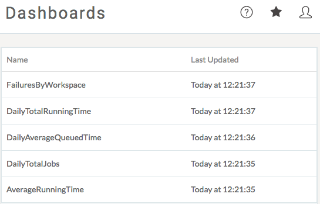
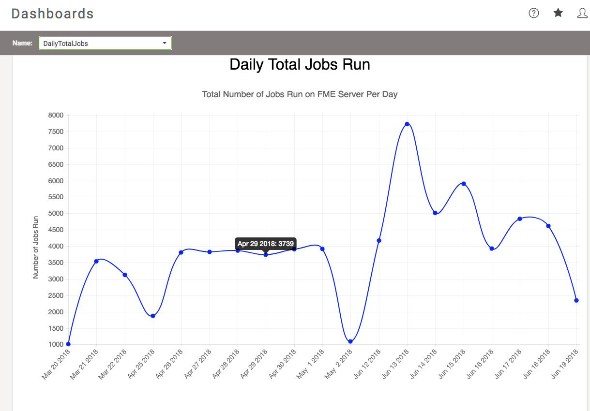

# Server仪表板

FME Server仪表板面板用于展示显示FME Server安装的整体运行状况的报告。

FME Server中存在五个默认报告：

这些报告中的每一个都是简单的静态HTML文件。单击任何链接将在Web浏览器中打开HTML文件并显示报告。以下是作业报告HTML文件的示例：

例如，在上图中，报告显示每天在FME Server上运行的作业数。

|  警察局长Webb-Mapp说...... |
| :--- |
|  这些报告是使用 - 还能是什么别的 - FME工作空间生成的！这些工作空间使用HTMLReportGenerator转换器和HTML格式写模块来创建报告中显示的图形。  这些是相当简单的工作空间，完全可以创建自己的报告 - 最好使用现有报告作为模板工作空间。仪表板文档解释了如何，但是——简单地说——写入文件夹resources \ dashboards \ dashboards的任何HTML文档都将在服务器Web界面的仪表板面板中显示为报表。 |

## 生成和使用报告

默认情况下，不会生成和/或更新仪表板面板中的报告。要让它们出现 - 并进行更新 - 您必须执行以下步骤：

1. 在FME Server Web界面中，单击_“运行工作空间”，_然后选择“ **仪表板”**库。
2. 运行工作空间**JobHistoryStatisticsGathering.fmw**以生成更新的统计信息。
3. 返回_“运行工作空间”_并再次选择 _“仪表板”_库。
4. 为要添加/更新的报告运行工作空间; 例如**DailyTotalJobs.fmw**。
5. 单击_仪表板_。
6. 单击所选报告以查看最新统计信息。

工作空间_JobHistoryStatisticsGathering.fmw_也设置为按计划运行。该计划称为_DashboardStatisticsGathering_，每24小时运行一次，默认情况下设置为“ **已禁用”**。因此，要自动获取每日统计信息，首先需要启用此计划。

