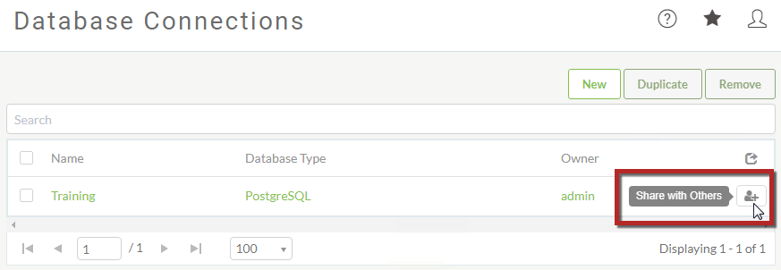

# 数据库连接

从FME Server运行的许多工作空间都要求您连接并验证数据库服务。例如，包含Oracle Spatial Relational读模块的工作区要求您提供服务名称，用户名和密码以连接到Oracle Spatial Relational数据集。

FME Server允许您将这些身份验证参数存储为自包含对象，_“ 数据库连接”_页面提供了一种方便安全的方法来管理它们。从FME Server运行需要数据库连接的工作空间时，可以引用连接名称，而不是重新输入连接参数。如果连接参数发生更改，则可以在一个位置编辑它们，而不是在使用该连接的每个工作空间中编辑它们。

## 使用数据库连接

运行工作空间时，与工作空间中的数据库类型兼容的任何连接都将显示在“已发布参数”下的“连接”下拉列表中。

## 添加数据库连接

有两种方法可以添加数据库连接：

1. **在数据库连接页面**: 点击_新建_。或者，选中现有连接旁边的框，然后单击_“ 复制”_。在“创建新（或复制）数据库连接”页面上，提供连接的名称，并指定数据库的类型。根据类型提供剩余的连接和身份验证参数。单击确定。
2. **从FME Workbench**: 当您将包含数据库连接的工作空间上传到FME Server时，您可以指定是否将连接与工作空间一起上传，或使用FME Server上已存在的连接。如果您选择上传连接，则会将其添加到此页面。

## 编辑数据库连接

单击连接名称。在_“ 编辑数据库连接”_页面上，指定新参数，然后单击_“ 确定”_。

## 共享数据库连接

要共享连接，请单击_“ 与他人共享”_图标。通过共享，您可以将项目的权限级别授予其他用户。如果您拥有该项目，或者您是具有管理安全性权限的用户（例如管理员），则可以共享该项目。有关共享和所有权的详细信息，请参阅基于角色和基于用户的访问控制。

## 删除数据库连接

选中要删除的一个或多个连接旁边的框，然后单击_“ 删除”_。在确认对话框中，单击_“ 确定”_。

