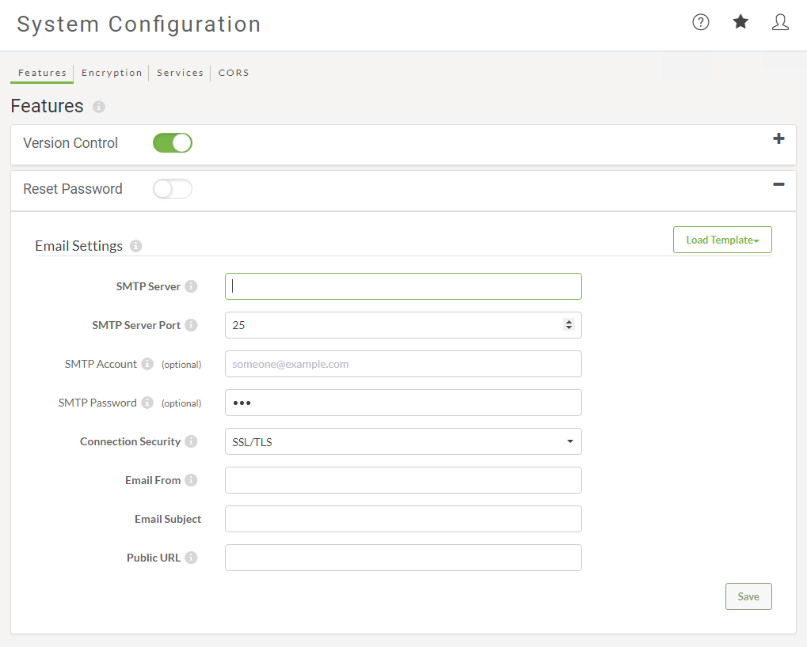

# 找回密码

您可以让您的用户重置其密码以登录FME Server。启用重置密码后，“忘记密码？” 链接显示在FME Server Web用户界面的登录页面上。此链接使用户能够接收电子邮件以重置其密码。

## 配置重置密码

您可以在FME Server Web UI的“系统配置”页面中启用“重置密码”功能。只有fmesuperuser角色的成员才能启用此功能。

确保所有用户都配置了有效的电子邮件地址，因为该命令要求此信息正常运行。

将电子邮件设置配置为有效的电子邮件服务器也很重要。

|  技巧 |
| :--- |
|  如果您的FME Server配置为活动目录，则您的用户无法使用此功能重置其域密码。在这种情况下，用户应该寻找他们的IT管理员进行密码管理或恢复。 |

