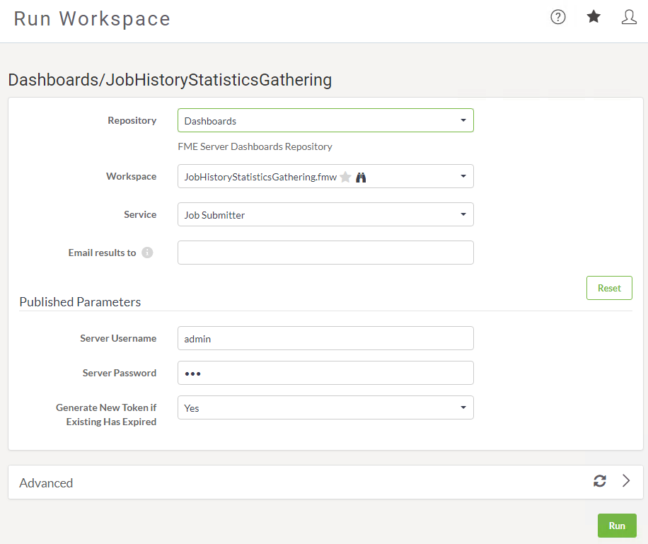
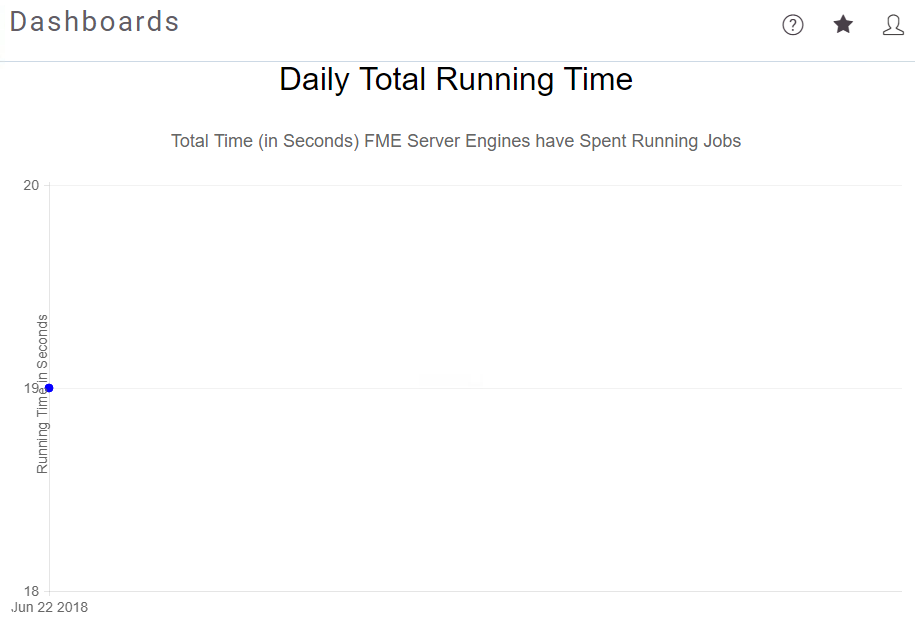

# 练习1：配置仪表板

|  练习1 |  配置仪表板 |
| :--- | :--- |
| 数据 | N / A |
| 总体目标 | 使用仪表板监控FME Server运行状况 |
| 演示 | 如何添加FME Server仪表板并对其进行故障排除 |
| 启动工作空间 | C:\FMEData2018\Workspaces\ServerAdmin\Customization-Ex1-JobHistoryStatisticsGathering.fmw |
| 结束工作空间 | 无 |

作为FME Server管理员的角色，您负责管理和维护公司FME Server的运行状况。为了轻松监控运行状况，FME Server具有可以启用的默认仪表板。

|  警告 |
| :--- |
|  如果您已完成配置HTTPS练习，则仅完成步骤1。如果您未完成此练习，请转到步骤2。 |

  
**1）更新工作空间**  
当您使用自签名证书配置FME Server时，仪表板将失败，这是一个众所周知的问题。要解决此问题，我们需要重新发布在HTTPCallers中更改了参数的仪表板工作空间。有关此问题的更多详细信息，请参阅[FME Server仪表板故障排除](https://knowledge.safe.com/articles/55053/fme-server-troubleshooting-fme-server-dashboards.html)文章。

  
在FME Desktop中，打开Customization-Ex1-JobHistoryStatisticsGathering.fmw工作空间并将其发布到FME Server。确保将存储库设置为仪表板并将工作空间重命名为JobHistoryStatisticsGathering.fmw。发布时，将显示警告消息，单击“是”以覆盖现有工作空间。这是控制器工作空间，现在它已更新，我们可以运行其他仪表板。

  
**2）登录FME服务器**  
通过Windows“开始”菜单上的“Web界面”选项或直接在Web浏览器中打开FME Server Web界面，然后使用用户名和密码_admin_登录。

  
**3）运行仪表板工作空间**  
我们首先需要启用仪表板，然后它们才会显示在仪表板页面上。FME Server附带五个默认仪表板，通过运行工作空间触发。

  
在侧面菜单栏上单击“运行工作空间”。在“运行工作空间”页面上，选择“仪表板”作为存储库。然后选择JobHistoryStatisticsGathering.fmw作为工作空间。在参数中将用户名和密码设置为_admin_，然后单击“运行”：

  
工作空间运行完毕后，返回“运行工作空间”页面，然后运行另一个仪表板。在“运行工作空间”页面上，选择DailyTotalRunningTime.fmw，然后单击“运行”。

  
再运行一个工作空间，以便我们查看一些数据。在运行工作空间页面上，将Repository更改为Samples并选择austinApartments.fmw并单击运行。

  
**4）查看仪表板**  
在侧面菜单栏上单击仪表板。这是仪表板页面，可以查看已运行的任何仪表板。

  
选择DailyTotalRunningTime以查看仪表板。由于我们只运行了一次austinApartments.fmw工作空间，我们的仪表板并没有告诉我们多少，但是超时仪表板成为服务器管理员的宝贵资源：

|  高级练习 |
| :--- |
|  作为高级练习，请设置一个计划，以便每天运行一次所有仪表板，这样当您开始新的一天时，您将获得有关服务器性能的最新快照。 |

<table>
  <thead>
    <tr>
      <th style="text-align:left">恭喜</th>
    </tr>
  </thead>
  <tbody>
    <tr>
      <td style="text-align:left">
        
通过完成本练习，您已学会如何：
           
        

        <ul>
          <li>设置现有仪表板</li>
          <li>在FME Server中查看仪表板</li>
          <li>更新自签名证书的仪表板</li>
        </ul>
      </td>
    </tr>
  </tbody>
</table>