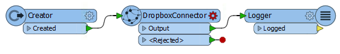
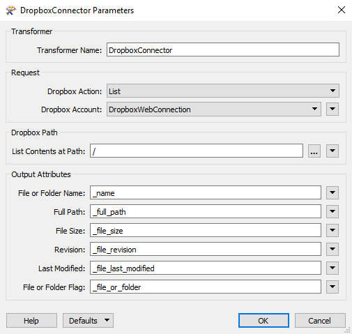
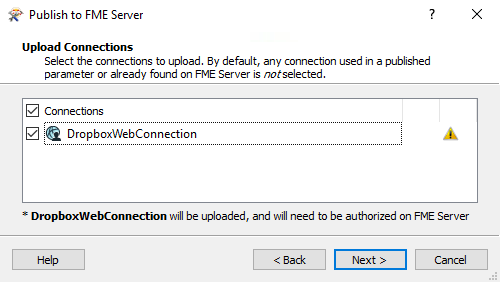
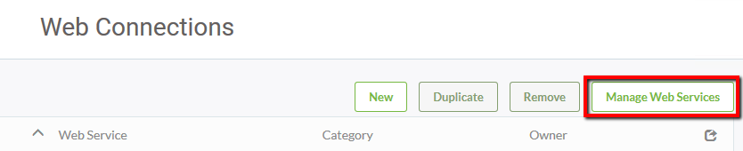
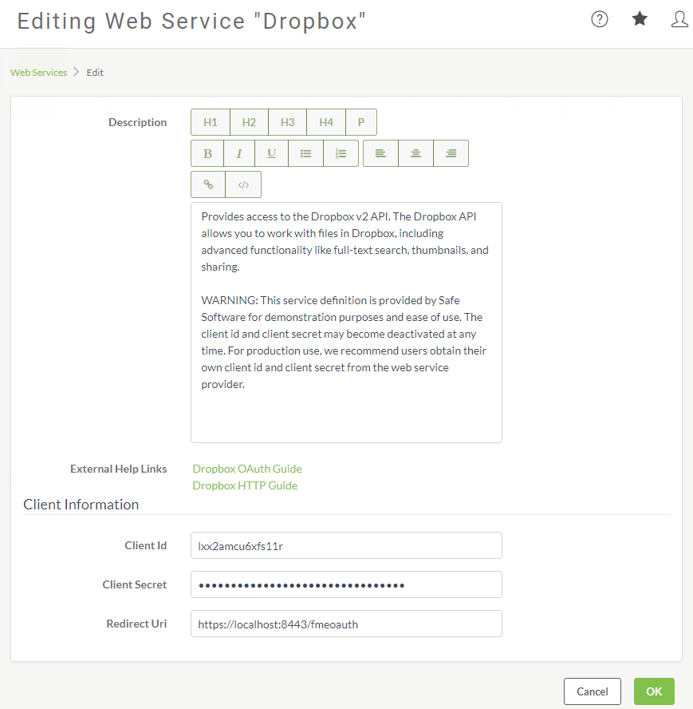
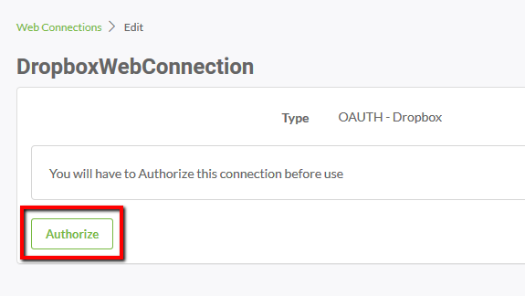
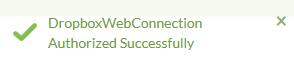

# 练习2：Web连接

|  练习2 |  添加Web连接 |
| :--- | :--- |
| 数据 | C:\FMEData2018\Resources\ServerAdmin\DropboxWebConnection.xml |
| 总体目标 | 验证FME Server的Web连接 |
| 演示 | 如何为Dropbox添加和验证Web连接 |
| 启动工作空间 | 无 |
| 结束工作空间 | C:\FMEData2018\Workspaces\ServerAdmin\Customization-Ex2-WebConnections-Complete.fmw |

您的GIS部门正在与其他几个组织合作开展一个大型项目。有很多要安排的事，因此每当有其他文件要共享时，每个组织都会将文件放入共享的Dropbox中，以便所有组织成员轻松访问。您的任务是配置FME Server以访问Dropbox。

  
**1）创建工作空间**  
您必须首先创建Dropbox Web连接。创建此Web连接的第一步是运行工作空间！打开FME Workbench并创建一个新的空白工作空间。

该**DropboxConnector**转换器可以访问Dropbox帐户，并执行删除，下载列表和上传的行动。

将**Creator**转换器和**DropboxConnector**转换器添加到工作空间。把Creator连接到DropboxConnector。添加一个**Logger**转换器连接到DropboxConnector的输出端口。

  
**2）配置DropboxConnector和创建Web连接**  
选择DropboxConnector并打开参数对话框或通过参数编辑器窗格查看它们。

将_Dropbox操作_更改为**List**。

然后选择下拉_Dropbox的连接_，然后选择**添加Web连接...**。将打开“Dropbox连接”对话框。

设置_连接名称_为**DropboxWebConnection**，然后单击**身份验证...**。

这将打开一个新窗口，其中包含与Dropbox的直接安全连接。填写_Web服务身份验证_凭据，如下所示：

* **电子邮件：** [fmedropbox@gmail.com](mailto:fmedropbox@gmail.com)
* **密码：** _&lt;distributed\_during\_course&gt;_

...然后单击“ **登录”**。

注意：上述电子邮件和密码应仅用于本练习。您可以使用_自己的Dropbox帐户_，但是对于本课程，我们提供了一个帐户供您使用。

单击“ **允许”**以允许FME访问Dropbox帐户。

您的_DropboxConnector_参数现在应如下所示：

单击“ **确定”**以应用更改。

  
**3）运行工作空间**  
最好先在FME Desktop中运行工作空间，然后再将其上传到FME Server。如果工作空间未在FME Desktop中运行，则它将无法在FME Server中运行！

单击**“运行”**以确保转换成功。现在我们准备将工作空间发布到FME Server。

  
**4）发布到FME Server**  
选择“文件”菜单下的“ _发布到FME Server_ ”。使用“发布到FME Server向导”将工作空间放在“ **培训”**存储库中。

在“上_载连接”_步骤中，选中“DropboxWebConnection”，然后单击“ **下一步”**。我们将使用FME Server Web界面授权我们的Web连接。

确保使用**Job Submitter** FME Server Service 注册工作空间。单击“ **发布”**。

  
**5）登录FME Server**  
通过Windows“开始”菜单上的“Web Interface”选项或直接在Web浏览器中打开FME Server Web界面，然后使用用户名和密码_admin_登录。

|  Vector小姐说...... |
| :--- |
|  如果您已完成Configure for HTTPS练习，请记住，连接到FME Server的URL现在是https：// localhost：8443 / fmeserver而不是http：// localhost / fmeserver！ |

  
**6）配置Dropbox Web服务**  
从左侧边栏转到**Connections&gt; Web Connections**。

单击“Web连接”页面上的“ **Manage Web Services** ”。

选择**Dropbox**。将打开_编辑Web服务“Dropbox”_页面。

填写_客户信息_参数如下：

* **客户端ID：** lxx2amcu6xfs11r
* **客户端密钥：** _&lt;distributed\_during\_course&gt;_
* **重定向Uri：** [https：// localhost：8443 / fmeoauth](https://localhost:8443/fmeoauth)

客户端ID和客户端密钥是您将客户端连接到Web服务的方式。在为Web服务创建新的API应用程序时会生成它们。REST API文档页面（例如[Dropbox的](https://www.dropbox.com/developers)这一页面）详细介绍了Web服务应用程序的创建。

单击“ **确定”**以保存这些更新。

  
**7）授权Web连接**  
返回**Connections&gt; Web Connections**

在Web连接列表中选择_DropboxWebConnection_。

在“ _编辑Edit”_页面上，单击“ **授权Authorize”**按钮：

将打开一个窗口，其中包含Dropbox的登录屏幕。登陆使用：

* **电子邮件：** [fmedropbox@gmail.com](mailto:fmedropbox@gmail.com)
* **密码：** _&lt;distributed\_during\_course&gt;_

窗口关闭，弹出一条消息：

您现在已成功授权FME Server中的Dropbox Web连接，以便您在工作空间中使用！

<table>
  <thead>
    <tr>
      <th style="text-align:left">恭喜！</th>
    </tr>
  </thead>
  <tbody>
    <tr>
      <td style="text-align:left">
        
通过完成本练习，您已学会如何：
           
        

        <ul>
          <li>访问Web服务</li>
          <li>发布到FME Server的Web连接</li>
          <li>在FME Server中配置Web服务</li>
          <li>在FME Server上授权Web连接</li>
        </ul>
      </td>
    </tr>
  </tbody>
</table>