# 练习3：工作空间版本控制

|  练习2 |  版本控制工作空间 |
| :--- | :--- |
| 总体目标 | 版本控制工作空间 |
| 演示 | 如何对已发布到FME Server的工作空间进行版本控制。 |
| 启动工作空间 | C:\FMEData2018\Workspaces\ServerAdmin\Customization-Ex3-Versioning-Begin.fmw |
| 结束工作空间 | C:\FMEData2018\Workspaces\ServerAdmin\Customization-Ex3-Versioning-Complete.fmw |

您的GIS部门有两名工作人员，他们会在必要时定期创作并更改自己的工作空间和其他工作空间。在某些情况下，对工作空间进行了更改，导致工作空间在编辑后失败。原来工作的工作空间未备份且丢失。这导致需要额外的时间来发现原因并恢复以前工作的工作空间。

您的管理层已了解FME Server中的新版本控制功能，并想知道它是否可以减少这些问题的发生。您的任务是启用版本控制并确保其正常运行。

|  Vector小姐说...... |
| :--- |
|  如果您已完成Configure for HTTPS练习，请记住，连接到FME Server的URL现在是https：// localhost：8443 / fmeserver而不是http：// localhost / fmeserver！ |

  
**1）登录FME服务器**  
通过Windows“开始”菜单上的“Web Interface”选项或直接在Web浏览器中打开FME Server Web界面，然后使用用户名和密码_admin_登录。

  
**2）启用版本控制** 您可以通过“系统配置”页面在FME Server中启用版本控制。选择“功能（Features）”，然后单击“版本控制”旁边的切换。

[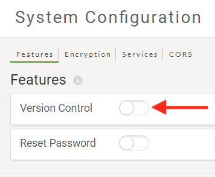](https://github.com/xuhengxx/FMETraining-1/tree/c60c1e291fd9e762b26517c54e4fd7ea9f748055/ServerAdmin5Customization/Images/5.210.Ex2.EnableVersionControl.png)

切换将变为绿色指示已启用。我们无需更新基本的本地版本控制功能的_远程设置_。

[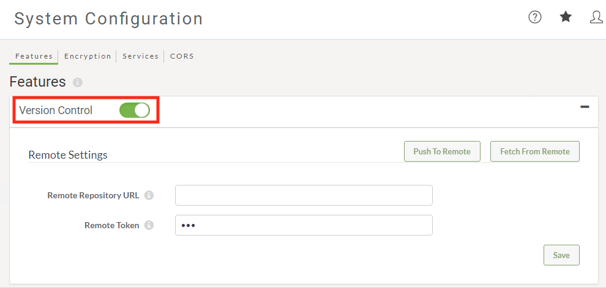](https://github.com/xuhengxx/FMETraining-1/tree/c60c1e291fd9e762b26517c54e4fd7ea9f748055/ServerAdmin5Customization/Images/5.211.Ex2.EnabledVersionControl.png)

  
**3）创建工作空间**  
接下来，您必须创建一个简单的工作空间，您可以使用它来测试版本控制功能。

打开FME Workbench并创建一个新的空白工作空间。

将**Creator**转换器添加到工作空间。

保存工作空间。

**4）运行工作空间**  
最好先在FME Desktop中运行工作空间，然后再将其上传到FME Server。如果工作空间未在FME Desktop中运行，则它将无法在FME Server中运行！

单击**“运行”**以确保转换成功。现在我们准备将工作空间发布到FME Server。

  
**5）发布到FME Server**  
选择“文件”菜单下的“ _发布到FME Server_ ”。使用“发布到FME Server向导”将工作空间放在名为“ **版本测试\(Version Test\)”**的新存储库中。如果不存在，请单击“ **新建...”**按钮创建新的存储库。

[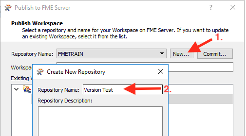](https://github.com/xuhengxx/FMETraining-1/tree/c60c1e291fd9e762b26517c54e4fd7ea9f748055/ServerAdmin5Customization/Images/5.213.Ex2.CreateRepository.png)

单击“确定”以创建新存储库并返回“发布到FME Server”对话框。

接下来，您应该在“发布到FME Server”对话框中看到一个名为**Commit ...**的新按钮。

[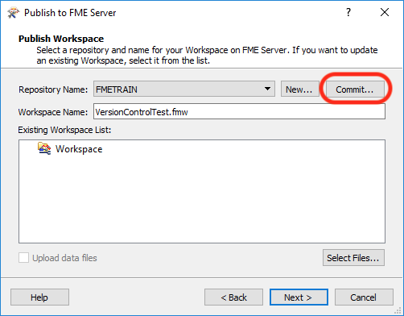](https://github.com/xuhengxx/FMETraining-1/tree/c60c1e291fd9e762b26517c54e4fd7ea9f748055/ServerAdmin5Customization/Images/5.214.Ex2.CommitButton.png)

单击**Commit**按钮，将出现以下对话框：

[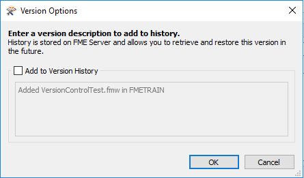](https://github.com/xuhengxx/FMETraining-1/tree/c60c1e291fd9e762b26517c54e4fd7ea9f748055/ServerAdmin5Customization/Images/5.215.Ex2.VersionOptions1.png)

单击复选框，使用**版本0.1初始工作空间\(Version 0.1 Initial Workspace\)**填充文本框，然后单击“ **确定”**。

[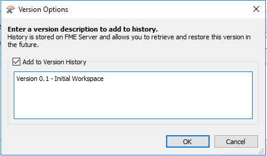](https://github.com/xuhengxx/FMETraining-1/tree/c60c1e291fd9e762b26517c54e4fd7ea9f748055/ServerAdmin5Customization/Images/5.216.Ex2.VersionOptions2.png)

单击“ **确定”**关闭“版本选项”对话框，然后返回“发布到FME Server”对话框。

[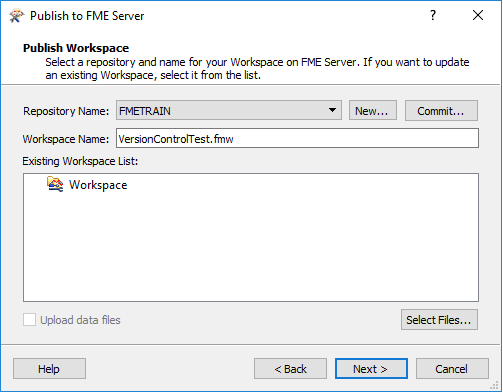](https://github.com/xuhengxx/FMETraining-1/tree/c60c1e291fd9e762b26517c54e4fd7ea9f748055/ServerAdmin5Customization/Images/5.217.Ex2.PublishtoFMEServer1.png)

单击“ **下一步** ”确保已使用“ **作业提交者Job Submitter** FME Server服务" 注册工作空间。单击“ **发布”**。

  
**6）在Web UI中查看版本历史记录**

  
通过Windows“开始”菜单上的“Web Interface”选项或直接在Web浏览器中打开FME Server Web界面，然后使用用户名和密码_admin_登录。

单击左侧菜单中的“ **存储库** ”。这将列出所有存储库。接下来，单击您在步骤5中创建的存储库**版本测试**旁边的复选框，然后单击“ **历史记录”**按钮。

[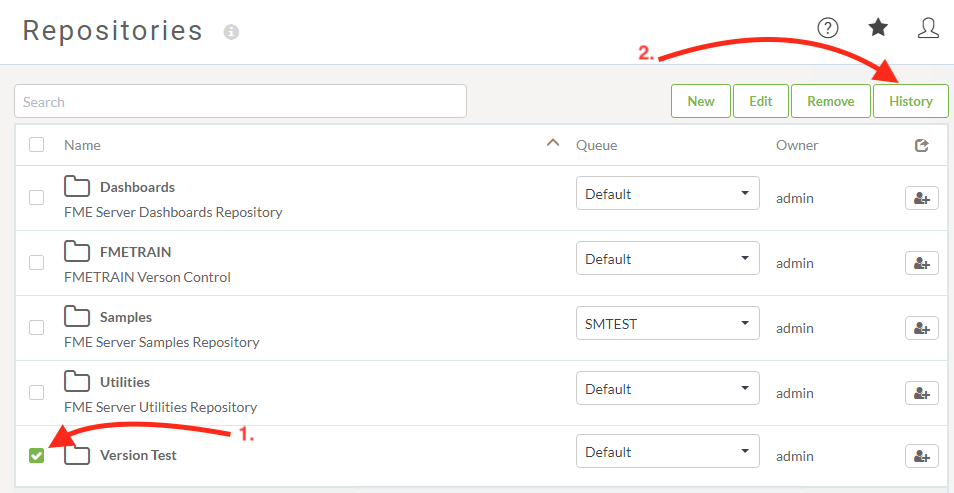](https://github.com/xuhengxx/FMETraining-1/tree/c60c1e291fd9e762b26517c54e4fd7ea9f748055/ServerAdmin5Customization/Images/5.218.Ex2.RespositoryVersion.png)

应显示以下对话框，显示此存储库的最新版本控制条目。

[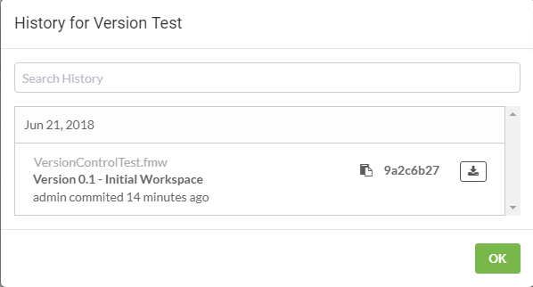](https://github.com/xuhengxx/FMETraining-1/tree/c60c1e291fd9e762b26517c54e4fd7ea9f748055/ServerAdmin5Customization/Images/5.219.Ex2.RespositoryVersionHistory.png)。

单击“ **确定”**关闭对话框。

  
**6）下载版本控制工作空间**

如果需要下载版本控制工作空间，并且要检索特定版本，则必须从Web UI执行此操作。FME Workbench无法通过下载向导选择版本控制工作空间。下载我们刚刚发布的工作空间版本0.1。

以_管理员_身份重新登录到FME Server ，在FME Server Web UI中，单击左侧菜单中的**Repositories**。这将列出所有存储库。接下来单击**Version Test**存储库。这将显示此存储库中的工作空间。您应该只看到名为_VersionControlTest.fmw的_工作空间。

让我们再次查看版本历史记录。单击工作空间旁边的复选框，然后单击“ **历史记录”**按钮。

[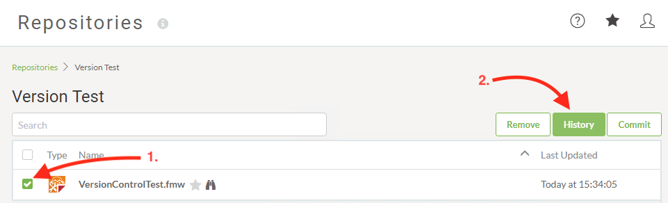](https://github.com/xuhengxx/FMETraining-1/tree/c60c1e291fd9e762b26517c54e4fd7ea9f748055/ServerAdmin5Customization/Images/5.220.Ex2.WorkspaceVersionHistory.png)

这将返回以下对话窗口列表中的可用版本。

[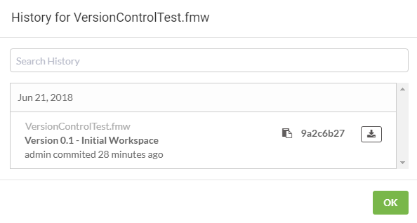](https://github.com/xuhengxx/FMETraining-1/tree/c60c1e291fd9e762b26517c54e4fd7ea9f748055/ServerAdmin5Customization/Images/5.221.Ex2.ViewWorkspaceVersions.png)

让我们下载这个工作空间并在FME Desktop中打开它。在下面的对话框中，单击您希望下载的工作空间旁边的“ _下载”_图标。在此示例中，_VersionControlTest.fmw＆Version 0.1 - Initial Workspace_。如果您选择了其他位置，请记住保存工作空间的位置，然后是默认位置。

[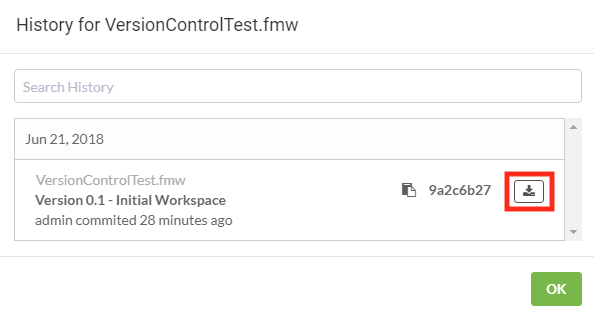](https://github.com/xuhengxx/FMETraining-1/tree/c60c1e291fd9e762b26517c54e4fd7ea9f748055/ServerAdmin5Customization/Images/5.222.Ex2.DownloadVersionWorksapce.png)

  
**7）编辑工作空间并重新发布相同的工作空间**

接下来，我们要对工作空间进行小编辑，然后将其重新发布到FME Server。然后，我们将访问Web UI并对工作区进行版本化，然后成功地测试它能正常工作。

打开我们在步骤6中下载的工作空间。默认下载位置为**C：\ Users \ Administrator \ Downloads**，并且工作空间应叫做_VersionControlTest.fmw_

在FME Workbench中打开工作空间后，将_Logger_添加到_Creator_转换器。

保存工作空间并运行工作空间。接下来，让我们将它发布到FME Server。

这次，**请勿**使用发布向导上的提交\( commit \)按钮。您将收到存储库中已存在工作空间的警告，这是正常的，因为我们已启用版本控制。单击"是"以_重写_工作空间。我们将在下一步中使用Web UI提交工作空间。

[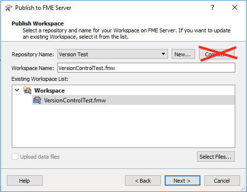](https://github.com/xuhengxx/FMETraining-1/tree/c60c1e291fd9e762b26517c54e4fd7ea9f748055/ServerAdmin5Customization/Images/5.224.Ex2.PublishtoFMEServer2.png)

**8）使用FME Server Web UI对Workspace进行版本控制**

我们已经发布了工作空间，我们的同事已确认工作空间运行。现在，我们将使用Web UI为工作空间创建新版本。

使用_admin_用户登录FME Server Web UI 。

再次查看工作空间的版本历史记录。单击左侧菜单中的_Repositories_并导航到**Version Test**存储库，最后单击存储库名称以查看内容。

应该有一个名为**VersionControlTest.fmw的**工作空间。

[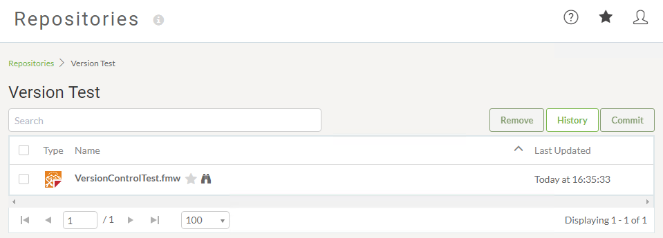](https://github.com/xuhengxx/FMETraining-1/tree/c60c1e291fd9e762b26517c54e4fd7ea9f748055/ServerAdmin5Customization/Images/5.225.Ex2.Workspace.png)

接下来，选择工作空间并单击Commit按钮。

这将打开“ _提交项（Commit Item）”_对话框。输入提交注释，然后单击“ **提交”**按钮。

[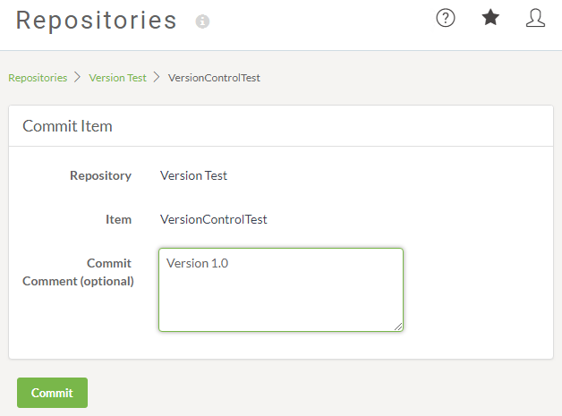](https://github.com/xuhengxx/FMETraining-1/tree/c60c1e291fd9e762b26517c54e4fd7ea9f748055/ServerAdmin5Customization/Images/5.226.Ex2.WebUIWorkspaceVersion.png)

您应该收到以下成功确认，即创建版本。

[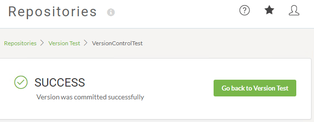](https://github.com/xuhengxx/FMETraining-1/tree/c60c1e291fd9e762b26517c54e4fd7ea9f748055/ServerAdmin5Customization/Images/5.227.Ex2.WebUIVersionSuccess.png)

（注意：如果您收到错误，可能是工作空间没有对其进行任何更改。从FME Workbench重新发布工作空间并确保编辑并保存在工作空间中。）

查看工作空间的版本历史记录，这次您应该看到列出的新版本。

[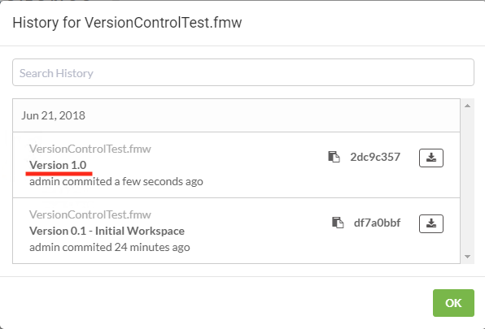](https://github.com/xuhengxx/FMETraining-1/tree/c60c1e291fd9e762b26517c54e4fd7ea9f748055/ServerAdmin5Customization/Images/5.228.Ex2.WorkspaceVersionHistory2.png)

您已成功启用并测试了FME Server的版本控制。

|  技巧 |
| :--- |
|  如果自上次提交后工作空间没有任何更改，您将收到通知。 这确认了工作空间的版本已存在。  [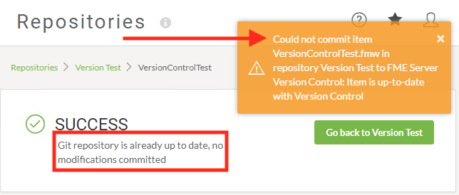](https://github.com/xuhengxx/FMETraining-1/tree/c60c1e291fd9e762b26517c54e4fd7ea9f748055/ServerAdmin5Customization/Images/5.229.Ex2.WebUI_VersionNoChanges.png)   |

<table>
  <thead>
    <tr>
      <th style="text-align:left">恭喜！</th>
    </tr>
  </thead>
  <tbody>
    <tr>
      <td style="text-align:left">
        
通过完成本练习，您已学会如何：
           
        

        <ul>
          <li>启用版本控制</li>
          <li>来自FME Workbench的测试版本控制</li>
          <li>下载一个版本控制的工作空间</li>
          <li>在FME Server的Web UI中对工作空间进行了版本控制</li>
          <li>查看了版本控制的工作空间的历史记录</li>
        </ul>
      </td>
    </tr>
  </tbody>
</table>