# 练习：温哥华社区测绘项目

|  练习 |  PowerPoint写模块 |
| :--- | :--- |
| 数据 | 图书馆（Esri地理数据库） 陆地边界（Esri Shapefile） |
| 总体的目标 | 创建一个PowerPoint演示文稿，显示温哥华市的各种感兴趣的项目 |
| 演示 | 与微软相关的转换器和格式 |
| 启动工作空间 | 无 |
| 结束工作空间 | C:\FMEData2018\Workspaces\UpgradingTo2018\Microsoft-Ex1-Complete.fmw |

作为社区测绘会议的一部分，您被要求提供有关温哥华市社区不同方面的演讲。您意识到这是一个很好的机会，既可以执行任务，也可以展示FME对此类项目的潜力。

我们将通过创建关于图书馆的幻灯片来开始这项任务。由于我们之前没有使用过这种格式或转换器，这将是一次共同的探索之旅！

_**注意：**_ _如果您的计算机上没有PowerPoint查看器，那么您可以在_[_onlinedocumentviewer.com_](http://onlinedocumentviewer.com/)_等网站上在线查看文件_

  
**1）启动Workbench**  
启动FME Workbench。生成工作空间如下：

| 读模块格式 | Esri地理数据库（File Geodb Open API） |
| :--- | :--- |
| 读模块数据集 | C：\ FMEData2018 \ DATA \ CommunityMapping \ CommunityMap.gdb |
| 读模块参数 | **表格单：**图书馆 |
| 写模块格式 | Microsoft PowerPoint |
| 写模块数据集 | C:\FMEData2018\Output\Training\VancouverCommunity.pptx |
| 写模块参数 | **模板：** C:\FMEData2018\Resources\DesktopBasic\VancouverTemplate.pptx |

  
**2）添加PowerPointStyler转换器**  
如果我们现在运行转换，我们将不会在输出中获得任何幻灯片。这是因为所有要素都需要首先为PowerPoint写模块进行样式化。因此，在读模块和写模块要素类型之间添加一个PowerPointStyler转换器。

检查转换器参数。设置：

* **幻灯片类型：**地图幻灯片
* **幻灯片子类型：**带说明的地图
* **标题：**温哥华图书馆
* **文字说明：**温哥华图书馆地图

[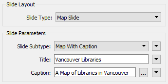](https://github.com/safesoftware/FMETraining/blob/Desktop-Upgrade-To-2018/2018Upgrade5Microsoft/Images/Img5.200.PPSParameters1.png)

接下来，设置标签参数以使用图书馆名称标记每个对象。使用您选择的字体和颜色，并确保将Wrap Label Text设置为No：

[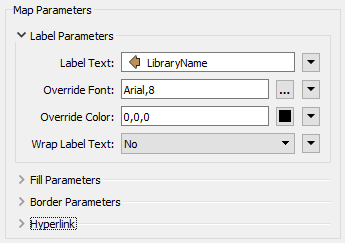](https://github.com/safesoftware/FMETraining/blob/Desktop-Upgrade-To-2018/2018Upgrade5Microsoft/Images/Img5.201.PPSParameters2.png)

单击“确定”关闭对话框并接受更改。

|  技巧 |
| :--- |
|  PowerPointStyler还有一个Hyperlink参数。如果您愿意，可以将Hyperlink参数设置为指向属性LibraryURL。这样，所有输出要素都将在PowerPoint文件中包含超链接。 |

  
**3）添加2DEllipseReplacer转换器**  
在PowerPoint幻灯片中，点要素不会很好地显示，所以让我们把图书馆变成更大的东西。

在PowerPointStyler之前添加2DEllipseReplacer转换器。将其设置为创建大小为200x200的椭圆：

[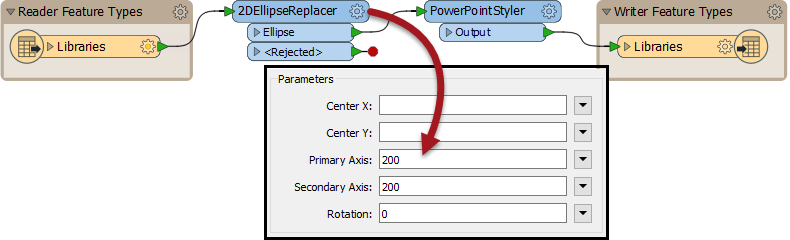](https://github.com/safesoftware/FMETraining/blob/Desktop-Upgrade-To-2018/2018Upgrade5Microsoft/Images/Img5.202.2DERParameters.png)

接受更改，启用要素缓存（如果尚未启用）并运行工作空间。结果将是一系列幻灯片，每个幻灯片都有一个图书馆：

[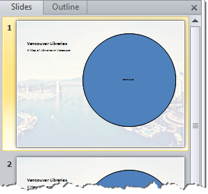](https://github.com/safesoftware/FMETraining/blob/Desktop-Upgrade-To-2018/2018Upgrade5Microsoft/Images/Img5.203.2DEROutput.png)

我们更喜欢所有图书馆的单张幻灯片，所以我们必须改变它。

  
**4）添加AttributeCreator 转换器**  
 PowerPointStyler转换器具有对对象进行分组的选项，但我们需要一个属性来对它们进行分组。因此，在2DEllipseCreator和PowerPointStyler之间放置一个AttributeCreator转换器（重要的是它可以在此处执行以后的步骤）。

使用转换器创建一个具有固定值（例如1）的属性（称为组）。

现在再次检查PowerPointStyler参数。在对话框底部附近的“要素处理”下，将“创建幻灯片”设置为“多个要素”，并将“幻灯片组ID”设置为“ _组”_属性：

[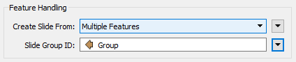](https://github.com/safesoftware/FMETraining/blob/Desktop-Upgrade-To-2018/2018Upgrade5Microsoft/Images/Img5.204.PPSParameters3.png)

现在重新运行工作空间。输出应该是包含所有图书馆的单个幻灯片：

[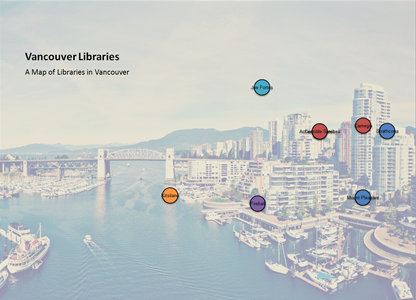](https://github.com/safesoftware/FMETraining/blob/Desktop-Upgrade-To-2018/2018Upgrade5Microsoft/Images/Img5.205.AttrCreatorOutput.png)

  
**5）添加Shapefile读模块**  
地图是正确的，但它确实需要图书馆要素的背景。我们将使用温哥华陆地边界的数据集创建它。因此，从菜单栏中选择读模块&gt; 添加读模块 并添加以下内容：

| 读模块格式 | Esri Shapefile |
| :--- | :--- |
| 读模块数据集 | C:\FMEData2018\Data\Boundaries\LandBoundary\VancouverLandBoundary.shp |

将新添加的要素类型连接到AttributeCreator输入端口：

[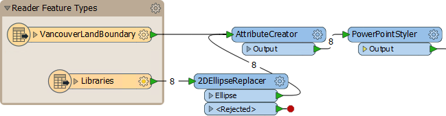](https://github.com/safesoftware/FMETraining/blob/Desktop-Upgrade-To-2018/2018Upgrade5Microsoft/Images/Img5.206.ShapefileOnCanvas.png)

我们将它连接到AttributeCreator端口，以便它获得相同的属性值，并显示在与图书馆要素相同的幻灯片上。

|  技巧 |
| :--- |
|  如果（在步骤4中）您想要使用现有属性而不是创建新属性，这就是我们没有这样做的原因。我们想要一些适用于多个数据集的东西。 这也是为什么将AttributeCreator放在2DEllipseReplacer之后很重要的原因，因为我们不想将其他数据也变成省略号，只是图书馆。 |

  
**6）添加Sorter**  
如果我们现在运行工作空间，你会看到一切并不好。陆地边界要素覆盖了图书馆。为了处理这个问题，我们必须按照图书馆首先到达的顺序对数据进行排序。我们可以使用Sorter转换器。

我们还可以为每种数据类型创建属性，但我们将通过重用格式属性_fme\_feature\_type来_避免这种_情况_。

因此，打开要素类型的参数对话框（无关紧要），单击“格式属性”选项卡，然后对_fme\_feature\_type_进行复选标记：

[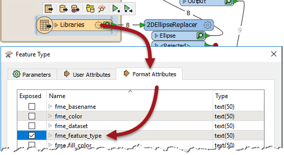](https://github.com/safesoftware/FMETraining/blob/Desktop-Upgrade-To-2018/2018Upgrade5Microsoft/Images/Img5.207.ExposeFFT.png)

单击“确定”关闭此选项，然后将Sorter放入PowerPointStyler之前的工作空间中。将其设置为按fme\_feature\_type，字母，降序排序：

[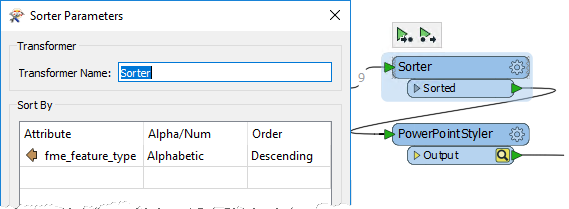](https://github.com/safesoftware/FMETraining/blob/Desktop-Upgrade-To-2018/2018Upgrade5Microsoft/Images/Img5.208.Sorter.png)

现在，当工作空间运行时，我们应该在城市边界之上获得图书馆要素。

  
**7）添加FeatureColorSetter**  
现在可以看到地图，但如果我们能够为每个图书馆对象获得标准颜色会更好。我们可以在PowerPointStyler中设置颜色，但这会导致所有要素颜色相同，包括城市边界。

因此，在Sorter转换器之前放置一个FeatureColorSetter转换器。打开其参数并将其设置为创建随机着色，但基于属性_fme\_feature\_type_：

[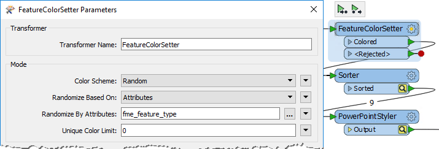](https://github.com/safesoftware/FMETraining/blob/Desktop-Upgrade-To-2018/2018Upgrade5Microsoft/Images/Img5.209.FeatureColorSetter.png)

这意味着每种不同的要素类型都将获得自己的颜色。在PowerPointStyler转换器中找到Foreground Fill Color参数并将其设置为_fme\_fill\_color_：

[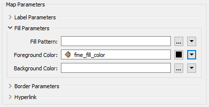](https://github.com/safesoftware/FMETraining/blob/Desktop-Upgrade-To-2018/2018Upgrade5Microsoft/Images/Img5.210.PPSParameters4.png)

|  技巧 |
| :--- |
|  这种技术就像创建一个带颜色的分组。它也是一种很好的技术，可用于ExcelStyler转换器，您可以在其中为每行创建不同的颜色，但基于属性值。 |

  
**8）添加标题幻灯片**  
最后一件事：我们真的需要一个标题幻灯片用于演示。这很容易实现。将Creator放在画布上，将其连接到第二个PowerPointStyler，并将其连接到输出：

[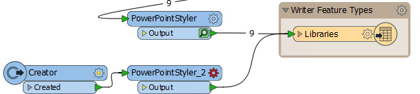](https://github.com/safesoftware/FMETraining/blob/Desktop-Upgrade-To-2018/2018Upgrade5Microsoft/Images/Img5.211.PPS2OnCanvas.png)

打开第二个PowerPointStyler的参数对话框。设置如下：

* **幻灯片类型：**标题幻灯片
* **标题：**温哥华社区
* **副标题：**一系列FME生成的地图和图表
* **滑动顺序：** 1

幻灯片顺序参数很重要，因为我们希望这是演示文稿中的第一张幻灯片。是的，我们可以依靠首先编写的这个要素，但这很难控制。同时访问第一个PowerPointStyler转换器并将其幻灯片顺序设置为2，以确保它在演示文稿中位居第二。

重新运行工作空间并检查输出。您现在应该有两张幻灯片（一张标题幻灯片，一张用于图书馆），所有幻灯片和要素的顺序正确，每个“图层”具有唯一的颜色：

[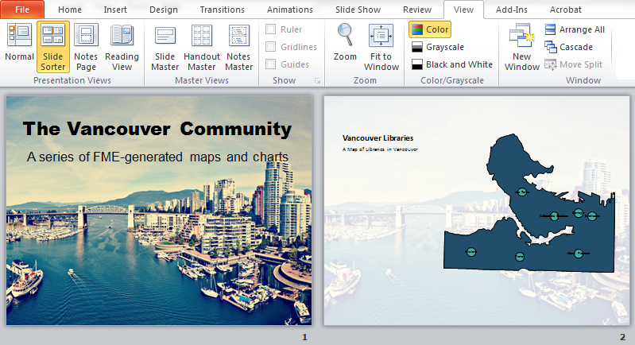](https://github.com/safesoftware/FMETraining/blob/Desktop-Upgrade-To-2018/2018Upgrade5Microsoft/Images/Img5.212.FinalOutput.png)

这为您在温哥华社区的演讲奠定了良好的基础！您甚至可以开始尝试使用BookCount和Circulation属性作为2DEllipseReplacer中要素的大小来创建一个主题地图。

<table>
  <thead>
    <tr>
      <th style="text-align:left">恭喜</th>
    </tr>
  </thead>
  <tbody>
    <tr>
      <td style="text-align:left">
        
通过完成本练习，您已学会如何：
           
        

        <ul>
          <li>使用PowerPointStyler创建地图</li>
          <li>使用2DEllipseReplacer将点要素替换为椭圆</li>
          <li>为每张PowerPoint幻灯片创建多个要素的幻灯片组</li>
          <li>将要素排序为正确的顺序，以便在幻灯片上进行可视化</li>
          <li>在随机分组的基础上设置要素颜色</li>
          <li>在演示文稿中将幻灯片排序为正确的顺序</li>
        </ul>
      </td>
    </tr>
  </tbody>
</table>