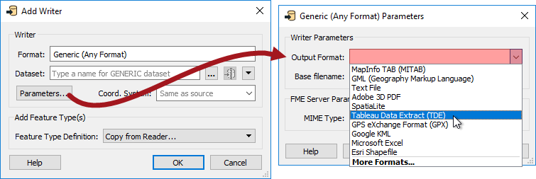
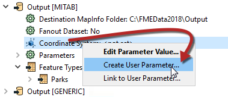
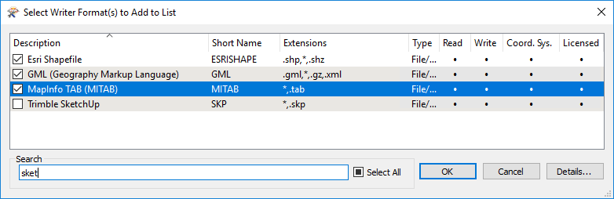
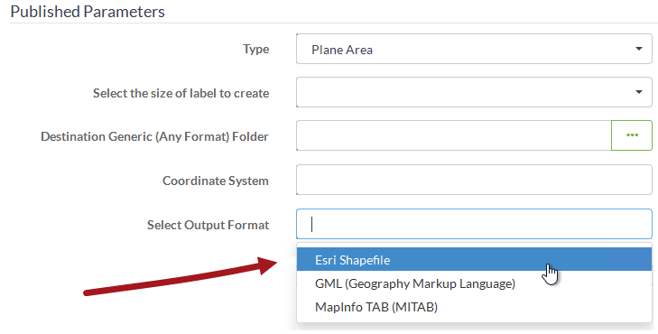

# 格式和坐标系选择

自助服务系统允许最终用户以他们选择的模式下载数据。该模式包括数据格式和坐标系。

## 格式选择

要在运行时控制格式，需要在FME中使用通用读模块/写模块。Writer有一个参数来控制正在写入的数据格式。

例如，在这里，通用写模块被设置为以Tableau数据提取格式写入数据。但是，如果工作空间的作者发布此参数，则用户可以在运行时选择自己的输出格式：

使用写模块时要记住的一点是每个写模块格式都有自己的特定参数，当使用通用写模块时，可能仍需要设置这些参数。这可以通过添加相同格式的写模块并在该写模块中设置参数来实现。即使没有连接任何要素，通用写模块也将继承此虚拟写模块的参数。

## 坐标系选择

无论格式如何，FME中的每个写模块都有一个可以发布的坐标系参数：

这允许最终用户在他们选择的坐标系中接收数据：

或者，可以使用转换器（例如CsmapReprojector），在这种情况下，可以在“导航器”窗口的“转换器”部分下找到相关参数。使用转换器的明显优势在于您可以控制其他重投影因子，例如地理转换和网格高度。

## 对格式/坐标系使用“别名选择”

上面的屏幕截图显示，虽然发布了格式和坐标系，但它们是FME Server Web界面中的纯文本字段。这将迫使最终用户手动输入值。

更好的解决方案是使用“别名选择”参数。它不仅显示为FME Server Web界面中的选项框，而且还显示用户的别名（因此它们以Esri Shapefile显示为格式名称而不是SHAPE）。

另一个好处是作者可以将格式列表（或坐标系统）减少到一组合理的选择，而不是FME支持的格式（或坐标系统）的完整列表。

操作的顺序是这样的：

* 使用“添加参数”在Workbench中创建新的用户参数。选择类型为选择别名，填写其他字段，然后单击配置按钮：

* 为格式或坐标系创建带有别名参数的选项时，无需手动输入显示名称和值。而是选择导入选项以从列表中选择所需的格式（或坐标系）：

* 然后，像这位作者一样，搜索并选择所选的格式（或坐标系）：

* 最后，您必须将新定义的“别名选择”参数加入到FME导航器中的适当参数中:

这些选择将成为参数定义的一部分，并允许用户从FME Server Web界面中选择所选格式：

请注意列表将如何仅显示四种选定格式，并将传递名称的简短形式，这正是FME所期望的。

|  Vector小姐说...... |
| :--- |
|  让我向你提一个简单的问题！如果发布通用写模块参数是为了确定在数据下载系统中写入数据的格式，那么通用读模块参数将用于什么用途？    [1.确定要在数据下载系统中读取的数据格式](http://52.73.3.37/fmedatastreaming/Manual/QAResponse2017.fmw?chapter=22&question=5&answer=1&DestDataset_TEXTLINE=C%3A%5CFMEOutput%5CQAResponse.html)  [2.确定要在数据上传系统中读取的数据格式](http://52.73.3.37/fmedatastreaming/Manual/QAResponse2017.fmw?chapter=22&question=5&answer=2&DestDataset_TEXTLINE=C%3A%5CFMEOutput%5CQAResponse.html)  [3.确定要在工作空间中使用的正确的样式转换器](http://52.73.3.37/fmedatastreaming/Manual/QAResponse2017.fmw?chapter=22&question=5&answer=3&DestDataset_TEXTLINE=C%3A%5CFMEOutput%5CQAResponse.html)  [4.确定我连接的是数据上传系统还是数据下载系统](http://52.73.3.37/fmedatastreaming/Manual/QAResponse2017.fmw?chapter=22&question=5&answer=4&DestDataset_TEXTLINE=C%3A%5CFMEOutput%5CQAResponse.html) |

