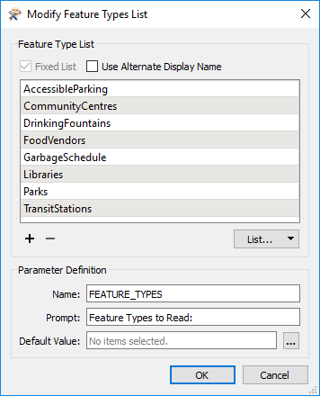
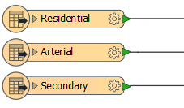

# 图层选择和处理

空间数据通常按层（组，类，类别，要素类型）进行组织，用户希望在自助服务系统中选择数据的常用方式是基于层。

在FME中，可以通过_要读取_的_要素类型_参数实现要素类型（层）灵活性。

## 选择层

FME中的每个读模块都有一个名为要读取的要素类型的参数。此参数用于告知FME应在转换中使用工作空间中的哪些要素类型。

这里的读模块包含八种要素类型。“要读取的要素类型”参数已设置为仅读取其中三个（“图书馆”，“公园”，“公交站”）。

该参数可以由工作空间作者设置，但在大多数情况下，它是已发布的，以便最终用户可以选择要读取的层列表。

## 发布要读取的要素类型

选择将要素类型发布到读取参数会产生与任何其他参数定义明显不同的对话框：

此对话框是参数的预定义配置。这是可能的，因为FME已经知道工作空间中存在哪些要素类型，而对于坐标系参数，它不知道作者希望允许哪些坐标系。

如果作者希望使用别名定义参数，则使用“备用显示名称”复选框可以执行此操作。

|  技巧 |
| :--- |
|  默认情况下，要读取的要素类型列表最初由工作空间中的要素类型设置，但如果更改，则会自动更新。例如，如果从工作空间中删除了图书馆要素类型，那么它也将从此参数中删除。  因此列表固定为工作空间中显示的内容。  但是，如果任何读模块要素类型具有合并过滤设置，那么列表就不再是固定的了。它将显示源数据集中的所有要素类型，无论它们是否存在于工作空间中！ |

## 分组层

有时，最好为代表多种要素类型的用户提供单一选择。例如，在此工作空间中：

......作者可能认为提供一个名为“道路”的选项就足够了 - 它包含所有三种读模块要素类型 - 而不是“住宅”，“主干”和“次级”作为单独的实体。如果用户选择读取“Roads”，则读取所有三种要素类型。

执行此操作的方法是使用“备用显示名称”选项，并为“显示名称”输入相同的值：

这样，向用户呈现组而不是单个层：

|  空间FME教授，ETL说...... |
| :--- |
|  由于作者和用户之间的观点不同，此要素很有用。作者询问应该读取哪些层。但是用户正在回答一个不同的问题：他们告诉我们他们想要写入哪些层。  上面的例子说明了这种情况。用户认为他们选择编写一个名为Roads的层，而实际上他们正在选择读取名为Residential，Arterial和Secondary的三种要素类型。 |

