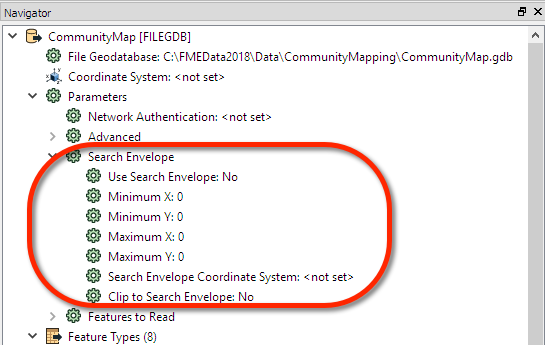
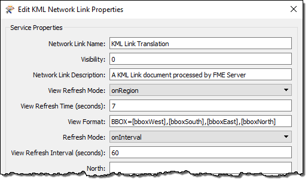

# 按边界框的地理选择

**边界框** - 也被称为**搜索矩形框** - 只是一个定义地理区域的矩形区域。在FME中，可以通过多种方式定义边界框，但最简单的方法是使用一组参数。

所有FME读模块都有参数来定义正在读取的数据的边界框（矩形框）：

参数不仅包括边界框的坐标，还包括用于定义坐标系的参数。边界框的坐标系不必与存储数据的坐标系相同，这意味着返回纬度/经度坐标的工具可用于剪切存储在UTM中的数据（对于移动FME Server解决方案非常有用） 。

还有一个参数指定是否将要素剪辑到精确的矩形框边界。如果设置为“否”，则与边界重叠的要素将包含在其完整（未剪辑）形式中。对于数据下载服务，此参数更有可能设置为“是”。

工作空间作者可以手动设置这些参数，但通过发布它们，最终用户可以输入定义他/她感兴趣的数据范围的值。

|  分析师女士说… |
| :--- |
|  使用读模块参数是选择感兴趣区域的最有效方法，因为它可能意味着FME不必先读取整个数据集，然后将其剪切为大小; 它只能读取必要的数据。它适用于矢量和栅格数据集，如果源格式具有空间索引，则特别有效。 |

## Web制图和边界框

当Web地图应用程序（例如Google Earth）请求数据时，边界框参数特别有用。应用程序将提供当前地图视图的范围，工作空间将自身限制为读取这些范围内的要素。

当然，这是使用已发布的参数完成的。发布时，工作空间中的参数需要具有特定名称，如下所示：

* bboxWest
* bboxEast
* bboxNorth
* bboxSouth

KML网络链接服务将自动使用这些参数。实际上，如果单击“KML网络链接”属性的“编辑”按钮（在“发布到FME Server”向导中），您将注意到这些用于将信息传递回工作空间的方式：

