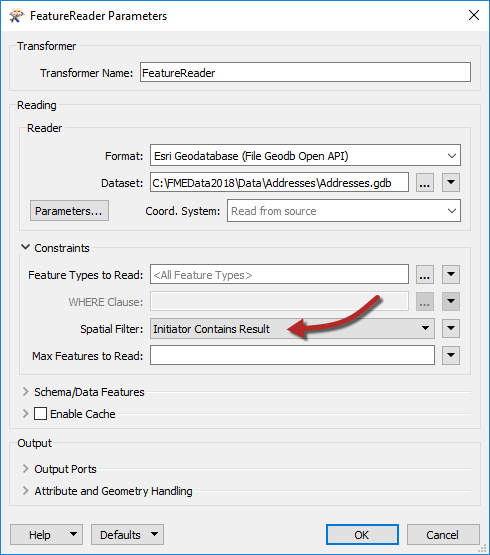
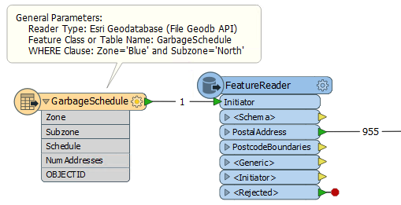
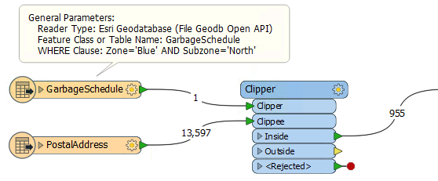

# 按现有区域的地理选择

**现有的边界**，是指非矩形地理区域的周长;例如区域边界，人口普查区域或类似区域。在FME中，这些由现有的多边形要素表示。

任何多边形要素都可以读入工作空间，但其周长不能用于剪切通过_读模块_读入工作空间的要素。但是，它可用于通过_转换器_剪切正在读入工作空间的要素。

因此，不使用读模块及其参数，而是使用现有边界来通过FeatureReader转换器或Clipper转换器来剪切数据。

## 选择现有区域

如果现有区域要素是数据集中的单个要素，则可以将其读入工作空间并立即使用。

但是，如果它是较大数据集的一部分，则需要从其余数据中过滤掉它。如果读模块有一个where子句（并且可以通过这种方式识别该要素），那么它是过滤数据的最有效方式：

此处使用WHERE子句将地理数据库中的数据过滤为所需的要素。连接上的要素计数仅显示传递的单个要素。

如果读模块没有WHERE子句参数，则可以读取完整数据集，并使用转换器（如Tester或TestFilter）过滤掉所需的要素：

但是，这种技术效率不高，因为 - 在上面的例子中 - 需要读取所有六个要素而不是一个。

## FeatureReader

要使用FeatureReader按现有区域过滤数据，将多边形要素路由到FeatureReader Initiator端口。

这里将单个垃圾计划区域（Blue zone，north）传递给FeatureReader以用作过滤器。我们的想法是只返回属于垃圾收集区的地址。参数设置如下：

请注意，FeatureReader设置为从地址地理数据库中读取。空间过滤器参数告诉转换器仅读取传入多边形要素（垃圾收集区域）内的要素（地址）。

这些要素通过动态添加到FeatureReader的端口输出：

此处的要素计数表明垃圾收集区内有955个地址。如果您注意到GarbageSchedule已经具有NumAddresses属性，是的，它是相同的值！

## Clipper

Clipper转换器是一种对已经读入工作空间的数据进行空间过滤的方法（其他类似的转换器是PointOnAreaOverlayer或SpatialFilter）。

这里将地址数据库读入工作空间，Clipper用于过滤掉属于所选垃圾收集区域的那些地址：

|  Vector女士说...... |
| :--- |
|  在上面的例子中，Clipper和FeatureReader的结果完全相同。那么为什么FeatureReader成为首选？选择适用的所有原因：     [1.它可以更快，更节省资源](http://52.73.3.37/fmedatastreaming/Manual/QAResponse2017.fmw?chapter=23&question=1&answer=1&DestDataset_TEXTLINE=C%3A%5CFMEOutput%5CQAResponse.html)   [2.它允许多个区域用作现有区域](http://52.73.3.37/fmedatastreaming/Manual/QAResponse2017.fmw?chapter=23&question=1&answer=2&DestDataset_TEXTLINE=C%3A%5CFMEOutput%5CQAResponse.html)   [3.它适用于栅格数据](http://52.73.3.37/fmedatastreaming/Manual/QAResponse2017.fmw?chapter=23&question=1&answer=3&DestDataset_TEXTLINE=C%3A%5CFMEOutput%5CQAResponse.html)   [4.它有更多的空间过滤选择](http://52.73.3.37/fmedatastreaming/Manual/QAResponse2017.fmw?chapter=23&question=1&answer=4&DestDataset_TEXTLINE=C%3A%5CFMEOutput%5CQAResponse.html) |

