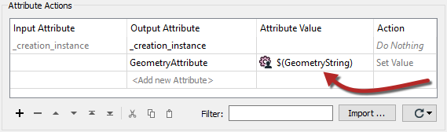
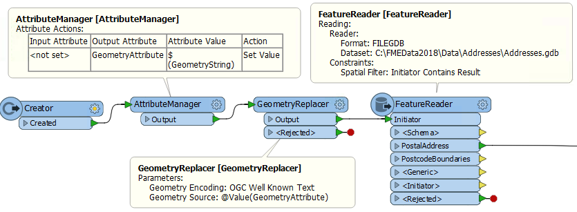

# 临时边界

**临时边界** 我们指的是数据下载的地理区域不是先前已知的形状。有时它只是由用户在Web地图上根据需要定义的。

在这种情况下，您的FME工作空间需要一种不同的技术，一种涉及已发布参数的技术。

## 将临时边界传递给FME

将区域边界传递给FME的方法是将几何定义为字符串。例如，几何可以是WKT（众所周知的文本）或XML。使用已发布的参数将字符串传递给FME。

一种简单的方法是使用AttributeManager转换器并发布Value部分：

这些信息可以按照这样的顺序使用; 使用Creator触发转换，使用AttributeManager检索几何字符串，使用GeometryReplacer将属性内容转换为真实几何图形，然后使用FeatureReader读取实际数据：

使用这些方法，一个允许用户定义他们自己感兴趣的自定义区域的web地图界面，可以将其传递到FME工作空间以用作Clipper或FeatureReader中的感兴趣区域。

|  Vector女士说... |
| :--- |
|  如果传入的几何字符串是XML，则上面的示例有一个快捷方式。它是什么？      [1.使用已 发布源数据集参数的XML读模块](http://52.73.3.37/fmedatastreaming/Manual/QAResponse2017.fmw?chapter=23&question=2&answer=1&DestDataset_TEXTLINE=C%3A%5CFMEOutput%5CQAResponse.html)   [2.在FeatureReader中发布源数据集参数以将XML直接发送到其中](http://52.73.3.37/fmedatastreaming/Manual/QAResponse2017.fmw?chapter=23&question=2&answer=2&DestDataset_TEXTLINE=C%3A%5CFMEOutput%5CQAResponse.html)   [3.使用XMLTemplater替换GeometryReplacer](http://52.73.3.37/fmedatastreaming/Manual/QAResponse2017.fmw?chapter=23&question=2&answer=3&DestDataset_TEXTLINE=C%3A%5CFMEOutput%5CQAResponse.html)  [4.使用发布了几何参数的Creator转换器](http://52.73.3.37/fmedatastreaming/Manual/QAResponse2017.fmw?chapter=23&question=2&answer=4&DestDataset_TEXTLINE=C%3A%5CFMEOutput%5CQAResponse.html) |

