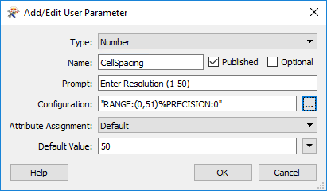
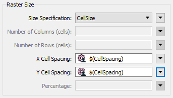
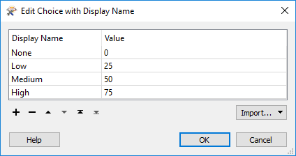
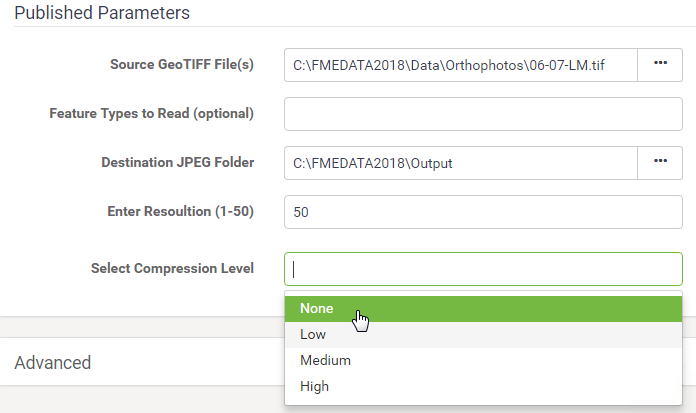

|  练习5.1 |  数据下载系统：已发布的参数 |
| :--- | :--- |
| 数据 | 正射影像（GeoTIFF） |
| 总体的目标 | 为正射影像创建FME Server数据下载系统 |
| 演示 | 在数据下载中为用户控制创建已发布的参数 |
| 启动工作空间 | C:\FMEData2018\Workspaces\ServerAuthoring\SelfServe2-Ex1-Begin.fmw |
| 结束工作空间 | C:\FMEData2018\Workspaces\ServerAuthoring\SelfServe2-Ex1-Complete.fmw |

作为一个城市GIS部门的技术分析师，您刚开始采取措施允许其他部门下载正射影像数据，而不是要求您为他们创建正射影像数据。他们的请求不仅会得到更快的处理，而且您还可以花更少的时间完成这项任务。

到目前为止，您已经创建了一个简单的工作空间来将正射影像转换为JPEG格式，并将其发布到FME Server上的数据下载服务。

现在，您需要开始自定义工作空间，以允许最终用户对输出进行一定程度的控制。

  
**1）打开工作空间**  
打开上面列出的起始工作空间。你可以看到它由一个读模块，一个写模块和两个转换器组成。

在此步骤中，我们将让最终用户控制转换阶段。

  
**2）创建用户参数**  
如果查看RasterResampler转换器的参数，您将看到X单元间距和Y单元间距的参数。我们应该让最终用户选择他们想要的间距。

因此，在FME Workbench的导航器窗口中，找到标记为“用户参数”的部分。右键单击那里并选择“创建用户参数”选项：

打开的对话框允许我们创建一个新参数。使用以下参数创建一个：

| 类型 | 数字 |
| :--- | :--- |
| 名称 | CELLSPACING |
| 发布的 | 是 |
| 可选的 | 没有 |
| 提示 | 输入分辨率（1-50） |
| 配置 | 下限：大于值：0 上限：小于值：51 小数位数精度：0 |
| 默认值 | 50 |

单击“确定”关闭对话框。

  
**3）应用用户参数**  
目前我们已经创建了一个用户参数，但没有将其应用到任何地方。

检查RasterResampler转换器的参数。单击X Cell Spacing参数右侧的下拉箭头，然后选择User Parameter&gt; CellSpacing。

对Y Cell Spacing参数执行相同操作。该对话框现在看起来像这样：

请注意，我们对X和Y单元格大小使用相同的值。没关系。虽然我们可以使用矩形（椭圆形）栅格单元，但在本练习中我们将使用正方形。

  
**4）创建用户参数**  
我们可以给用户控制的另一个设置是文件压缩。这不是在转换器中定义的，而是在写模块要素类型中定义的。但是，我们仍然可以以相同的方式创建已发布的参数。

因此，在“导航”窗口中右键单击“用户参数”，然后再次选择“添加参数”。

这次我们会做一点点不同的事情。压缩可以是从零到一百的值，但我们将为用户提供“无”，“低”，“中”和“高”选项。

因此，使用以下内容创建参数：

| 类型 | 别名选择 |
| :--- | :--- |
| 名称 | 压缩 |
| 发布的 | 是 |
| 可选的 | 无 |
| 提示 | 选择压缩级别 |

对于配置字段，单击\[...\]浏览按钮。在打开的对话框中，设置以下内容：

| 显示名称 | 值 |
| :--- | :--- |
| 无 | 0 |
| 低 | 25 |
| 中 | 50 |
| 高 | 75 |

单击“确定”，再次单击“确定”关闭这些对话框并创建参数。

  
**5）应用用户参数**  
要应用参数，请检查JPEG要素类型的参数。展开“压缩”参数（如有必要），并将“压缩级别”参数设置为“用户参数”&gt;“压缩”。

单击“确定”关闭对话框。如果您现在按下运行按钮 - 设置了提示选项 - 您将看到现在有两个新的单元格大小和压缩提示。

  
**6）发布和运行工作空间**  
现在将工作空间发布到FME Server。将其发布到Training存储库，然后将其注册到数据下载服务。

通过FME Server Web界面找到工作空间并运行它。这次，系统将提示您设置单元格大小和压缩。

运行工作空间几次，改变单元大小和压缩，以确认参数是否有效。输出文件的大小可以很好地指示进程是否正常工作。

<table>
  <thead>
    <tr>
      <th style="text-align:left">恭喜</th>
    </tr>
  </thead>
  <tbody>
    <tr>
      <td style="text-align:left">
        
通过完成本练习，您已学会如何：
           
        

        <ul>
          <li>创建一个整数用户参数并将其应用于两个转换器参数</li>
          <li>创建一个“选择”用户参数并将其应用于写模块要素类型参数</li>
          <li>发布工作空间并使用已发布的参数</li>
        </ul>
      </td>
    </tr>
  </tbody>
</table>
