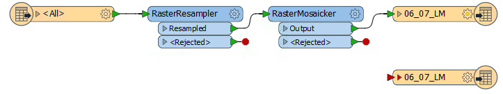
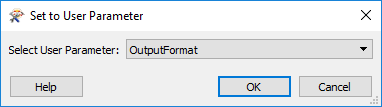
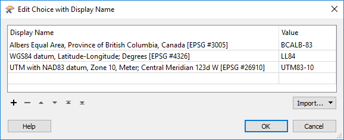
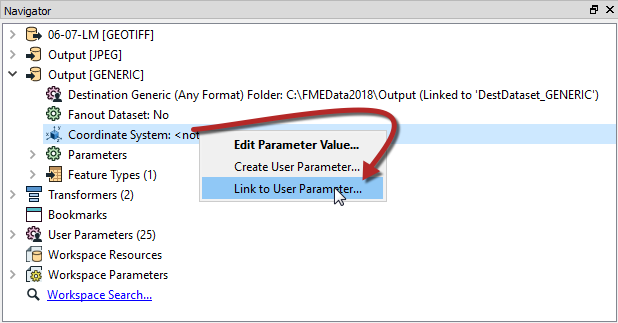

# 练习5.2：数据下载系统：格式和坐标系

|  练习2 |  数据下载系统：格式和坐标系 |
| :--- | :--- |
| 数据 | 正射影像（GeoTIFF） |
| 总体的目标 | 为正射影像创建FME Server数据下载系统 |
| 演示 | 控制数据下载中的输出格式和坐标系 |
| 启动工作空间 | C:\FMEData2018\Workspaces\ServerAuthoring\SelfServe2-Ex2-Begin.fmw |
| 结束工作空间 | C:\FMEData2018\Workspaces\ServerAuthoring\SelfServe2-Ex2-Complete.fmw |

作为一个城市GIS部门的技术分析师，您刚开始采取措施允许其他部门下载正射影像数据，而不是要求您为他们创建正射影像数据。他们的请求不仅会得到更快的处理，而且您还可以花更少的时间完成这项任务。

到目前为止，您已创建了一个简单的工作空间，用于将正射影像转换为JPEG格式，添加已发布的转换参数，并将其发布到FME Server上的数据下载服务。

现在，您需要让最终用户控制输出格式和输出坐标系。

  
**1）打开工作空间**  
从练习1或上面列出的开始工作空间打开工作空间。您可以看到它包含一个读模块，一个写模块和两个转换器，以及一些已发布的参数。

在这一步中，我们将让最终用户控制格式和坐标系。

  
**2）添加写模块**  
要控制格式，您需要一个通用格式写模块。从菜单栏中选择Writers&gt; Add Writer。出现提示时输入以下参数：

| 写模块格式 | 通用（任何格式） |
| :--- | :--- |
| 写模块数据集 | C:\FMEData2018\Output |
| 写模块参数 | 输出格式：JPEG MIME类型：image / jpeg |
| 添加要素类型 | 从读模块复制 |

MIME类型设置不适用于数据下载服务，但无论如何我们都会设置它。不会有什么损害。您的工作空间现在看起来像这样：

未连接的要素类型属于通用写模块（Generic Writer）。

  
**3）切换要素类型**  
我们要写入通用写模块而不是JPEG写模块，因此将连接从JPEG要素类型切换到通用要素类型。它们都标有相同的名称，因此请务必检查其属性以检查是否需要。你也可以\(应该?\)给它们添加注释，把它们区分开来。

请勿删除JPEG写模块或其要素类型。我们需要这些，理由稍后解释。

  
**4）创建用户参数**  
要控制格式，需要发布参数。因此，在FME Workbench的导航窗口中，找到标记为用户参数的部分。右键单击那里并选择“创建用户参数”选项。

设置参数值如下：

| 类型 | 别名选择 |
| :--- | :--- |
| 名称 | OutputFormat |
| 发布的 | 是 |
| 可选的 | 没有 |
| 提示 | 选择输出格式 |

对于配置字段，单击\[...\]浏览按钮。在打开的对话框中，单击“导入”&gt;“写模块格式”：

这将打开FME支持的格式列表。选择一些简单的栅格格式，如JPEG，PNG和GeoTIFF。单击“确定”关闭对话框并返回上一个对话框：

|  警告 |
| :--- |
|  请务必使用名为PNGRASTER的PNG格式。不要选择称为PNG Rasterizer（PNG）的格式，因为它用于栅格化矢量数据，而不是写入栅格数据。 |

单击“确定”，再次单击“确定”关闭这些对话框并创建参数。

  
**5）应用用户参数**  
现在我们已经创建了一个用户参数，我们必须应用它。

在Navigator窗口中找到Generic Writer，展开其参数并找到名为Output Format的参数。这已经链接到了FME自动创建的已发布参数，但我们想忽略它并使用我们自己的参数。

因此，右键单击“输出格式”并选择“链接到用户参数”选项：

出现提示时，选择我们刚刚创建的OutputFormat参数：

创建的参数FME（GENERIC\_OUT\_FORMAT\_GENERIC）将被自动删除。FME意识到我们不再需要它了，因为它在其他任何地方都没有使用，所以会删除它。

_**注意：**如果没有为OutputFormat用户参数设置默认值，则通用写模块参数将变为红色（标记为不完整）。这没什么好担心的。它将在运行时设置。_

  
**6）创建用户**  
参数所需的下一个参数是控制输出坐标系。该过程与格式非常相似。在FME Workbench的“导航”窗口中，找到标记为“用户参数”的部分。右键单击那里并选择“创建用户参数”选项。

设置参数值如下：

| 类型 | 别名选择 |
| :--- | :--- |
| 名称 | OutputCoordSys |
| 发布的 | 是 |
| 可选的 | 无 |
| 提示 | 选择输出坐标系 |

对于配置字段，单击\[...\]浏览按钮。在打开的对话框中，单击“导入”&gt;“坐标系”。这将打开FME坐标系列表。选择一些适用于加拿大这一地区的简单系统，例如LL84，BCALB-83和UTM83-10。

单击“确定”关闭对话框并返回上一个对话框：

单击“确定”，再次单击“确定”关闭这些对话框并创建参数。

  
**7）应用用户参数**  
再一次，现在我们已经创建了一个用户参数，我们必须应用它。

在Navigator窗口中找到Generic Writer，这次查找名为Coordinate System的参数：

右键单击此参数，然后选择“链接到用户参数”。出现提示时，选择我们刚刚创建的名为OutputCoordSys的已发布参数。

如果现在使用Workbench中的“运行”按钮，您将看到这两个参数现在都已发布。

  
**8）发布到FME Server**  
保存工作空间并将其发布到FME Server。**然而！**在数据下载服务中注册时，请务必单击“编辑”按钮以编辑服务属性。在该对话框中，您必须将写模块设置为“Output \[GENERIC\]”（而不是“Output \[JPEG\]”）。

如果不这样做，那么数据下载将包含JPEG写模块的输出。既然没有连接，就没有输出，所以没有zip文件！

发布后，在FME Server Web界面中找到工作空间并运行它。

为输出格式和坐标系选择不同的选项，以查看输出中发生的情况。

|  空间FME教授，ETL说...... |
| :--- |
|  现在我想你有一些问题！  **问）为什么我们在添加通用写模块时不删除原始的JPEG写模块？** A）这是因为我们有一个为JPEG压缩发布的参数。如果我们删除了JPEG写模块，我们将无法再访问该参数。  **问）但我们甚至不再使用JPEG 写模块，那么该参数将如何工作？** A）因为通用写模块从任何该格式的写模块中获取其正在写入的格式的参数!所以你可以添加一个伪PNG格式的写模块，而通用写模块在写入PNG时会使用虚拟参数。 |

<table>
  <thead>
    <tr>
      <th style="text-align:left">恭喜</th>
    </tr>
  </thead>
  <tbody>
    <tr>
      <td style="text-align:left">
        
通过完成本练习，您已学会如何：
           
        

        <ul>
          <li>添加通用写模块并设置其格式和MIME类型参数</li>
          <li>创建输出格式用户参数并将其应用于通用写模块</li>
          <li>创建输出坐标系用户参数并将其应用于通用写模块</li>
          <li>将伪写模块中的参数应用于通用写模块</li>
        </ul>
      </td>
    </tr>
  </tbody>
</table>