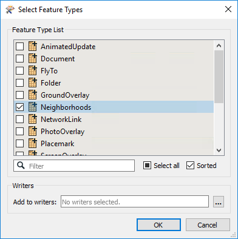
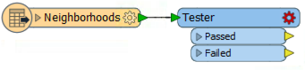
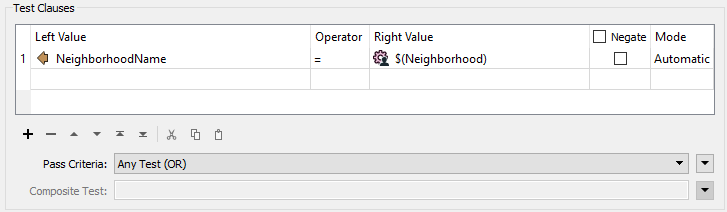
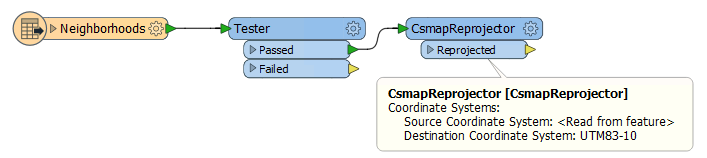
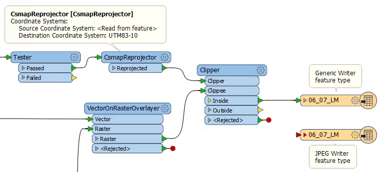
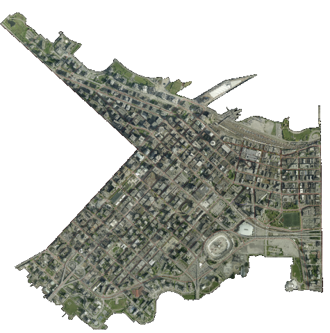

# 练习5.4：数据下载系统：地理选择

|  练习4 |  数据下载系统：地理选择 |
| :--- | :--- |
| 数据 | 正射影像（GeoTIFF） |
| 总体目标 | 为正射影像创建FME服务器数据下载系统 |
| 演示 | 按地理区域处理选择 |
| 启动工作空间 | C:\FMEData2018\Workspaces\ServerAuthoring\SelfServe2-Ex4-Begin.fmw |
| 结束工作空间 | C:\FMEData2018\Workspaces\ServerAuthoring\SelfServe2-Ex4-Complete.fmw |

作为一个城市GIS部门的技术分析师，您刚开始采取措施允许其他部门下载正射影像数据，而不是要求您为他们创建正射影像数据。他们的请求不仅会得到更快的处理，而且您还可以花更少的时间完成这项任务。

您已经为转换，格式，坐标系和要处理的层实现了许多不同的选项。但是，最终用户还经常要求为城市的特定街区提供栅格数据，这通过使用Clipper转换器很容易做到。

  
**1）打开工作空间**  
打开上面列出的开始工作空间，或者从之前的练习中继续工作空间。您可以看到它由一个读模块，两个写模块，三个转换器和各种已发布的参数组成。

要将数据剪切到特定的街区，首先需要为这些街区要素准备一个读模块，因此这是第一步......

  
**2）添加读模块**  
选择读模块&gt;添加读模块并使用以下设置：

| 读模块格式 | 谷歌KML |
| :--- | :--- |
| 读模块数据集 | C:\FMEData2018\Data\Boundaries\VancouverNeighborhoods.kml |
| 工作流程 | 个别要素类型 |

如果执行上一个练习，请务必设置工作流程选项，因为它可能默认为不同的值。单击“确定”，然后在出现提示时，仅选择“社区（Neighborhoods）”的要素类型：

添加后，删除SourceDataset\_OGCKML的已发布参数。我们不需要提示用户选择此数据集。

  
**3）添加已发布的参数**  
目前，KML读模块将读取所有街区。但是，我们需要用户选择其中一个来剪切数据。要选择街区，我们将使用已发布的参数。

所以，添加一个新参数。设置参数值如下：

| 类型 | 选择\(Choice\) |
| :--- | :--- |
| 名称 | 街区 |
| 发布的 | 是 |
| 可选的 | 是 |
| 提示 | 选择街区 |

对于配置字段，单击\[...\]浏览按钮。在打开的对话框中，输入温哥华街区的名称。这些是：

* Downtown\(市中心\)
* Fairview
* Kitsilano
* Mount Pleasant
* Strathcona
* West End\(西端\)

请注意，此参数是可选的。如果用户不想要，则不必选择值。此外，这是一个单独选择字段；不需要别名，因为适当的值已足够清楚。

|  技巧 |
| :--- |
|  或者，您可以从数据集导入值，而不是手动键入所有属性值。  在“选择列表”中，单击“导入...”。在“导入向导”中，再次选择VancouverNeighborhoods.kml文件，然后为“导入自”下拉列表选择“属性值”。接下来，选择“街区”作为“要素类型”。最后，对于“选择列表”，从下拉列表中选择NeighborhoodName，然后单击导入。 |

  
**4）添加Tester**  
现在我们需要根据用户的选择过滤街区数据。因此，将Tester转换器添加到工作空间，连接到街区要素类型：

检查其参数并将其设置为测试NeighborhoodName =街区发布参数的位置：

保存参数更改。

  
**5）添加CsmapReprojector**  
街区数据集的一个有趣部分是它在纬度/经度坐标系中，而所有其他数据都在UTM83-10中。为了能够与另一个剪切，需要两个数据集都在同一个坐标空间中。

因此，在Tester之后放置一个CsmapReprojector转换器，连接到Tester：Passed端口。将其设置为重新投影到UTM83-10

|  空间FME教授，ETL说...... |
| :--- |
|  为什么CsmapReprojector会在Tester之后？因为它的工作量较少。如果数据首先被重新投影，那么我们将重新投影随后被过滤掉的数据。这可能只是一个小的差别，但这是在大型项目中真正有助于工作空间性能的细节类型。 |

  
**6）添加Clipper**  
现在剪切栅格数据。将Clipper转换器添加到工作空间。将CsmapReprojector连接到Clipper：Clipper端口。将VectorOnRasterOverlayer的输出连接到Clipper：Clippee端口：

检查参数。要检查的唯一参数是与栅格数据特别相关的参数：Preserve Clippee Extents。如果尚未设置此参数，则将其设置为“否”。

  
**7）发布到FME服务器**  
保存工作空间并将其发布到FME Server。将其注册到数据下载服务，确保单击“编辑”按钮以编辑服务属性。在该对话框中将写模块设置为“Output \[GENERIC\]”（不是“Output \[JPEG\]”）。

在FME Server上运行工作空间。您现在应该能够选择所有源图块并将它们剪切到选定的街区，就像这样（这里是市中心区域）：

<table>
  <thead>
    <tr>
      <th style="text-align:left">恭喜</th>
    </tr>
  </thead>
  <tbody>
    <tr>
      <td style="text-align:left">
        
通过完成本练习，您已学会如何：
           
        

        <ul>
          <li>为用户建立一个工作空间来选择特定区域要素</li>
          <li>将数据剪切到选定区域以便在数据下载系统中使用</li>
        </ul>
      </td>
    </tr>
  </tbody>
</table>