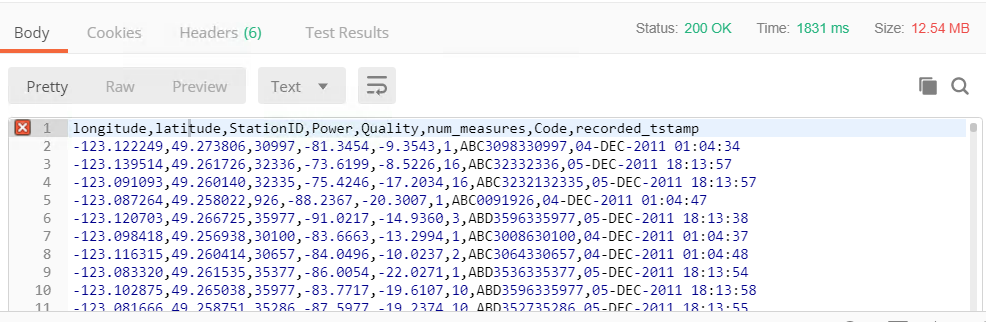

# 6.1练习10-使用资源

|  练习10 |  使用资源 |
| :--- | :--- |
| 数据 | C：\ FMEData2018 \ DATA \ CellSignals \ CellSignal.csv |
| 总体目标 |  演示如何使用REST API上传文件和下载文件。 |
| 演示 |  管理资源的调用 |

通过REST API，您将可以访问FME Server中可用的资源。您可以使用REST API列出文件，上传文件和删除文件。如果要将数据定向到FME Server中的某个区域，这在Web应用程序中很有用。

|  Ricky RESTless说...... |
| :--- |
| 大多数文件管理都可以通过REST API处理。这意味着在Web应用程序中可以让用户将文件上传到服务器，运行转换，然后将文件返回给用户。这些调用也在FME JavaScript API中，稍后将在课程中使用。 |

## 上传文件

此调用会将文件上传到资源文件夹中的数据文件夹。文件名在Content-Disposition参数中指定。如果要在数据文件夹中指定目录，只需在filesys之后写入文件夹名称。如果从用户请求数据并将数据输入到工作空间中，则上传文件在Web应用程序中可能是有用的。

  
**1）在Postman中输入以下URL和Headers**

在Postman中，单击加号以打开新选项卡。 &lt;style type =“text / css”&gt; .tg {border-collapse：collapse; border-spacing：0;} .tg td {font-family：Arial，sans-serif; font-size：14px; padding：10px 5px ; border-style：solid; border-width：1px; overflow：hidden; word-break：normal; border-color：black;} .tg th {font-family：Arial，sans-serif; font-size：14px; font-weight：normal; padding：10px 5px; border-style：solid; border-width：1px; overflow：hidden; word-break：normal; border-color：black;} .tg .tg-ao4k {background-color ：＃e6ffe6;颜色：＃333333; vertical-align：top} .tg .tg-a080 {background-color：＃e6ffe6; vertical-align：top} &lt;/ style&gt;

| POST | http:///fmerest/v3/resources/connections/FME\_SHAREDRESOURCE\_DATA/filesys/ |
| :--- | :--- |


**头域：**

* **Content-Type：** application / octet-stream
* **Accept：** application / json
* **Content-Disposition：**attachment; filename= "uploadingfiles.csv"
* **Authorization：** fmetoken token = &lt;yourToken&gt;

[](https://github.com/xuhengxx/FMETraining-1/tree/b47e2c2ddcf98cce07f6af233242f0087d2d374d/FMESERVER_RESTAPI6ServerAdmin/Images/image6.2.1.FileUploadRequest.png)

  
**2）在Postman中上传文件**  


在Postman中上传文件。切换到Body选项卡。选择二进制。按选择文件并导航到

```text
C:\FMEData2018\Data\CellSignals\CellSignal.csv
```

[](https://github.com/xuhengxx/FMETraining-1/tree/b47e2c2ddcf98cce07f6af233242f0087d2d374d/FMESERVER_RESTAPI6ServerAdmin/Images/image6.2.2.CellSignal.png)

点击发送！然后，查看响应

[](https://github.com/xuhengxx/FMETraining-1/tree/b47e2c2ddcf98cce07f6af233242f0087d2d374d/FMESERVER_RESTAPI6ServerAdmin/Images/image6.2.3.FileUploadResponse.png)

**可选查询字符串参数**

查询字符串参数添加在URL的末尾。如果您希望包含这些，那么URL将如下所示：

```text
http://<yourServerHost>/fmerest/v3/resources/connections/FME_SHAREDRESOURCE_DATA/filesys?createDirectories=true&overwrite=false
```

| 参数 | 值 | 描述 |
| :--- | :--- | :--- |
| createDirectories | True \| false | 如果路径不存在，则在路径中创建目录 |
| overwrite | True \| false |  如果文件已存在，则覆盖该文件 |

## 列表文件

此调用将列出资源中的文件。资源中的列表文件可以在工作空间或Web应用程序中使用。一个可能的用例是创建一个工作空间来列出资源中的所有文件，并创建一个由上传日期组织的excel电子表格。

  
**3）在Postman中输入以下URL和头域** &lt;style type =“text / css”&gt; .tg {border-collapse：collapse; border-spacing：0;} .tg td {font-family：Arial，sans-serif; font-size：14px; padding：10px 5px ; border-style：solid; border-width：1px; overflow：hidden; word-break：normal; border-color：black;} .tg th {font-family：Arial，sans-serif; font-size：14px; font-weight：normal; padding：10px 5px; border-style：solid; border-width：1px; overflow：hidden; word-break：normal; border-color：black;} .tg .tg-ej3l {background-color ：＃66ccff; vertical-align：top} .tg .tg-ufe5 {background-color：＃66ccff; vertical-align：top} &lt;/ style&gt;

| GET | http:///fmerest/v3/resources/connections/FME\_SHAREDRESOURCE\_DATA/filesys/ |
| :--- | :--- |


**头域：**

* **Accept：** application / json
* **Authorization:：** fmetoken token = &lt;yourToken&gt;

  
**4）查看Postman的响应**

[](https://github.com/xuhengxx/FMETraining-1/tree/b47e2c2ddcf98cce07f6af233242f0087d2d374d/FMESERVER_RESTAPI6ServerAdmin/Images/image6.2.4.ListFileResult.png)

## 下载文件

下载文件调用在Web应用程序中特别有用。这可用于将文件返回给用户。此调用也可以在工作空间中用于下载文本文件。

此调用将资源连接中的文件作为内联资源或附件下载。'disposition'参数仅与某些REST客户端相关。特别是，Internet Explorer在没有附件处置头域的情况下表现不佳。此网页仅显示响应主体而不是下载文件，因此REST客户端应检查Content-Disposition头域并处理下载。

此调用将查看“资源/ 数据”目录以查找uploadedfiles.csv。

  
**5）在Postman中输入以下URL和头域** &lt;style type =“text / css”&gt; .tg {border-collapse：collapse; border-spacing：0;} .tg td {font-family：Arial，sans-serif; font-size：14px; padding：10px 5px ; border-style：solid; border-width：1px; overflow：hidden; word-break：normal; border-color：black;} .tg th {font-family：Arial，sans-serif; font-size：14px; font-weight：normal; padding：10px 5px; border-style：solid; border-width：1px; overflow：hidden; word-break：normal; border-color：black;} .tg .tg-ao4k {background-color ：＃e6ffe6;颜色：＃333333; vertical-align：top} .tg .tg-a080 {background-color：＃e6ffe6; vertical-align：top} &lt;/ style&gt;

| POST | HTTP：// &lt;yourServerHost&gt; /fmerest/v3/resources/connections/FME\_SHAREDRESOURCE\_DATA/download/uploadingfiles.csv |
| :--- | :--- |


**头域：**

* **Accept：** application / octet-stream
* **Authorization：** fmetoken token = &lt;yourToken&gt;
* **Content-Type：** application / x-www-form-urlencoded

[](https://github.com/xuhengxx/FMETraining-1/tree/b47e2c2ddcf98cce07f6af233242f0087d2d374d/FMESERVER_RESTAPI6ServerAdmin/Images/image6.2.5.FileDownloadRequest.png)

  
**6）输入调用主体**

进入调用体内。单击body选项卡，选中raw，然后粘贴下面的内容。

```text
accept=contents&disposition=inline
```

点击发送！然后，查看Postman的响应

[](https://github.com/xuhengxx/FMETraining-1/tree/b47e2c2ddcf98cce07f6af233242f0087d2d374d/FMESERVER_RESTAPI6ServerAdmin/Images/image6.2.6.CSVDownload.png)

**参数：**

| 参数 | 值 | 描述 |
| :--- | :--- | :--- |
| disposition处理 |  inline/attachment | 内联将显示如何使用“Content-Disposition”头域检索资源。此参数仅与某些REST客户端（主要是Web浏览器）相关。如果未选择处理，则不设置头域。 |
| Path路径 |  |  路径，相对于资源连接（例如，upload.csv） |
| 资Resource源 |  | 资源连接的名称。只能包含字母数字字符。（例如，FME\_SHAREDRESOURCE\_DATA） |

<table>
  <thead>
    <tr>
      <th style="text-align:left">恭喜</th>
    </tr>
  </thead>
  <tbody>
    <tr>
      <td style="text-align:left">
        <p>通过完成本练习，您已学会如何：
          <br />
        </p>
        <ul>
          <li>使用REST API上传文件</li>
          <li>使用REST API列出文件</li>
          <li>使用REST API下载文件</li>
        </ul>
      </td>
    </tr>
  </tbody>
</table>