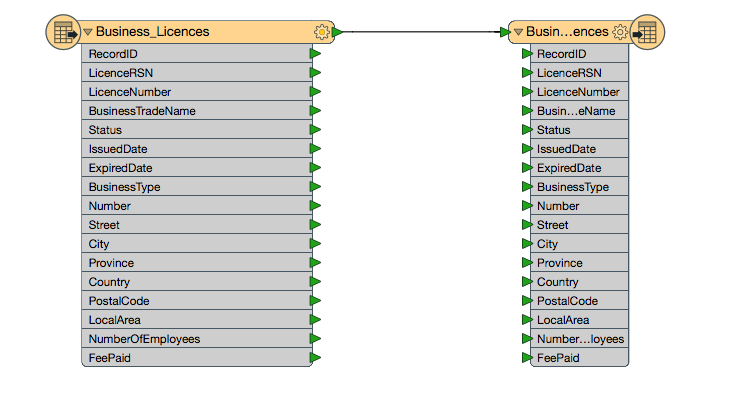
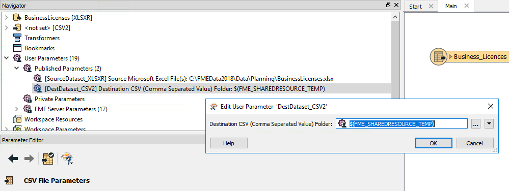
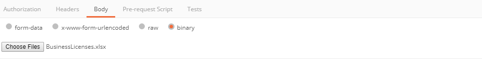
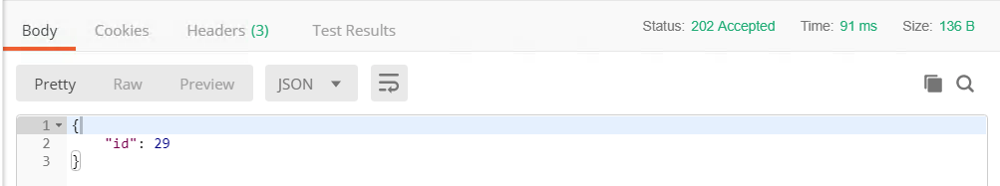

|  练习11 |  使用共享资源作为工作空间输出位置 |
| :--- | :--- |
| 数据 | C:\FMEData2018\Data\Planning\BusinessLicenses.xlsx |
| 总体目标 |  演示如何使用REST API上载文件和下载文件。 |
| 演示 |  用于管理资源的调用 |
| 工作空间 |  C:\FMEData2018\Resources\RESTAPI\Chapter6Exercise11.fmw |

|  Ricky RESTless说...... |
| :--- |
| 如果您要创建一个运行转换并下载从转换创建的文件的Web应用程序，则下一个练习演示了一个典型的工作流程。首先，您将使用Workbench将工作空间上传到FME Server。然后，将指示用户上传文件，这应该上转到FME服务器内的共享资源文件夹。在用户上传文件之后，应用程序将运行工作空间，该工作空间将生成文件到共享资源位置。然后，用户将能够下载该文件。 |

如果您希望通过REST API从工作空间检索结果数据集，最好的方法是将其写入客户端可访问的共享资源位置。在此示例中，我们将创建一个工作空间，然后在将输出更改为临时存储库时运行调用。我们将使用一个非常基本的工作空间来测试它。

## 创建工作空间

  
**1）打开FME Workbench并启动空白工作空间。**

  
**2）使用BusinessLicenses文件添加Microsoft Excel读模块。**

有许多方法可以将读模块添加到工作空间。我们可以通过单击画布并键入Excel来添加读模块。

选择Excel 读模块后，单击“...”按钮导航到“数据集”。

数据集位于：

```text
C:\FMEData2018\Data\Planning\BusinessLicenses.xlsx
```

[](https://github.com/xuhengxx/FMETraining-1/tree/b47e2c2ddcf98cce07f6af233242f0087d2d374d/FMESERVER_RESTAPI6ServerAdmin/Images/image6.3.0.ExcelParameters.png)

  
**3）然后将CSV写模块添加到工作空间。**

接下来，我们可以添加CSV写模块。CSV写模块可以以相同的方式添加。单击画布并开始键入CSV。选择CSV写模块。

接受默认参数是可以的。

[](https://github.com/xuhengxx/FMETraining-1/tree/b47e2c2ddcf98cce07f6af233242f0087d2d374d/FMESERVER_RESTAPI6ServerAdmin/Images/image6.3.1.CSVParam.png)

然后，将Excel文件连接到CSV文件。

[](https://github.com/xuhengxx/FMETraining-1/tree/b47e2c2ddcf98cce07f6af233242f0087d2d374d/FMESERVER_RESTAPI6ServerAdmin/Images/image6.3.1.Excel.png)

  
**4）设置目标文件夹。**

下一步是确定目标数据集的已发布参数。已发布的参数位于FME Workbench的“导航器”面板中。它应该被称为DestDataset\_CSV2。右键单击DestDataset\_CSV2并选择Edit Value。然后使用下拉箭头展开FME Server Parameter菜单并选择$（FME\_SHAREDRESOURCE\_TEMP）。

[](https://github.com/xuhengxx/FMETraining-1/tree/b47e2c2ddcf98cce07f6af233242f0087d2d374d/FMESERVER_RESTAPI6ServerAdmin/Images/image6.3.2.SharedResource.png)

通过REST API使用调用时，将文件写入FME Server可以访问的区域非常重要。临时文件夹是将文件写入测试的好地方，因为文件将被清除。

  
**5）设置源数据集**

我们稍后将使用API​​上传数据。现在将源数据集文件夹更改为：

```text
$(FME_SHAREDRESOURCE_DATA)/SharedResourceTest/BusinessLicenses.xlsx
```

源数据集还必须位于FME Server可以访问的位置。我们在这里指定一个将通过REST API创建的文件夹。

  
**6）将源数据集设置为私有参数**

下一步是将源数据集设置为私有参数。这可以通过转到导航器面板然后右键单击参数来完成。然后选择“转换为私有参数”。

将公共参数转换为私有参数可确保调用易于使用。由于数据集的来源不会改变，因此将其转换为私有参数是最佳做法。

[](https://github.com/xuhengxx/FMETraining-1/tree/b47e2c2ddcf98cce07f6af233242f0087d2d374d/FMESERVER_RESTAPI6ServerAdmin/Images/image6.3.3.Private.png)

  
**7）发布到FME Server**

_如果您尚未设置服务器连接，则可以在_[_此处_](https://safe-software.gitbooks.io/fme-server-rest-api-training-2018/content/FMESERVER_RESTAPI4Workspaces/4.4.TransactData.html)_找到相关说明_

单击“发布到FME Server”按钮。

选择先前创建的FME Server连接。点击下一步。

将存储库名称设置为RESTTraining。

将工作空间名称设置为Chapter6Exercise11.fmw。点击下一步。

选择Job Submitter服务并发布工作空间

## 使用“资源调用”来上传数据

  
**8）在Postman中输入以下URL和Headers** 

&lt;style type =“text / css”&gt; .tg {border-collapse：collapse; border-spacing：0;} .tg td {font-family：Arial，sans-serif; font-size：14px; padding：10px 5px ; border-style：solid; border-width：1px; overflow：hidden; word-break：normal; border-color：black;} .tg th {font-family：Arial，sans-serif; font-size：14px; font-weight：normal; padding：10px 5px; border-style：solid; border-width：1px; overflow：hidden; word-break：normal; border-color：black;} .tg .tg-ao4k {background-color ：＃e6ffe6;颜色：＃333333; vertical-align：top} .tg .tg-a080 {background-color：＃e6ffe6; vertical-align：top} &lt;/ style&gt;

| POST | http:///fmerest/v3/resources/connections/FME\_SHAREDRESOURCE\_DATA/filesys/SharedResourceTest?createDirectories=true |
| :--- | :--- |


**头域：**

* **Content-Type：** application / octet-stream
* **Accept：** application / json
* **Content-Disposition：**附件; filename =“BusinessLicenses.xlsx”
* **Authorization：** fmetoken token = &lt;yourToken&gt;

[](https://github.com/xuhengxx/FMETraining-1/tree/b47e2c2ddcf98cce07f6af233242f0087d2d374d/FMESERVER_RESTAPI6ServerAdmin/Images/image6.3.2.UploadRequest.png)

  
**9）在Postman中添加调用主体**

首先，单击Postman中的body选项卡。然后，选择二进制并单击选择文件。  
 找到C：\ FMEData2018 \ Data \ Planning \ BusinessLicenses.xlsx作为要上传的文件！

[](https://github.com/xuhengxx/FMETraining-1/tree/b47e2c2ddcf98cce07f6af233242f0087d2d374d/FMESERVER_RESTAPI6ServerAdmin/Images/image6.3.3.FileUpload.png)

  
**10）单击发送！然后，查看响应**

[](https://github.com/xuhengxx/FMETraining-1/tree/b47e2c2ddcf98cce07f6af233242f0087d2d374d/FMESERVER_RESTAPI6ServerAdmin/Images/image6.3.4.UploadResponse.png)

## 运行作业

  
**11）在Postman中输入以下URL和Headers** 

&lt;style type =“text / css”&gt; .tg {border-collapse：collapse; border-spacing：0;} .tg td {font-family：Arial，sans-serif; font-size：14px; padding：10px 5px ; border-style：solid; border-width：1px; overflow：hidden; word-break：normal; border-color：black;} .tg th {font-family：Arial，sans-serif; font-size：14px; font-weight：normal; padding：10px 5px; border-style：solid; border-width：1px; overflow：hidden; word-break：normal; border-color：black;} .tg .tg-ao4k {background-color ：＃e6ffe6;颜色：＃333333; vertical-align：top} .tg .tg-a080 {background-color：＃e6ffe6; vertical-align：top} &lt;/ style&gt;

| POST | http:///fmerest/v3/transformations/submit/RESTTraining/Chapter6Exercise11.fmw |
| :--- | :--- |


**头域：**

* **Accept：** application / json
* **Content-Type：** application / json
* **Authorization：** fmetoken token=

[](https://github.com/xuhengxx/FMETraining-1/tree/b47e2c2ddcf98cce07f6af233242f0087d2d374d/FMESERVER_RESTAPI6ServerAdmin/Images/image6.3.5.SubmitURL.png)

  
**12）在Postman中添加调用主体**

首先，单击Postman中的body选项卡。然后，单击原始\(raw\)按钮。然后，粘贴以下信息。

```text
{
"publishedParameters": [
{
  "name": "DestDataset_CSV2",
  "value": "$(FME_SHAREDRESOURCE_TEMP)"
}
]
}
```

[](https://github.com/xuhengxx/FMETraining-1/tree/b47e2c2ddcf98cce07f6af233242f0087d2d374d/FMESERVER_RESTAPI6ServerAdmin/Images/image6.3.6.SubmitBody.png)

  
**13）查看来自FME Server的响应**

```text
{

"id": 29

}
```

[](https://github.com/xuhengxx/FMETraining-1/tree/b47e2c2ddcf98cce07f6af233242f0087d2d374d/FMESERVER_RESTAPI6ServerAdmin/Images/image6.3.7.SubmitResult.png)

请注意。图示的作业ID可能与您的机器返回的内容不同。

## 测试工作是否成功

  
**14）在Postman中输入以下调用。然后，单击发送！**

此调用将异步运行，因此作为回应，您将收到一个id。要检查您的调用是否已完成，请使用此调用。 

&lt;style type =“text / css”&gt; .tg {border-collapse：collapse; border-spacing：0;} .tg td {font-family：Arial，sans-serif; font-size：14px; padding：10px 5px ; border-style：solid; border-width：1px; overflow：hidden; word-break：normal; border-color：black;} .tg th {font-family：Arial，sans-serif; font-size：14px; font-weight：normal; padding：10px 5px; border-style：solid; border-width：1px; overflow：hidden; word-break：normal; border-color：black;} .tg .tg-ej3l {background-color ：＃66ccff; vertical-align：top} .tg .tg-ufe5 {background-color：＃66ccff; vertical-align：top} &lt;/ style&gt;

| GET | http:///fmerest/v3/transformations/jobs/id/ |
| :--- | :--- |


**头域**

* **Accept：** application / json
* **Authorization：** fmetoken token = &lt;yourToken&gt;

  
**15）查看响应以确保作业成功完成**

[](https://github.com/xuhengxx/FMETraining-1/tree/b47e2c2ddcf98cce07f6af233242f0087d2d374d/FMESERVER_RESTAPI6ServerAdmin/Images/image6.3.8.JobResult.png)

## 下载生成的文件

  
**16）在请求URL和头域中输入Postman**

然后，您可以使用下面的调用下载该文件。 

&lt;style type =“text / css”&gt; .tg {border-collapse：collapse; border-spacing：0;} .tg td {font-family：Arial，sans-serif; font-size：14px; padding：10px 5px ; border-style：solid; border-width：1px; overflow：hidden; word-break：normal; border-color：black;} .tg th {font-family：Arial，sans-serif; font-size：14px; font-weight：normal; padding：10px 5px; border-style：solid; border-width：1px; overflow：hidden; word-break：normal; border-color：black;} .tg .tg-ao4k {background-color ：＃e6ffe6;颜色：＃333333; vertical-align：top} .tg .tg-a080 {background-color：＃e6ffe6; vertical-align：top} &lt;/ style&gt;

| POST | http:///fmerest/v3/resources/connections/FME\_SHAREDRESOURCE\_TEMP/download/Business\_Licences.csv |
| :--- | :--- |


**头域：**

* **Accept：** application / octet-stream
* **Authorization：** fmetoken token = &lt;yourToken&gt;
* **Content-Type：** application / x-www-form-urlendcoded

[](https://github.com/xuhengxx/FMETraining-1/tree/b47e2c2ddcf98cce07f6af233242f0087d2d374d/FMESERVER_RESTAPI6ServerAdmin/Images/image6.3.9.ConnectionsHeaders.png)

  
**17）在Postman中输入主体**

单击Postman中的body选项卡。然后选择raw。然后，粘贴以下信息。点击发送！

```text
accept=contents&disposition=inline
```

  
**18）在Postman中查看响应！**

虽然Postman可以处理调用，但无法下载CSV文件。如果您想下载该文件的副本，可以通过FME JavaScript API进行下载。我们将在课程后面介绍这个过程。

[](https://github.com/xuhengxx/FMETraining-1/tree/b47e2c2ddcf98cce07f6af233242f0087d2d374d/FMESERVER_RESTAPI6ServerAdmin/Images/image6.3.10.ConnectionsResponse.png)

<table>
  <thead>
    <tr>
      <th style="text-align:left">恭喜</th>
    </tr>
  </thead>
  <tbody>
    <tr>
      <td style="text-align:left">
        <p>通过完成本练习，您已学会如何：
          <br />
        </p>
        <ul>
          <li>创建与Submit调用兼容的工作空间</li>
          <li>使用REST API将文件上传到共享资源</li>
          <li>运行Submit调用并测试是否成功</li>
          <li>使用REST API下载文件</li>
        </ul>
      </td>
    </tr>
  </tbody>
</table>
