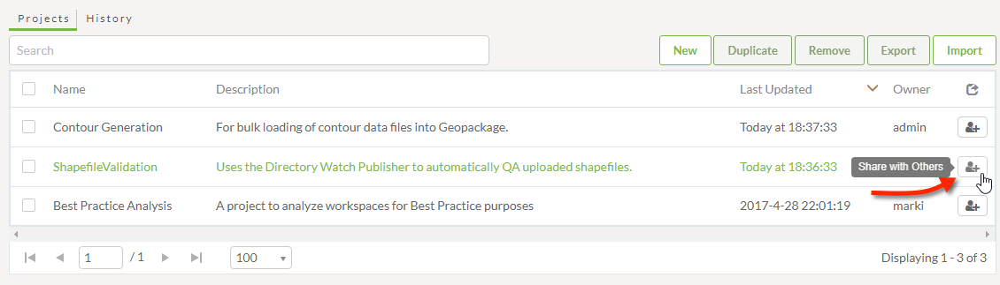
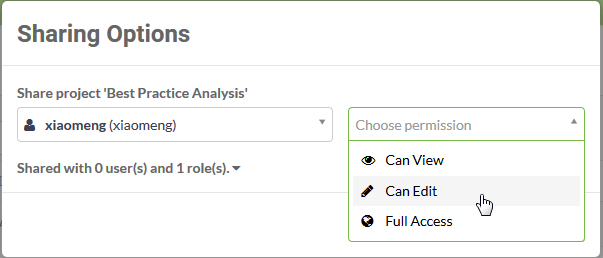

# 分享项目

项目通常由一组FME用户和作者执行。因此，可以在多个FME用户之间共享项目。

## 共享项目

在项目页面上进行共享项目（通过主菜单访问），只需单击“与他人共享”按钮即可共享项目：

您甚至不需要先选择项目。

“与他人共享”工具的工作方式与共享存储库的工具相同：它会打开一个弹出对话框，在其中选择用户并选择您希望为其提供的权限级别：

请记住，FME安全性基于用户和角色。角色类似于一组用户。共享项目时，“用户”字段可以是单个用户，也可以应用于特定角色; 例如，您可以让fmeuser角色中的任何人查看您的项目。

共享项目不仅可以访问存储库和工作空间，还可以访问与该项目相关的所有组件。

|  Vector小姐说... |
| :--- |
|  只有在以下情况下才能共享项目：    [1. 您必须拥有项目。只有项目所有者才能共享它。](http://52.73.3.37/fmedatastreaming/Manual/QAResponse2017.fmw?chapter=25&question=1&answer=1&DestDataset_TEXTLINE=C%3A%5CFMEOutput%5CQAResponse.html)  [2. 您必须是具有管理安全性权限的用户。只有这样的用户才能共享项目。](http://52.73.3.37/fmedatastreaming/Manual/QAResponse2017.fmw?chapter=25&question=1&answer=2&DestDataset_TEXTLINE=C%3A%5CFMEOutput%5CQAResponse.html)  [3. 您可以拥有项目，也可以是拥有管理安全权限的用户（即您可以是其中之一）。](http://52.73.3.37/fmedatastreaming/Manual/QAResponse2017.fmw?chapter=25&question=1&answer=3&DestDataset_TEXTLINE=C%3A%5CFMEOutput%5CQAResponse.html)  [4. 您拥有项目并且您是有权管理安全性的用户（即您必须是两者）。](http://52.73.3.37/fmedatastreaming/Manual/QAResponse2017.fmw?chapter=25&question=1&answer=4&DestDataset_TEXTLINE=C%3A%5CFMEOutput%5CQAResponse.html) |

