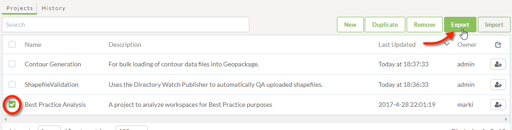
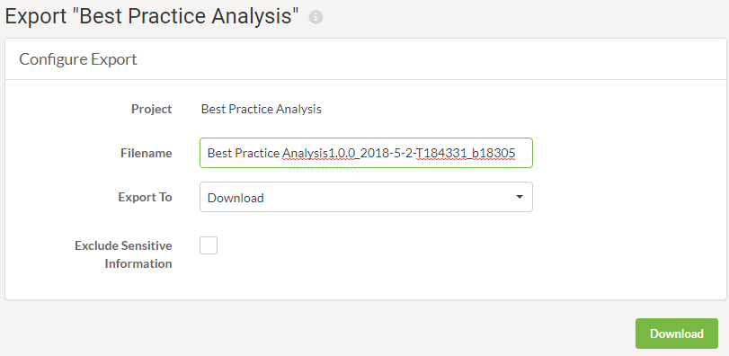

# 管理项目

项目的主要用途是将一组FME Server组件从一个Server实例传输到另一个Server实例。这是通过使用导出和导入工具执行的。还有一个用于从系统中删除项目的工具。

## 导出项目

通过选择要导出的项目并单击“导出”按钮，可以在“项目”页面（通过主菜单访问）上导出项目：

这将打开一个对话框，用于配置和执行导出：

导出将写入具有.fsproject扩展名的文件。可以选择将导出作为下载提供，也可以将其写入资源文件夹。

|  Vector小姐说... |
| :--- |
|  如果您选择将项目导出到资源文件夹（而不是下载它），那么您还可以获得哪些额外功能？    [1. 在完成导出时触发通知主题的能力。](http://52.73.3.37/fmedatastreaming/Manual/QAResponse2017.fmw?chapter=25&question=2&answer=1&DestDataset_TEXTLINE=C%3A%5CFMEOutput%5CQAResponse.html)  [2. 导出服务器的FME许可证的能力。](http://52.73.3.37/fmedatastreaming/Manual/QAResponse2017.fmw?chapter=25&question=2&answer=2&DestDataset_TEXTLINE=C%3A%5CFMEOutput%5CQAResponse.html)  [3. 在导出项目时删除项目的所有组件的能力。](http://52.73.3.37/fmedatastreaming/Manual/QAResponse2017.fmw?chapter=25&question=2&answer=3&DestDataset_TEXTLINE=C%3A%5CFMEOutput%5CQAResponse.html)  [4. 将组件的所有权更改为您自己的用户帐户的能力。](http://52.73.3.37/fmedatastreaming/Manual/QAResponse2017.fmw?chapter=25&question=2&answer=4&DestDataset_TEXTLINE=C%3A%5CFMEOutput%5CQAResponse.html) |

