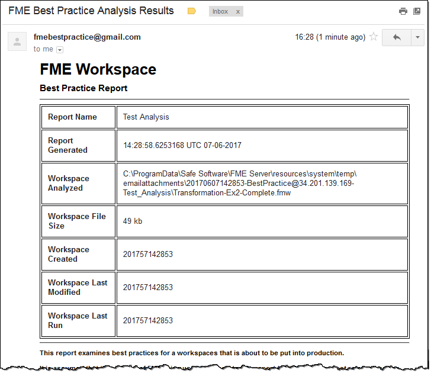

|  练习6.1 |  最佳实践工作空间分析项目 |
| :--- | :--- |
| 数据 | 工作空间文件文件 |
| 总体目标 | 导入FME Server项目 |
| 演示 | FME Server项目 |
| 启动工作空间文件 | N / A |
| 结束工作空间文件 | N / A |

最佳实践是FME工作空间的基本概念。为了鼓励同事执行最佳实践，您希望安装一个允许分析工作空间的项目。

  
**1）浏览到项目**  
打开FME Server Web界面并使用具有管理员权限的帐户登录。

在主菜单上选择Projects以浏览到Projects页面：

[](https://github.com/xuhengxx/FMETraining-1/tree/f1cdae5373cf9425ee2d148732792713c9043d44/ServerAuthoring6AdvancedWorkflows/Images/Img6.200.Ex1.ProjectsMenu.png)

  
**2）导入项目**  
单击“导入”按钮以打开“导入”页面：

[](https://github.com/xuhengxx/FMETraining-1/tree/f1cdae5373cf9425ee2d148732792713c9043d44/ServerAuthoring6AdvancedWorkflows/Images/Img6.201.Ex1.ImportButton.png)

在“配置导入”部分下，确保将“导入自”设置为“上传”。然后在配置参数后，单击“导入”按钮：

[](https://github.com/xuhengxx/FMETraining-1/tree/f1cdae5373cf9425ee2d148732792713c9043d44/ServerAuthoring6AdvancedWorkflows/Images/Img6.202.Ex1.ImportConfig.png)

_覆盖现有项_不太重要，因为项目应该还不存在对于需要覆盖的项来说。同样，_暂停通知系统_并不重要，因为项目中的通知不太可能立即触发（它们用于处理传入的电子邮件）。

单击Upload File按钮并浏览到Code Smells Workshop并选择BestPracticeAnalysis.fsproject：

```text
C：\ FMEData2018 \资源\ CodeSmellsWorkshop \ BestPracticeAnalysis.fsproject
```

该项目将很快导入：

[](https://github.com/xuhengxx/FMETraining-1/tree/f1cdae5373cf9425ee2d148732792713c9043d44/ServerAuthoring6AdvancedWorkflows/Images/Img6.203.Ex1.ImportComplete.png)

  
**3）检查日志**  
单击“查看详细信息”按钮以检查“项目导入”日志。成功导入将如下所示：

[](https://github.com/xuhengxx/FMETraining-1/tree/f1cdae5373cf9425ee2d148732792713c9043d44/ServerAuthoring6AdvancedWorkflows/Images/Img6.204.Ex1.ImportSummary.png)

|  技巧 |
| :--- |
|  项目下的历史页面将显示已导入系统的所有项目的完整历史记录。 |

  
**4）检查组件**  
现在让我们检查一些应该导入的组件。

再次单击菜单上的“项目”，然后选择最近导入的项目。您现在应该看到导入内容的列表：

[](https://github.com/xuhengxx/FMETraining-1/tree/f1cdae5373cf9425ee2d148732792713c9043d44/ServerAuthoring6AdvancedWorkflows/Images/Img6.205.Ex1.ProjectContents.png)

使用菜单选项检查“仓库”，“通知”和“资源”页面，以确保导入的组件确实存在。

  
**5）测试项目**  
现在让我们发送一封电子邮件到您的FME Server来测试项目。此处假设您使用的是具有公共名称，域或地址的服务器。

对于Safe的培训计算机上的FME Server，公共IP地址显示在桌面的右上角：

[](https://github.com/xuhengxx/FMETraining-1/tree/f1cdae5373cf9425ee2d148732792713c9043d44/ServerAuthoring6AdvancedWorkflows/Images/Img6.206.Ex1.ServerIPAddress.png)

电子邮件地址为BestPractice @ xxxx，其中xxxx是IP地址：

[](https://github.com/xuhengxx/FMETraining-1/tree/f1cdae5373cf9425ee2d148732792713c9043d44/ServerAuthoring6AdvancedWorkflows/Images/Img6.207.Ex1.EmailTest.png)

设置主题行并附加工作空间文件文件。单击“发送”按钮。作为回应（可能需要一两分钟），您将收到有关该工作空间文件中使用的最佳实践的电子邮件报告：

[](https://github.com/xuhengxx/FMETraining-1/tree/f1cdae5373cf9425ee2d148732792713c9043d44/ServerAuthoring6AdvancedWorkflows/Images/Img6.208.Ex1.BPReport.png)

这表明项目已导入并正确设置。

  
**6）清理项目**  
项目中不需要的一部分是用户帐户。

因此，返回项目内容，选择marki User，然后将其删除。

[](https://github.com/xuhengxx/FMETraining-1/tree/f1cdae5373cf9425ee2d148732792713c9043d44/ServerAuthoring6AdvancedWorkflows/Images/Img6.209.Ex1.RemoveAccount.png)

这将从项目中删除该帐户，但由于该项目已导入，因此该帐户也将存在于该计算机上。因此，也可以转到Security&gt; Users页面并删除该用户。

发送另一封电子邮件以确认项目仍在运行。

  
**7）导出项目**  
现在项目已经更新，将其导出，以便可以在其他地方以适当的形式导入。

为此，请浏览到“项目”页面，选择项目（使用左侧的复选框），然后单击“导出”按钮。

在打开的对话框中，您可以选择是将项目文件保存到下载还是资源文件夹。完成后，将显示以下消息：

[](https://github.com/xuhengxx/FMETraining-1/tree/f1cdae5373cf9425ee2d148732792713c9043d44/ServerAuthoring6AdvancedWorkflows/Images/Img6.210.Ex1.ProjectExported.png)

<table>
  <thead>
    <tr>
      <th style="text-align:left">恭喜</th>
    </tr>
  </thead>
  <tbody>
    <tr>
      <td style="text-align:left">
        <p>通过完成本练习，您已学会如何：
          <br />
        </p>
        <ul>
          <li>导入项目</li>
          <li>检查项目历史记录并确认已成功导入项目</li>
          <li>编辑项目的内容</li>
          <li>导出项目</li>
        </ul>
      </td>
    </tr>
  </tbody>
</table>
