<table>
<tbody><tr>
<td width="25%">
<i></i>
练习6.2
</td>
<td>
编写工作空间链
</td>
</tr>
<tr>
<td>数据</td>
<td>投票分区（GML（地理标记语言）） 地址（Esri地理数据库（File Geodb API））</td>
</tr>
<tr>
<td>总体目标</td>
<td>创建工作空间以： - 处理投票分区 - 将投票分区分配给地址 - 将前两个转换链接在一起</td>
</tr>
<tr>
<td>演示</td>
<td>编写工作空间链</td>
</tr>
<tr>
<td>启动工作空间</td>
<td>没有</td>
</tr>
<tr>
<td>结束工作空间</td>
<td>C:\FMEData2018\Workspaces\ServerAuthoring\AdvancedWorkflows-Ex2-CompleteA.fmw
  C:\FMEData2018\Workspaces\ServerAuthoring\AdvancedWorkflows-Ex2-CompleteB.fmw
  C:\FMEData2018\Workspaces\ServerAuthoring\AdvancedWorkflows-Ex2-CompleteC.fmw
</td>
</tr>
</tbody></table>

---

您是当地城市GIS部门的技术分析师。您有使用FME Desktop的丰富经验，而您的部门刚刚购买了FME Server。

市政选举即将发生，Interopolis选举机构提供了GML格式的新投票分区的数据集。您今天的第一个任务是创建一个工作空间，将这些投票分区转换为SpatiaLite数据库格式，以便在城市内使用，并将数据写入FME Server上的资源文件夹，以便每个人都可以使用它。

巧合的是，规划部门听说了这一更新，并要求您将投票分区ID分配给城市地址数据库中的每个记录，以便用于选举计划。

您意识到可以将这两个转换链接在一起以在主工作空间下连续执行。总而言之，您有三个工作空间可供创建！

  
**1）启动FME Workbench**  
启动FME Workbench并使用以下参数生成转换：

| 读模块格式 | GML（地理标记语言） |
| :--- | :--- |
| 读模块数据集 | C:\FMEData2018\Data\Elections\ElectionVoting.gml |
| 写模块格式 | SpatiaLite |
| 写模块数据集 |  |

写模块数据集现在可以保留为空。出现提示时，请选中两个源要素类（层）。

[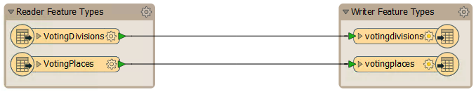](https://github.com/xuhengxx/FMETraining-1/tree/f1cdae5373cf9425ee2d148732792713c9043d44/ServerAuthoring6AdvancedWorkflows/Images/Img6.211.Ex2.InitialWorkspace.png)

  
**2）创建资源**  
我们将使用FME Server上的资源文件夹处理此工作空间的输入和输出。因此，登录FME Server Web界面并导航到“资源”页面。

如果您执行了练习1.4，那么您应该已经有一个包含工作空间中使用的源数据的文件夹Resources \ Data \ Election \ Input。

如果没有，请创建该组文件夹和子文件夹。将源GML数据集上传到Input文件夹（您应该上传.gml和.xsd文件）：

[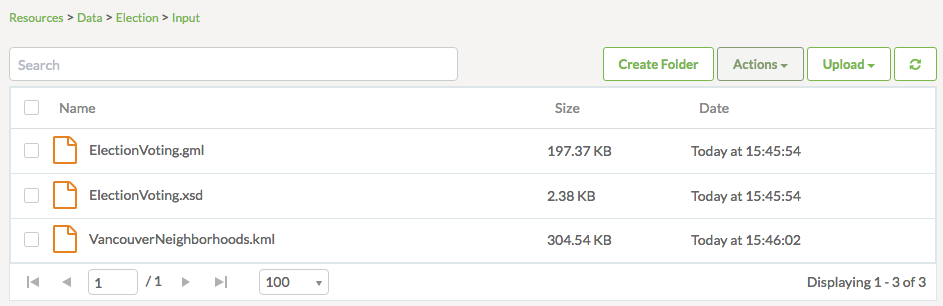](https://github.com/xuhengxx/FMETraining-1/tree/f1cdae5373cf9425ee2d148732792713c9043d44/ServerAuthoring6AdvancedWorkflows/Images/Img6.212.Ex2.UploadedData.png)

  
**3）编辑工作空间以使用资源**  
返回FME Workbench，在“用户参数”下的“导航”窗口中查找名为SourceDataset\_GML和DestDataset\_SPATIALITE的两个现有已发布参数。依次单击每个，然后按删除键将其删除。

接下来，找到GML源数据集和SpatiaLite目标数据集的参数。更新参数如下：

| GML读模块 | $\(FME\_SHAREDRESOURCE\_DATA\)\Election\Input\ElectionVoting.gml |
| :--- | :--- |
| SpatiaLite写模块 | $\(FME\_SHAREDRESOURCE\_DATA\)\Election\Output\VotingDivisions.sl3 |

最后一个调整：将写模块参数"覆盖现有数据库（Overwrite Existing Database\)"更改为是

[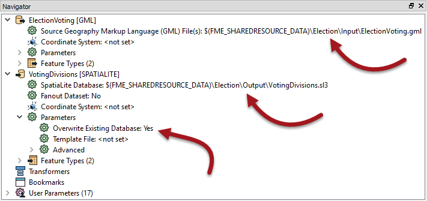](https://github.com/xuhengxx/FMETraining-1/tree/f1cdae5373cf9425ee2d148732792713c9043d44/ServerAuthoring6AdvancedWorkflows/Images/Img6.213.Ex2.WorkspaceDatasetParameters.png)

  
**4）保存，发布和运行工作空间**  
保存工作空间（类似于AdvancedWorkflows-Ex2-CompleteA.fmw）并记住文件名：稍后它将很重要。将工作空间发布到FME Server。它应该在Job Submitter服务中注册。

在服务器web界面中找到工作空间并运行它，并确保它运行到完成。成功的证据将是资源文件夹中的日志和sl3文件。

选择sl3数据集，然后单击“操作”&gt;“下载”以下载文件。这个很重要; 我们需要该文件来设置我们的下一个工作空间。

[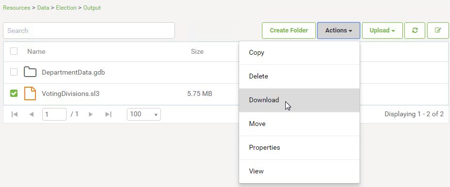](https://github.com/xuhengxx/FMETraining-1/tree/f1cdae5373cf9425ee2d148732792713c9043d44/ServerAuthoring6AdvancedWorkflows/Images/Img6.214.Ex2.DownloadSpatialiteDB.png?)

将文件保存到Elections文件夹，这样您就会记住它的位置; 即，C：\ FMEData2018 \ Data \ Elections \ VotingDivisions.sl3

  
**5）生成工作空间**  
那是我们项目中的第一个工作空间。现在是第二个。

必要时打开Workbench并使用以下参数生成新工作空间：

| 读模块格式 | Esri地理数据库（File Geodb Open API） |
| :--- | :--- |
| 读模块数据集 | C:\FMEData2018\Data\Addresses\Addresses.gdb |
| 写模块格式 | Esri地理数据库（File Geodb Open API） |
| 写模块数据集 | C:\FMEData2018\Output\Training\NewAddresses.gdb |

出现提示时，请保留两个源要素类（表）。

[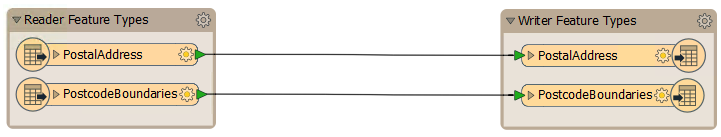](https://github.com/xuhengxx/FMETraining-1/tree/f1cdae5373cf9425ee2d148732792713c9043d44/ServerAuthoring6AdvancedWorkflows/Images/Img6.215.Ex2.StartingWorkspaceB.png)

  
**6）添加读模块**  
要分配投票分区，我们需要在工作空间中拥有该数据。因此，从菜单栏中选择读模块&gt;读模块并添加读模块以读取下载的VotingDivisions SpatiaLite数据库：

| 读模块格式 | SpatiaLite |
| :--- | :--- |
| 读模块数据集 | C:\FMEData2018\Data\Elections\VotingDivisions.sl3 |

_**注意：**_ _如果找不到该sl3文件，请返回步骤4，确保下载了第一个工作空间的结果。_

出现提示时，仅选择源要素类（表）_votedivisions_。

[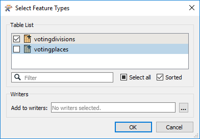](https://github.com/xuhengxx/FMETraining-1/tree/f1cdae5373cf9425ee2d148732792713c9043d44/ServerAuthoring6AdvancedWorkflows/Images/Img6.216.Ex2.SelectingVotingDivisions.png)

  
**7）添加转换器**  
现在让我们添加一个转换器，为每个地址分配投票分区。将PointOnAreaOverlayer转换器放入工作空间。按如下方式连接：

[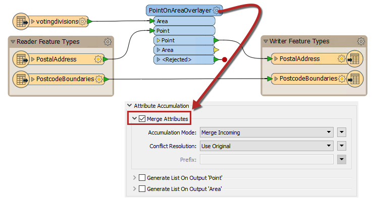](https://github.com/xuhengxx/FMETraining-1/tree/f1cdae5373cf9425ee2d148732792713c9043d44/ServerAuthoring6AdvancedWorkflows/Images/Img6.217.Ex2.POAOOnCanvas.png)  

* **删除连接：**Geodatabase:PostalAddress &gt; Geodatabase:PostalAddress
* **添加连接：**Geodatabase:PostalAddress &gt; PointOnAreaOverlayer:Point
* **添加连接：** SpatiaLite:votingdivisions &gt; PointOnAreaOverlayer:Area
* **添加连接：** PointOnAreaOverlayer:Point &gt; Geodatabase:PostalAddress

  
然后打开PointOnAreaOverlayer的参数，展开Attribute Accumulation（属性聚合）部分，并选中Merge Attributes（合并属性）。默认设置很好。这将从votingdivisions添加属性到PostalAddress。

  
**8）编辑写模块模式**  
 PointOnAreaOverlayer会将division属性复制到每个地址，但除非我们将其添加到输出模式，否则不会写入该属性。

因此，请检查写模块要素类PostalAddress的参数。在“用户属性”选项卡中，添加一个名为division的新属性（类型为int）：

[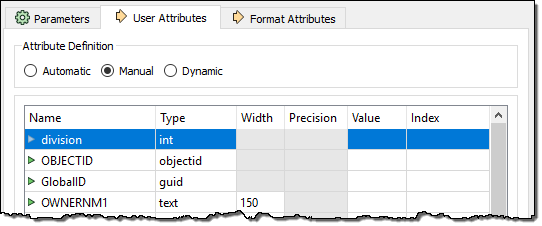](https://github.com/xuhengxx/FMETraining-1/tree/f1cdae5373cf9425ee2d148732792713c9043d44/ServerAuthoring6AdvancedWorkflows/Images/Img6.218.Ex2.DivisionAttrAddedToSchema.png)

_division_是区分大小写的，因为我们希望它与来自_votingdivisions_表的内容相匹配。

  
**9）测试运行工作空间**  
在开始调整数据集路径以便在FME Server上使用之前，运行工作空间以确保它产生正确的输出; 即，每个地址现在都有一个division属性。

  
**10）创建资源**  
我们还将使用FME Server上的资源文件夹处理此工作空间的输入和输出。

首先，只有在我们使用Chrome web浏览器时，我们才能将一个File Geodatabase（文件地理数据库）上传为文件夹/文件。如果不是，请在文件系统中找到源地理数据库并将其压缩为单个zip文件：

[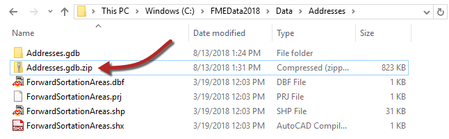](https://github.com/xuhengxx/FMETraining-1/tree/f1cdae5373cf9425ee2d148732792713c9043d44/ServerAuthoring6AdvancedWorkflows/Images/Img6.219.Ex2.CompressedAddresses.png)

接下来，将Addresses.gdb文件夹（或addresses.gdb.zip）上传到FME Server上的Resources&gt; Data&gt; Election&gt; Input文件夹：

[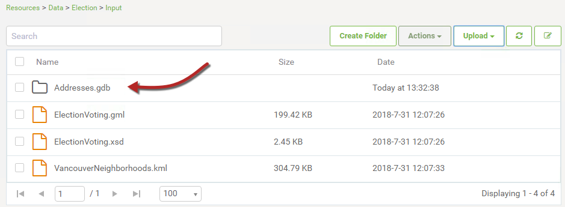](https://github.com/xuhengxx/FMETraining-1/tree/f1cdae5373cf9425ee2d148732792713c9043d44/ServerAuthoring6AdvancedWorkflows/Images/Img6.220.Ex2.UploadedCompressedAddresses.png)

  
**11）编辑工作空间以使用资源**  
返回FME Workbench，在“用户参数”下的“导航”窗口中查找三个现有已发布参数SourceDataset\_FILEGDB，SourceDataset\_SPATIALITE和DestDataset\_SPATIALITE。依次单击每个，然后按删除键将其删除。

接下来，找到地理数据库源数据集，SpatiaLite源数据集和地理数据库目标数据集的参数。更新参数如下：

| 地理数据库读模块 | $\(FME\_SHAREDRESOURCE\_DATA\)\Election\Input\Addresses.gdb.zip |
| :--- | :--- |
| SpatiaLite读模块 | $\(FME\_SHAREDRESOURCE\_DATA\)\Election\Output\VotingDivisions.sl3 |
| 地理数据库写模块 | $\(FME\_SHAREDRESOURCE\_DATA\)\Election\Output\NewAddresses.gdb.zip |

**注意：**如果您将Addresses.gdb作为zip文件上传，请在参数末尾为地理数据库读模块和写模块添加.zip。

最后一次调整：将写模块参数Overwrite Geodatabase（覆盖地理数据库）更改为Yes：

[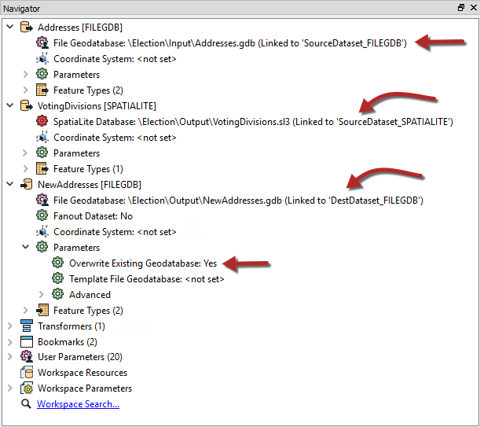](https://github.com/xuhengxx/FMETraining-1/tree/f1cdae5373cf9425ee2d148732792713c9043d44/ServerAuthoring6AdvancedWorkflows/Images/Img6.221.Ex2.UpdatedWorkspaceParameters.png)

  
**12）保存，发布和运行工作空间**  
保存工作空间（类似于AdvancedWorkflows-Ex2-CompleteB.fmw）并记住文件名：稍后它将很重要。将工作空间发布到FME Server。它应该在Job Submitter服务中注册。

在服务器Web界面中找到工作空间并运行它以确保它运行完成。成功的证据将是资源文件夹中的日志和压缩地理数据库文件。

[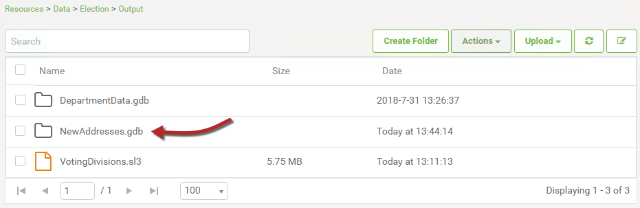](https://github.com/xuhengxx/FMETraining-1/tree/f1cdae5373cf9425ee2d148732792713c9043d44/ServerAuthoring6AdvancedWorkflows/Images/Img6.222.Ex2.GeodatabaseWrittenToResources.png)

您可能希望下载新创建的数据集以检查它并确保输出正确; 即，每个地址现在都有一个division属性。

  
**13）创建工作空间**  
上面是我们项目中的第二个工作空间。现在是第三个也是最后一个工作空间。此工作空间将用于链接前两个工作空间。它将成为主空间，两个先前的工作空间作为子空间。

因此，打开Workbench并从空白画布开始。放置一个Creator转换器，然后放置两个FMEServerJobSubmitter转换器：

[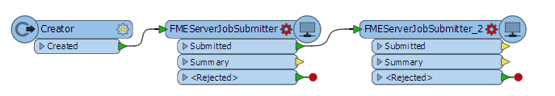](https://github.com/xuhengxx/FMETraining-1/tree/f1cdae5373cf9425ee2d148732792713c9043d44/ServerAuthoring6AdvancedWorkflows/Images/Img6.223.Ex2.FMEServerJobSubmitters.png)

  
**14）设置参数**  
检查第一个FMEServerJobSubmitter转换器的参数。

首先，选择您的FME Server连接。然后，在“提交模式”下，将“等待作业完成”设置为“是”。如果我们没有这样做，那么第二个job submitter转换器将在第一个完成之前运行！

最后，选择Training存储库和两个先前工作空间中的第一个（将选举分区从GML转换为SpatiaLite的工作空间）。

[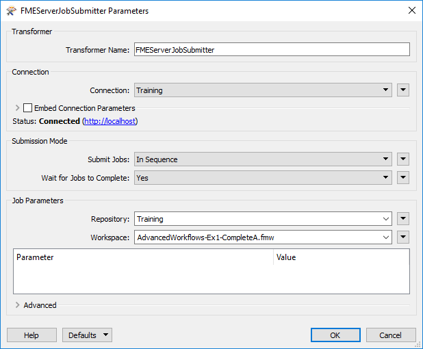](https://github.com/xuhengxx/FMETraining-1/tree/f1cdae5373cf9425ee2d148732792713c9043d44/ServerAuthoring6AdvancedWorkflows/Images/Img6.224.Ex2.FMEServerJobSubmitterParams1.png)

下面是我们可以设置转换参数的区域。但是，由于没有已发布的参数，我们无需担心。

单击“确定”关闭对话框。

请注意，转换器上的输出端口已更改，因为我们已将其设置为等待作业完成。通过将一个连接从Succeeded端口拖动到第二个转换器上的input端口，将其重新连接到另一个FMEServerJobSubmitter。

现在为第二个FMEServerJobSubmitter重复相同的过程，这次选择第二个工作空间（在分区上叠加地址的那个工作空间）。

  
**15）保存，发布和运行工作空间**  
保存工作空间（类似于AdvancedWorkflows-Ex2-CompleteC.fmw）并将其发布到FME Server。它应该在Job Submitter服务中注册。

在服务器Web界面中找到工作空间并运行它以确保它运行完成。它将依次运行两个子工作空间中的每一个。

不要担心FME会报告写入了零要素。这仅指主工作空间（而不是子工作空间）。成功的证据将是资源文件夹中的日志和新输出文件（sl3，gdb）：

[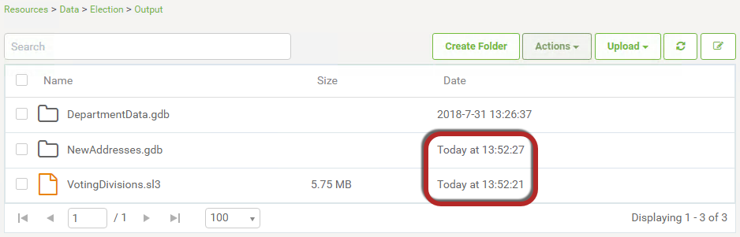](https://github.com/xuhengxx/FMETraining-1/tree/f1cdae5373cf9425ee2d148732792713c9043d44/ServerAuthoring6AdvancedWorkflows/Images/Img6.225.Ex2.OutputDatasetsInResources.png)

请注意，两个数据集的日期/时间戳非常相似; 应首先创建VotingDivisions.sl3文件，不久之后创建NewAddresses.gdb.zip。

---

|  Intuitive修女说...... |
| :--- |
|  如前所述，有许多方法可以设置链，这只是其中之一。将数据写入固定位置（如此处）的缺点是，有人可能会更改第一个工作空间以将数据写入其他位置，从而导致第二个工作空间失败。 |

---

<table>
  <thead>
    <tr>
      <th style="text-align:left">恭喜</th>
    </tr>
  </thead>
  <tbody>
    <tr>
      <td style="text-align:left">
        
通过完成本练习，您已学会如何：
           
        

        <ul>
          <li>创建用于读取和写入资源数据集的子工作空间</li>
          <li>使用FMEServerJobSubmitter创建运行子工作空间的主工作空间</li>
        </ul>
      </td>
    </tr>
  </tbody>
</table>
