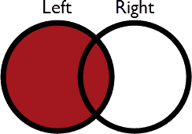

# FeatureJoiner模式

FeatureJoiner转换器是FME 2018的新变换器。它是FeatureMerger转换器的基于SQL的替代方案，它基于公共密钥将数据连接在一起，并使用SQL术语定义结果。

在画布上它看起来像这样：

参数对话框如下所示：

## 连接模式

连接的功能通过Joined端口退出变压器。其余要素会发生什么变化由连接模式（Join Mode）参数控制。

有三种连接模式：内部，左侧和完全。

**内部**模式下，没有连接的要素通过Unjoined Left或Unjoined Right端口退出。

**左侧** 模式下，没有匹配的左侧要素仍然通过Joined端口退出。没有匹配的右侧要素从Unjoined Right端口退出。

**完全** 模式下，没有匹配的左侧和右侧要素仍然通过Joined端口退出。

我们可以用图表来形象化这种行为：

| 模式 | 描述 | 描绘 | Joined Output | Unjoined Left | Unjoined Right |
| :--- | :--- | :--- | :--- | :--- | :--- |
| 左侧 | 左侧要素会查找匹配项，无论它们是否找到匹配项，，都会输出 |  | 所有匹配加上不匹配的左侧要素 | 无 | 未使用的右侧要素 |
| 内部 | 左侧要素会查找匹配项，如果找到则会输出 |  | 仅所有匹配的 | 不匹配的左侧要素 | 未使用的右侧要素 |
| 完全 | 左侧和右侧要素两者都通过Joined输出端口输出，无论它们是否找到连接 |  | 所有匹配加上不匹配的左侧和右侧要素 | 无 | None |

