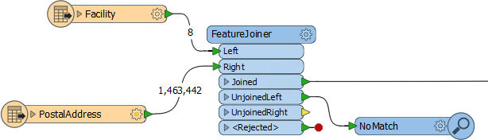

# 多连接匹配

每次左侧的要素与右侧的要素匹配时，从Joined端口输出新要素。这意味着，如果单个左侧（需求者）要素有多个匹配项，则会有多个输出要素。

这就是FeatureJoiner与FeatureMerger“处理重复提供者”参数无关的原因。它不需要这个。它只是为每个重复的提供者创建一个新的连接要素。

为了理解这一点，让我们来看看这个，其中包含一些要素计数:

有八（8）个设施要素和1,463,442个地址。有多少要素将退出Joined端口？这得看情况。

如果我们假设每个设施和地址之间存在严格的1：1匹配，则8个要素将作为已连接退出。为什么？因为我们有8个匹配。根据模式，计数将是以下之一：

|  | Joined | Unjoined Left | Unjoined Right |
| :--- | :--- | :--- | :--- |
| 左侧 | 8 | 0 | 1463434 |
| 内部 | 8 | 0 | 1463434 |
| 完全 | 1463442 | 0 | 0 |

但是，我们可能在设施和地址表之间没有这种干净的1：1匹配。我们可以有1：M，M：1，甚至M：M。

假设每个设施在地址表中有两个匹配项。然后我们得到这个：

|  | Joined | Unjoined Left | Unjoined Right |
| :--- | :--- | :--- | :--- |
| 左侧 | 16 | 0 | 1463426 |
| 内部 | 16 | 0 | 1463426 |
| 完全 | 1463442 | 0 | 0 |

为什么我们获得的要素比我们放入左侧端口更多？因为我们每个匹配都得到一个要素，而我们有16个匹配！

这不是FeatureMerger会做的事情。它要么会忽略第个匹配要么创建一个列表。但这被设计为一个SQL等效物，因此它的工作方式不同。事实上 - 在极端情况下 - 如果我们假设每个设施都有AddressID = 1，并且每个地址都有AddressID = 1，那么每个设施都会匹配到每个地址！

这将给我们8 x 1,463,442 = 11,707,536个匹配

如果你想要的要素与FeatureMerger提供的相同 - 一个匹配的记录和匹配列表 - 那么你只需要通过连接键创建一个ListBuilder分组列表。

