# 练习：犯罪分析项目

|  练习 |  FeatureJoiner |
| :--- | :--- |
| 数据 | 地址（Esri Geodatabase） 犯罪统计（Microsoft Excel） |
| 总体目标 | 使用街道名称和街区号码将犯罪统计数据连接到每个地址 |
| 演示 | FeatureJoiner转换器 |
| 启动工作空间 | C:\FMEData2018\Workspaces\UpgradingTo2018\FeatureJoiner-Ex1-Begin.fmw |
| 结束工作空间 | C:\FMEData2018\Workspaces\UpgradingTo2018\FeatureJoiner-Ex1-Complete.fmw |

您今天的任务是在地址点和犯罪统计数据集之间建立连接。已经设置了现有工作空间，以通过标准化连接键所需的属性来准备数据。

  
**1）打开工作空间**  
打开练习的开始工作空间FeatureJoiner-Ex1-Begin.fmw

检查工作空间内容：

[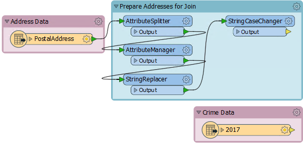](https://github.com/safesoftware/FMETraining/blob/Desktop-Upgrade-To-2018/2018Upgrade6FeatureJoiner/Images/Img6.200.StartingWorkspace.png)

请注意，特别设置了StringReplacer和StringCaseChanger来调整PostalAddress属性\(200大街\)，以便与犯罪数据\(2XX大街\)中的属性匹配。

还要注意，犯罪数据是直接从温哥华市的网站上读取的。我们可能不希望过多地读取这些内容，因此将使用缓存。。

|  技巧 |
| :--- |
|  如果由于某种原因，您无法访问温哥华市网站上的数据，请更改Excel读模块上的读模块参数以指向：C：\ FMEData2018 \ Data \ Emergency \ crime\_xlsx\_all\_years.zip |

  
**2）运行工作空间**  
在放下任何转换器之前，打开要素缓存并运行工作空间。我们无法确定填充缓存需要多长时间，我们可以在运行时继续构建工作空间。

  
**3）放置AttributeManager**  
 FeatureJoiner转换器不允许使用文本编辑器来构造连接键，因此我们希望制作的任何连接键必须在AttributeManager中完成。

因此，将一个AttributeManager转换器放在Prepare Addresses书签中，连接到StringCaseChanger：

[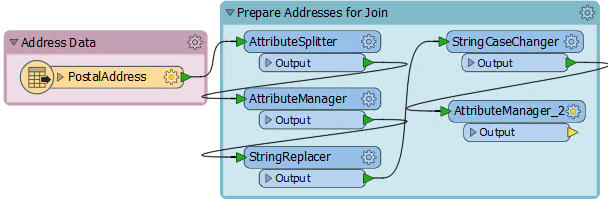](https://github.com/safesoftware/FMETraining/blob/Desktop-Upgrade-To-2018/2018Upgrade6FeatureJoiner/Images/Img6.201.AttrManagerOnCanvas.png)

打开AttributeManager参数对话框。创建一个名为JoinKey的新属性。对于属性值，单击下拉列表并选择打开文本编辑器。在编辑器中输入：

```text
@Trim（@Value（Number）@Value（Street））
```

...在Number和Street属性之间使用空格字符：

[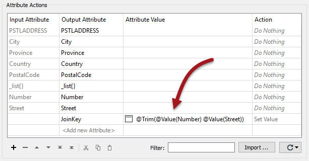](https://github.com/safesoftware/FMETraining/blob/Desktop-Upgrade-To-2018/2018Upgrade6FeatureJoiner/Images/Img6.202.AttrManagerParams.png)

  
**4）放置FeatureJoiner**  
添加FeatureJoiner转换器，新的AttributeManager连接到Left输入端口，Crime Data要素类连接到Right：

[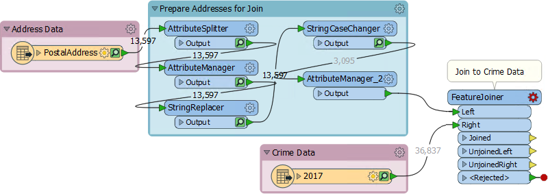](https://github.com/safesoftware/FMETraining/blob/Desktop-Upgrade-To-2018/2018Upgrade6FeatureJoiner/Images/Img6.203.FeatureJoinerOnCanvas.png)

打开参数对话框。将加入模式（Join Mode）设置为内部（ Inner），因为我们希望仅保留与同一街区上的犯罪匹配的地址。。将其他两个Join Mode参数保留为默认值（Use Left）：

[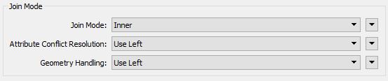](https://github.com/safesoftware/FMETraining/blob/Desktop-Upgrade-To-2018/2018Upgrade6FeatureJoiner/Images/Img6.204.FeatureJoinerJoinModeParams.png)

现在选择新创建的JoinKey属性作为左连接键（Left Join On）。选择现有的犯罪数据属性HUNDRED\_BLOCK作为右连接键（Right Join On）：

[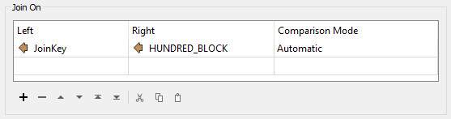](https://github.com/safesoftware/FMETraining/blob/Desktop-Upgrade-To-2018/2018Upgrade6FeatureJoiner/Images/Img6.205.FeatureJoinerJoinOnParams.png)

关闭对话框。

  
**5）运行工作空间**  
通过选择FeatureJoiner并选择Run To This来运行工作空间。除了注意转换的运行速度之外，请注意将有67,896个匹配的要素。那是因为每个街区有多个犯罪，因此每个地址有多个匹配。

检查缓存的数据，您会注意到每个要素有一个连接，而不是FeatureMerger可能创建的列表。

  
**6）添加AttributeValueMapper**  
我们想要执行此连接的原因是评估每个地址的犯罪。我们将通过为每个犯罪行为赋值并为每个地址创建一个总和来实现这一点。

因此，将AttributeValueMapper转换器连接到FeatureJoiner:Joined的输出端口。打开参数并将Source Attribute设置为TYPE，将Destination Attribute设置为_CrimeValue_：

[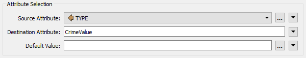](https://github.com/safesoftware/FMETraining/blob/Desktop-Upgrade-To-2018/2018Upgrade6FeatureJoiner/Images/Img6.206.AVMAttributeSelection.png)

现在单击“导入”按钮。我们将使用它从犯罪数据集中导入不同类型的犯罪列表。输入：

| 读模块格式 | Microsoft Excel |
| :--- | :--- |
| 读模块数据集 | C:\FMEData2018\Data\Emergency\crime\_xlsx\_all\_years.zip |

点击下一步。出现提示时（扫描数据集需要一段时间）选择2017作为要素类，并将Import From（导入自）更改为Attribute Values（属性值）：

[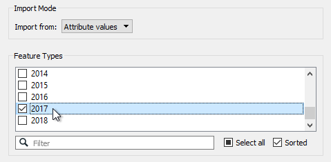](https://github.com/safesoftware/FMETraining/blob/Desktop-Upgrade-To-2018/2018Upgrade6FeatureJoiner/Images/Img6.207.AVMImport1.png)

接下来，选择TYPE作为源值（不需要选择目标值），然后单击“导入”。FME将导入一系列不同的犯罪行为。根据您认为的犯罪严重程度，给每个犯罪一个值（比如1-25）：

[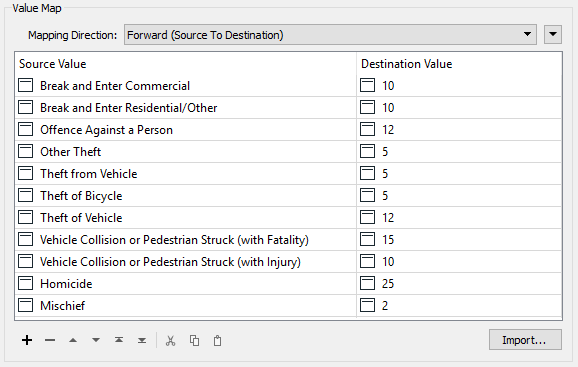](https://github.com/safesoftware/FMETraining/blob/Desktop-Upgrade-To-2018/2018Upgrade6FeatureJoiner/Images/Img6.208.AVMImport2.png)

别担心，这只是一个假设的练习。您不会被标记在你所给予的值上！

  
**7）添加Aggregator**  
现在我们需要按地址对所有连接的要素进行分组，并将犯罪值加在一起。ListBuilder和ListSummer可能是一个解决方案，但在这里我们将使用Aggregator 转换器，因为它可以在一个中执行两个操作。

因此，将Aggregator连接到AttributeValueMapper。打开参数对话框。设置：

* 分组依据：PSTLADDRESS
* 计数属性：NumberOfCrimes
* 加和属性：CrimeValue

如果我们想创建一个犯罪列表，我们可以使用Generate List选项执行此操作，但我们现在不会这样做：

[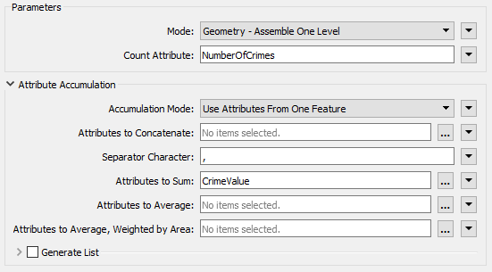](https://github.com/safesoftware/FMETraining/blob/Desktop-Upgrade-To-2018/2018Upgrade6FeatureJoiner/Images/Img6.209.AggregatorParams.png)

现在使用Aggregator上的Run To This运行工作空间：

[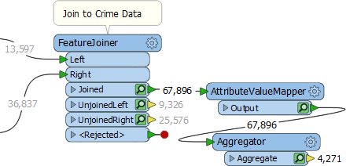](https://github.com/safesoftware/FMETraining/blob/Desktop-Upgrade-To-2018/2018Upgrade6FeatureJoiner/Images/Img6.210.AggregatorRunWorkspace.png)

Aggregator的输出（4,271个要素）加上FeatureJoiner（9,326）上的UnJoinedLeft输出应该等于进入FeatureJoiner（13,597）的地址数量。确实如此，所以我们可以告诉我们有正确数量的要素。

  
**8）添加CenterPointReplacer**  
检查Aggregator缓存。请注意，每个要素实际上都由一个多点要素组成。这是我们不需要的，因此将CenterPointReplacer转换器添加到工作空间的末尾以将其减少到单个点。

现在我们有了我们想要的输出：每个地址的一个要素，包括该街区中犯罪数量的计数以及它们的严重程度之和。有了这些信息，我们可以（如果需要）计算每个地址/块的平均犯罪严重程度，甚至可能使用MapnikRasterizer转换器映射这些数据。

将工作空间保存为模板，包括要素缓存，您可以在下次启动FME时继续执行项目。

<table>
  <thead>
    <tr>
      <th style="text-align:left">恭喜</th>
    </tr>
  </thead>
  <tbody>
    <tr>
      <td style="text-align:left">
        <p>通过完成本练习，您已学会如何：
          <br />
        </p>
        <ul>
          <li>为FeatureJoiner创建连接键</li>
          <li>使用FeatureJoiner转换器连接两组要素</li>
          <li>将多个连接要素与Aggregator组合在一起</li>
          <li>为分组连接创建单点几何对象</li>
        </ul>
      </td>
    </tr>
  </tbody>
</table>
