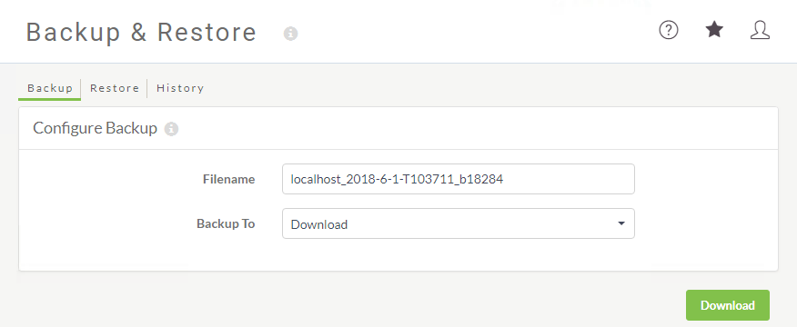
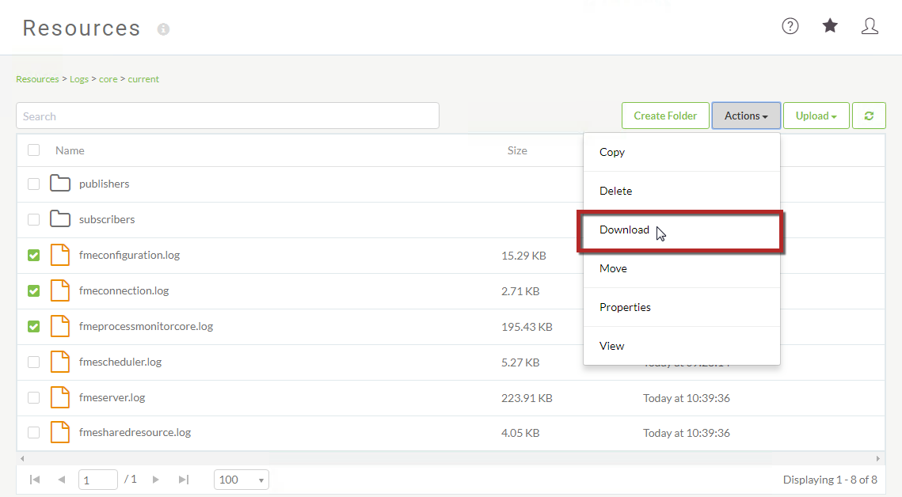

# 练习1：备份和迁移

|  练习1 |  备份和迁移 |
| :--- | :--- |
| 数据 | N / A |
| 总体目标 | 执行FME Server安装的备份和还原操作 |
| 演示 | 备份和恢复自动和手动FME Server配置 |

您的组织已决定将FME Server升级到刚刚发布的最新版本。您希望确保对当前FME Server所做的所有配置，设置和资源都将转移到新的FME Server安装中。通过备份当前的FME Server，然后将配置和设置迁移到新版本，您将节省大量时间！

|  Vector小姐说...... |
| :--- |
|  如果您已完成Configure for HTTPS练习，请记住，连接到FME Server的URL现在是https：// localhost：8443 / fmeserver而不是http：// localhost / fmeserver！ |

  
**1）连接到FME服务器**  
 通过Windows“开始”菜单上的“Web Interface”选项或直接在Web浏览器中打开FME Server Web界面，然后使用用户名和密码_admin_登录。

  
**2）备份FME服务器**  
 迁移FME Server时，需要备份当前的FME Server配置。

在左侧边栏上，单击“ **备份和还原”**。

在“ _备份”_页面上，确保已设置默认参数：

* **备份到：**下载

单击“ **下载”**按钮以启动FME Server备份过程并将文件保存到您的计算机。

  
**3）备份配置文件**  
最佳做法是将已更改的任何FME Server配置文件手动备份到FME Server安装目录之外的安全位置。某些配置不包含在主备份过程中，您可能希望引用对这些文件所做的更改。

在本培训课程中，如果您已完成所有练习，我们已修改_server.xml_，_web.xml_，_context.xml_，_cacerts_，并在配置FME Server for HTTPS练习中创建了一个_tomcat.keystore_文件。

因此，如果我们尝试迁移当前的FME Server配置，那么这些文件是我们以后在恢复FME服务器配置时需要有副本以供参考的。

使用备份配置文件保存这些文件，以便在还原期间轻松找到。

  
**4）备份日志文件**  
与配置文件一样，不会自动备份FME Server日志文件。

可以在_Logs_文件夹中Web界面的“ _资源”_页面上找到FME Server日志文件。

在本练习中，我们将仅备份几个日志文件。转到**资源&gt;日志&gt;核心&gt;当前，**并在_fmeconfiguration.log_，_fmeconnection.log_和_fmeprocessmonitorcore.log_旁边的复选框中_打勾_。

单击“ **下载”**并将这些日志文件保存在保存**BackupFMEServer**配置和配置文件的相同位置。

可以备份来自FME Server的日志文件，但_无法将其还原_到新的FME Server实例。但是，备份日志文件仍然是一个好主意，以备日后需要引用它们时使用。如果不备份日志文件，则在卸载FME Server时它们将消失。

|  Workbench博士说...... |
| :--- |
|  如果要备份整个日志文件夹，可以在FME Server系统共享的“资源”文件夹内的文件系统中找到它。 |

  
**5）验证备份，安装FME Server，还原配置**  
此时，在常规迁移工作流程中，这是验证备份并安装新FME Server的时间。为了本练习的目的，我们将在此结束练习。

_在_卸载FME Server _之前_，首先通过安装新的FME Server实例来验证FME Server备份至关重要。卸载后，除非您定期执行整个文件系统的备份，否则无法轻松回溯。

在还原手动备份的配置文件时，强烈建议您浏览每个配置文件，而不是简单地将旧配置文件复制到新的FME Server目录中 - 文件结构和参数可能在不同版本之间发生了变化！

<table>
  <thead>
    <tr>
      <th style="text-align:left">恭喜！</th>
    </tr>
  </thead>
  <tbody>
    <tr>
      <td style="text-align:left">
        
通过完成本练习，您已学会如何：
           
        

        <ul>
          <li>备份您的FME Server实例</li>
          <li>备份其他配置文件</li>
          <li>备份日志文件</li>
        </ul>
      </td>
    </tr>
  </tbody>
</table>