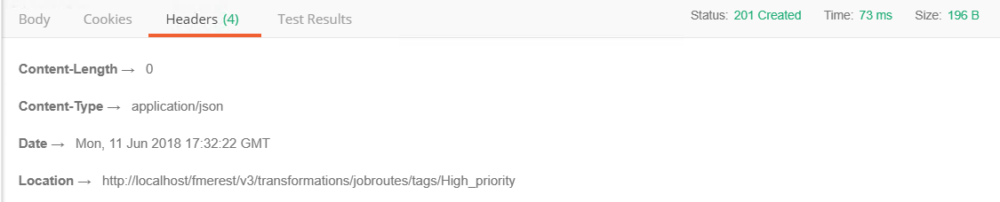
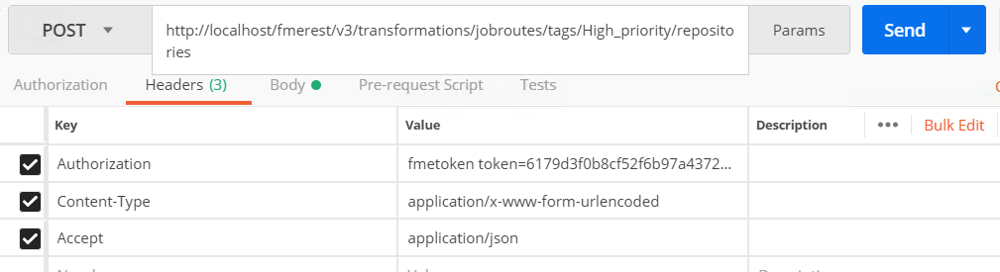
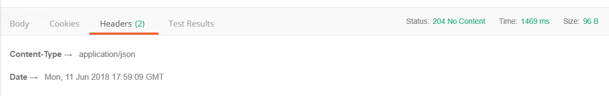

|  练习12 |  创建作业队列 |
| :--- | :--- |
| 数据 | 没有 |
| 总体的目标 |  演示如何使用FME REST API管理FME Server中的作业队列 |
| 演示 |  如何创建队列 |
| 工作空间 | 存储在范例仓库中austinDownload.fmw。 |

|  新变化 |
| :--- |
|  以前，通过引擎标签配置进行作业管理。这已被弃用，现在我们使用作业队列。但是，REST API端点是相同的，但是现在可以管理队列。 |

## 创建作业队列

以下调用允许您为作业创建新队列。创建的以下标签将被称为High\_Priority。任何带有此标签的作业都将发送到FMETRAINING\_Engine1。您可能需要向多个引擎添加标签。

_FMETRAINING\_Engine1特定于培训机器_

  
**1）在Postman中输入以下URL和Headers** 

&lt;style type =“text / css”&gt; .tg {border-collapse：collapse; border-spacing：0;} .tg td {font-family：Arial，sans-serif; font-size：14px; padding：10px 5px ; border-style：solid; border-width：1px; overflow：hidden; word-break：normal; border-color：black;} .tg th {font-family：Arial，sans-serif; font-size：14px; font-weight：normal; padding：10px 5px; border-style：solid; border-width：1px; overflow：hidden; word-break：normal; border-color：black;} .tg .tg-ao4k {background-color ：＃e6ffe6;颜色：＃333333; vertical-align：top} .tg .tg-a080 {background-color：＃e6ffe6; vertical-align：top} &lt;/ style&gt;

| POST | http:///fmerest/v3/transformations/jobroutes/tags |
| :--- | :--- |


**头域：**

* **Content-Type：** application / x-www-form-urlencoded
* **Accept：** application / json
* **Authorization：** fmetoken token = &lt;yourServerHost&gt;

[](https://github.com/xuhengxx/FMETraining-1/tree/b47e2c2ddcf98cce07f6af233242f0087d2d374d/FMESERVER_RESTAPI7JobManagement/Images/image7.1.1.JobRouteHeader.png)

  
**2）切换到Body选项卡。单击raw 并粘贴以下信息**

```text
engines=FMETRAINING_Engine1&name=High_priority&priority=1
```

[](https://github.com/xuhengxx/FMETraining-1/tree/b47e2c2ddcf98cce07f6af233242f0087d2d374d/FMESERVER_RESTAPI7JobManagement/Images/image7.1.2.JobBody.png)

**附加参数**

以下是您可能用于未来调用的一些其他参数。

| 参数 | 描述 |
| :--- | :--- |
| 描述 | 标签说明 |
| 引擎 | 标签的引擎分配 |
| 名称 | 必需 - 要创建的标签的唯一名称 |
| 资料库 | 标签的仓库分配 |
| 优先 | 标签的优先级。优先级值必须是1到10之间的整数。 |

  
**3）单击发送并查看来自FME Server的响应。**

您应该收到以下响应。

```text
 201- Success. The queue was created.
```

[](https://github.com/xuhengxx/FMETraining-1/tree/b47e2c2ddcf98cce07f6af233242f0087d2d374d/FMESERVER_RESTAPI7JobManagement/Images/image7.1.3.JobRouteResponse.png)

## 将引擎分配给作业队列

  
**4）在Postman中输入以下URL和头域** 

&lt;style type =“text / css”&gt; .tg {border-collapse：collapse; border-spacing：0;} .tg td {font-family：Arial，sans-serif; font-size：14px; padding：10px 5px ; border-style：solid; border-width：1px; overflow：hidden; word-break：normal; border-color：black;} .tg th {font-family：Arial，sans-serif; font-size：14px; font-weight：normal; padding：10px 5px; border-style：solid; border-width：1px; overflow：hidden; word-break：normal; border-color：black;} .tg .tg-ao4k {background-color ：＃e6ffe6;颜色：＃333333; vertical-align：top} .tg .tg-a080 {background-color：＃e6ffe6; vertical-align：top} &lt;/ style&gt;

| POST | http:///fmerest/v3/transformations/jobroutes/tags/High\_priority/engines |
| :--- | :--- |


**头域：**

* **Content-Type：** application / x-www-form-urlencoded
* **Accept：** application / json
* **Authorization：** fmetoken token = &lt;yourServerHost&gt;

  
**5）切换到Body选项卡。单击原始并粘贴以下信息：**

```text
engines=FMETRAINING_Engine1
```

  
**6）单击发送并查看来自FME Server的响应。**

## 将仓库分配给作业队列

在本练习的下一阶段，我们将获取刚刚创建的作业队列并将其分配给仓库。这可确保每次运行仓库中的作业时，都会将其分配给此队列。

  
**7）在Postman中输入以下URL和头域**

**请求** 

&lt;style type =“text / css”&gt; .tg {border-collapse：collapse; border-spacing：0;} .tg td {font-family：Arial，sans-serif; font-size：14px; padding：10px 5px ; border-style：solid; border-width：1px; overflow：hidden; word-break：normal; border-color：black;} .tg th {font-family：Arial，sans-serif; font-size：14px; font-weight：normal; padding：10px 5px; border-style：solid; border-width：1px; overflow：hidden; word-break：normal; border-color：black;} .tg .tg-ao4k {background-color ：＃e6ffe6;颜色：＃333333; vertical-align：top} .tg .tg-a080 {background-color：＃e6ffe6; vertical-align：top} &lt;/ style&gt;

| POST | http:///fmerest/v3/transformations/jobroutes/tags/High\_priority/repositories |
| :--- | :--- |


**头域：**

* **Content-Type：** application / x-www-form-urlencoded
* **Accept：** application / json
* **Authorization：** fmetoken token = &lt;yourServerHost&gt;

[](https://github.com/xuhengxx/FMETraining-1/tree/b47e2c2ddcf98cce07f6af233242f0087d2d374d/FMESERVER_RESTAPI7JobManagement/Images/image7.1.4.TagHeader.png)

  
**8）切换到Body选项卡。单击原始并粘贴以下信息：**

```text
repositories=RESTTraining
```

[](https://github.com/xuhengxx/FMETraining-1/tree/b47e2c2ddcf98cce07f6af233242f0087d2d374d/FMESERVER_RESTAPI7JobManagement/Images/image7.1.5.TagBody.png)

**额外参数**

以下是您可能用于未来调用的一些其他参数。

| 参数 | 描述 |
| :--- | :--- |
| 资料库 | 队列的仓库分配 |
| 标签 | 作业队列的名称 |

  
**9）单击发送并查看来自FME Server的响应。**

您应该收到以下响应。

```text
204- Success. The assigned repositories were assigned.
```

[](https://github.com/xuhengxx/FMETraining-1/tree/b47e2c2ddcf98cce07f6af233242f0087d2d374d/FMESERVER_RESTAPI7JobManagement/Images/image7.1.6.TagResponse.png)

  
**10）检查FME Server以查看是否已成功分配仓库**

转到FME Server并单击“仓库”。

[](https://github.com/xuhengxx/FMETraining-1/tree/b47e2c2ddcf98cce07f6af233242f0087d2d374d/FMESERVER_RESTAPI7JobManagement/Images/image7.1.7.TagAssigned.png)

在仓库名称的右侧，您应该看到潜在队列的下拉列表。应分配High\_Priority队列。

## 提交作业并在请求中包含标签

当你提交工作。您可以在TMDirectives下的请求中指定队列。TMDirectives指定服务器应如何运行作业。以下是完整的参数列表。

|  警告 |
| :--- |
|  请注意，优先级已被弃用，队列将被使用。 |

```text
TMDirectives {
rtc (boolean, optional): Runs a job until it is explicitly canceled. The job will run again regardless of whether the job completed successfully, failed, or the server crashed or was shut down.,

ttc (integer, optional): Time (in seconds) elapsed for a running job before it's canceled. The minimum value is 1 second, values less than 1 second are ignored.,

ttl (integer, optional): Time to live in the job queue (in seconds),
description (string, optional): Description of the request,

priority (integer, optional): The priority of the job. Priority values must be integers between 1 and 200. If a request's priority value is less than 1, greater than 200, or is not specified, then FME Server sets it to 100.,

tag (string, optional): The job routing tag for the request
}
```

以下是TMDirectives的外观示例：

```text
"TMDirectives": {
    "rtc": false,
    "ttc": 60,
    "description": "This is my description",
    "tag": "linux",
    "ttl": 60
  },
```

现在，我们将使用Submit调用并更改参数以包括先前创建的作业队列（在REST API中也称为标签）。

  
**11）在Postman中输入以下URL和头域** 

&lt;style type =“text / css”&gt; .tg {border-collapse：collapse; border-spacing：0;} .tg td {font-family：Arial，sans-serif; font-size：14px; padding：10px 5px ; border-style：solid; border-width：1px; overflow：hidden; word-break：normal; border-color：black;} .tg th {font-family：Arial，sans-serif; font-size：14px; font-weight：normal; padding：10px 5px; border-style：solid; border-width：1px; overflow：hidden; word-break：normal; border-color：black;} .tg .tg-ao4k {background-color ：＃e6ffe6;颜色：＃333333; vertical-align：top} .tg .tg-a080 {background-color：＃e6ffe6; vertical-align：top} &lt;/ style&gt;

| POST | http:///fmerest/v3/transformations/submit/Samples/austinDownload.fmw |
| :--- | :--- |


**头域：**

* **Content-Type：** application / json
* **Accept：** application / json
* **Authorization：** fmetoken token = &lt;yourServerHost&gt;

[](https://github.com/xuhengxx/FMETraining-1/tree/b47e2c2ddcf98cce07f6af233242f0087d2d374d/FMESERVER_RESTAPI7JobManagement/Images/image7.1.8.SubmitCall.png)

  
**12）切换到Body选项卡。单击原始并粘贴以下信息**

```text
{
  "publishedParameters": [
    {
      "name": "MAXY",
      "value": "42"
    },
    {
      "name": "THEMES",
      "value": [
        "airports",
        "cenart"
      ]
    }
  ],
  "TMDirectives": {
    "tag": "High_priority"

  }
}
```

[](https://github.com/xuhengxx/FMETraining-1/tree/b47e2c2ddcf98cce07f6af233242f0087d2d374d/FMESERVER_RESTAPI7JobManagement/Images/image7.1.9.SubmitResponse.png)

  
**13）单击发送并查看来自FME Server的响应。**

```text
{

    "id": 33

}
```

请注意。根据FME Server已完成的作业数量，服务器返回的作业ID将有所不同。

现在我们可以检查作业，看看作业是否在High\_priority标签下成功运行。

[](https://github.com/xuhengxx/FMETraining-1/tree/b47e2c2ddcf98cce07f6af233242f0087d2d374d/FMESERVER_RESTAPI7JobManagement/Images/image7.1.10.SubmitResponse.png)

  
**14）在Postman中输入以下URL和头域**

_**将33替换为您从上次调用中收到的ID**_ 

&lt;style type =“text / css”&gt; .tg {border-collapse：collapse; border-spacing：0;} .tg td {font-family：Arial，sans-serif; font-size：14px; padding：10px 5px ; border-style：solid; border-width：1px; overflow：hidden; word-break：normal; border-color：black;} .tg th {font-family：Arial，sans-serif; font-size：14px; font-weight：normal; padding：10px 5px; border-style：solid; border-width：1px; overflow：hidden; word-break：normal; border-color：black;} .tg .tg-ej3l {background-color ：＃66ccff; vertical-align：top} .tg .tg-ufe5 {background-color：＃66ccff; vertical-align：top} &lt;/ style&gt;

| GET | http:///fmerest/v3/transformations/jobs/id/ |
| :--- | :--- |


**头域：**

* **Accept：** application / json
* **Authorization：** fmetoken token = &lt;yourToken&gt;

  
**15）单击发送并查看来自FME Server的响应**

在响应中，您可以找到提交呼叫的引擎和呼叫参数。

[](https://github.com/xuhengxx/FMETraining-1/tree/b47e2c2ddcf98cce07f6af233242f0087d2d374d/FMESERVER_RESTAPI7JobManagement/Images/image7.1.11.Response.png)

正如您在此处看到的，作业是在High\_priority标签下提交的。然而，所显示的优先级仍然是-1。标签会覆盖这个优先级，所以它仍然以优先级1提交，只是没有显示在FME Server中。

<table>
  <thead>
    <tr>
      <th style="text-align:left">恭喜</th>
    </tr>
  </thead>
  <tbody>
    <tr>
      <td style="text-align:left">
        <p>通过完成本练习，您已学会如何：
          <br />
        </p>
        <ul>
          <li>使用REST API创建作业队列</li>
          <li>使用REST API将引擎分配给作业队列</li>
          <li>使用REST API将存储库分配给作业队列</li>
          <li>使用REST API运行作业并在调用中分配队列</li>
        </ul>
      </td>
    </tr>
  </tbody>
</table>
