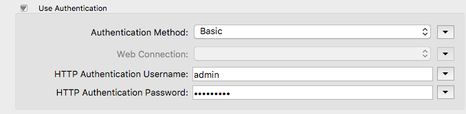
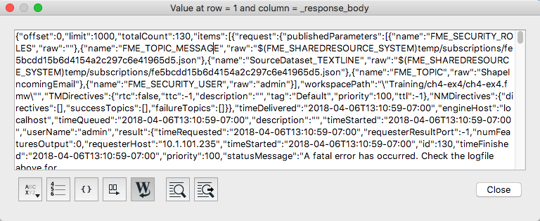
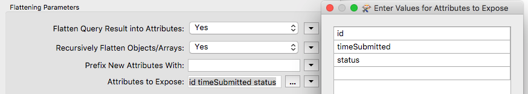
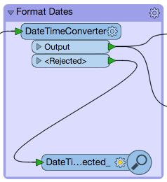
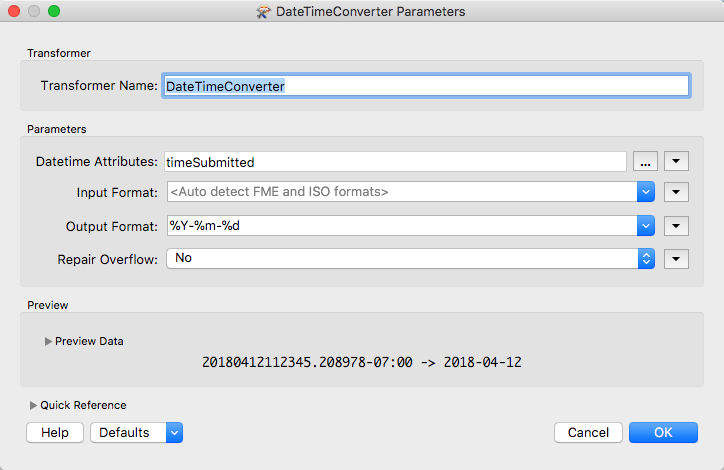
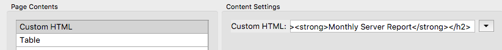
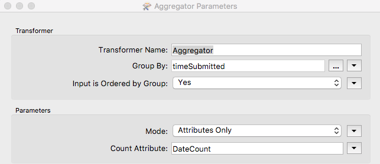
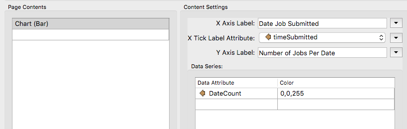
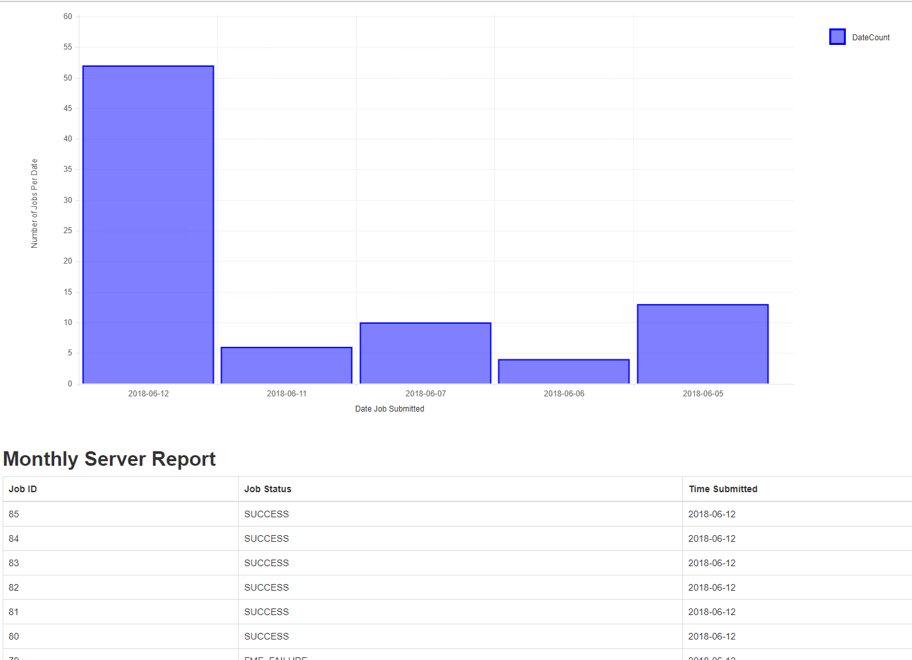

# 7.3练习13-创建工作区以检索作业历史记录

|  练习13 |  创建工作空间以检索作业历史记录结果 |
| :--- | :--- |
| 数据 | 无 |
| 总体目标 |  创建可以检索最后1000个作业并将其显示在HTML中的工作空间。 |
| 演示 |  如何在工作空间中使用“获取作业\(Get Jobs\)”调用 |
| 工作空间 |  C:\FMEData2018\Resources\RESTAPI\Chapter7Exercise13.Complete |

在本练习中，我们将创建一个工作空间，用于从FME Server检索作业历史记录，并创建包含结果的HTML文件。我们将创建的第一个工作空间从FME Server检索最新的1000个作业。然后将结果格式化为包含结果的表格，在此表格下方将有一个图表，其中包含按日期显示的结果数量。

## 使用HTTPCaller获取作业，然后格式化属性

[](https://github.com/xuhengxx/FMETraining-1/tree/b47e2c2ddcf98cce07f6af233242f0087d2d374d/FMESERVER_RESTAPI7JobManagement/Images/image7.3.1.Step1.png)

  
**1）添加一个Creator**

在空白的FME工作空间中添加Creator转换器。可以接受默认参数。

  
**2）添加HTTPCaller**

添加HTTPCaller并设置如下所示的参数：

**请求URL：** http：// &lt;yourServerHost&gt; / fmerest / v3 / transformations / jobs / completed **HTTP方法：** GET

[](https://github.com/xuhengxx/FMETraining-1/tree/b47e2c2ddcf98cce07f6af233242f0087d2d374d/FMESERVER_RESTAPI7JobManagement/Images/image7.3.2.HTTPParam.png)

选中使用身份验证旁边的复选框。然后选择Basic作为身份验证模式，并使用Admin/Admin用户名和密码。您还可以将身份验证方法设置为Web连接，然后使用在上一个练习中创建的FME Server连接。

[](https://github.com/xuhengxx/FMETraining-1/tree/b47e2c2ddcf98cce07f6af233242f0087d2d374d/FMESERVER_RESTAPI7JobManagement/Images/image7.3.3.HTTPAuth.png)

  
**3）附加一个Inspector**

将Inspector附加到HTTPCaller。然后运行工作空间。工作空间运行后，将显示FME Data Inspector。

[](https://github.com/xuhengxx/FMETraining-1/tree/b47e2c2ddcf98cce07f6af233242f0087d2d374d/FMESERVER_RESTAPI7JobManagement/Images/image7.3.4.HTTPResponse.png)

我们需要解析响应以将我们想要的信息转换为我们可以使用的属性。在本练习中，我们将保留id，timeSubmitted和status。我们希望在从FME Server返回的JSON中找到id，timeSubmitted和status。

  
**4）删除Inspector**

现在，我们知道我们想要保留的属性并了解它们存储在从FME Server返回的JSON中的位置，我们可以删除Inspector。选择Inspector并点击键盘上的删除按钮。

  
**5）添加JSONFragmenter**

我们将使用JSONFragmenter将响应解析为所需的属性。

[](https://github.com/xuhengxx/FMETraining-1/tree/b47e2c2ddcf98cce07f6af233242f0087d2d374d/FMESERVER_RESTAPI7JobManagement/Images/image7.3.5.JSONFrag.png)

JSON属性是从前一个调用生成的响应主体。

JSON查询应该以json开头，然后是存储属性的类别。这可能首先需要一些试错。

对于JSON查询，我们希望在项目类别中找到所有响应，因此，我们使用此语句json \[“items”\] \[\*\]

接下来，我们需要在JSONFragmenter中设置Flattening Parameters。

[](https://github.com/xuhengxx/FMETraining-1/tree/b47e2c2ddcf98cce07f6af233242f0087d2d374d/FMESERVER_RESTAPI7JobManagement/Images/image7.3.6.FlatParam.png)

在这里，我们输入我们希望保留的查询属性。您应该保留id，timeSubmitted和status。

  
**6）添加一个Attribute Keeper**

接下来，添加AttributeKeeper。将AttributeKeeper附加到JSONFragmenter。在参数和要保留的属性下：写入timeSubmitted，id，status。

[](https://github.com/xuhengxx/FMETraining-1/tree/b47e2c2ddcf98cce07f6af233242f0087d2d374d/FMESERVER_RESTAPI7JobManagement/Images/image7.3.7.AttKeep.png)

## 格式日期

[](https://github.com/xuhengxx/FMETraining-1/tree/b47e2c2ddcf98cce07f6af233242f0087d2d374d/FMESERVER_RESTAPI7JobManagement/Images/image7.3.8.Step2.png)

  
**7）添加DateTimeConverter**

添加DateTimeConverter并将其附加到AttributeKeeper。使用DateTimeConverter将日期格式化为％Y-％m-％d格式。从FME Server返回的日期时间格式可能难以阅读。通过修改输出格式，我们可以使我们的图表更具视觉吸引力。

参数应填写如下：

**日期时间属性：** timeSubmitted  
 **输入格式：**自动检测FME和ISO格式  
 **输出格式：**％Y-％m-％d  
 **修复溢出：**否

[](https://github.com/xuhengxx/FMETraining-1/tree/b47e2c2ddcf98cce07f6af233242f0087d2d374d/FMESERVER_RESTAPI7JobManagement/Images/image7.3.9.DateTime.png)

## 使用作业历史记录结果创建表格

[](https://github.com/xuhengxx/FMETraining-1/tree/b47e2c2ddcf98cce07f6af233242f0087d2d374d/FMESERVER_RESTAPI7JobManagement/Images/image7.3.10.Step3.png)

如果我们用当前的结果编译一个表，它将创建一个表。但是，它没有顺序，所以我们使用Sorter转换器。

  
**8）添加Sorter转换器**

Sorter转换器将连接到DateTimeConverter。在“排序依据”部分下，列出以下参数：

[](https://github.com/xuhengxx/FMETraining-1/tree/b47e2c2ddcf98cce07f6af233242f0087d2d374d/FMESERVER_RESTAPI7JobManagement/Images/image7.3.11.Sorter.png)

  
**9）添加HTMLReportGenerator**

在HTML报告生成器中，我们可以添加自定义的HTML或包含从FME Server获取的信息的表。

[](https://github.com/xuhengxx/FMETraining-1/tree/b47e2c2ddcf98cce07f6af233242f0087d2d374d/FMESERVER_RESTAPI7JobManagement/Images/image7.3.12.HTMLReportGen.png)

  
**10）将自定义HTML添加到HTMLReportGenerator**

首先，我们要添加自定义HTML以指定HTML文件中的头域。

```text
<h2><strong>Monthly Server Report</strong></h2>
```

如果您有一个简介或任何格式化要求，您也可以将它放在这里。

  
**11）将表添加到HTMLReportGenerator**

接下来，在页面内容下，添加一个表。指定表将使用的列内容和标题。

[](https://github.com/xuhengxx/FMETraining-1/tree/b47e2c2ddcf98cce07f6af233242f0087d2d374d/FMESERVER_RESTAPI7JobManagement/Images/image7.3.13.HTMLTableParam.png)

要在创建表之前查看该表，请单击“在浏览器中预览”按钮。

## 使用”按日期的作业“创建条形图

[](https://github.com/xuhengxx/FMETraining-1/tree/b47e2c2ddcf98cce07f6af233242f0087d2d374d/FMESERVER_RESTAPI7JobManagement/Images/image7.3.14.Step4.png)

  
**12）添加Aggregator转换器**

添加Aggregator转换器并将其附加到DateTimeConverter。

[](https://github.com/xuhengxx/FMETraining-1/tree/b47e2c2ddcf98cce07f6af233242f0087d2d374d/FMESERVER_RESTAPI7JobManagement/Images/image7.3.15.AggSetUP.png)

我们需要按日期汇总所有作业以创建条形图，因此我们需要Aggregator。

[](https://github.com/xuhengxx/FMETraining-1/tree/b47e2c2ddcf98cce07f6af233242f0087d2d374d/FMESERVER_RESTAPI7JobManagement/Images/image7.3.16.Aggregator.png)

在这里，我们按timeSubmitted对结果进行分组，timeSubmitted是提交属性的日期。然后在Count Attribute下，我们创建一个名为DateCount的新属性。 **确保“聚合模式\(Accumulation Mode\)”设置为“合并传入属性\(Merge Incoming Attributes\)”**

  
**13）附加HTMLReportGenerator**

接下来，我们附加另一个HTMLReportGenerator。参数设置如下：

[](https://github.com/xuhengxx/FMETraining-1/tree/b47e2c2ddcf98cce07f6af233242f0087d2d374d/FMESERVER_RESTAPI7JobManagement/Images/image7.3.17.png)

## 格式化布局并写入HTML

[](https://github.com/xuhengxx/FMETraining-1/tree/b47e2c2ddcf98cce07f6af233242f0087d2d374d/FMESERVER_RESTAPI7JobManagement/Images/image7.3.18.Step5.png)

  
**14）添加HTMLLayouter**

将HTMLReportGenerators连接到HTMLLayouter。

[](https://github.com/xuhengxx/FMETraining-1/tree/b47e2c2ddcf98cce07f6af233242f0087d2d374d/FMESERVER_RESTAPI7JobManagement/Images/image7.3.19.HTMLLayouter.png)

  
**15）添加HTML写模块**

最后，添加一个HTML写模块。可以接受默认值。将文件保存到：

C:\FMEData2018\Resources\Output\Training\JobHistory.html

  
**16）查看结果！**

运行工作空间并查看结果。

[](https://github.com/xuhengxx/FMETraining-1/tree/b47e2c2ddcf98cce07f6af233242f0087d2d374d/FMESERVER_RESTAPI7JobManagement/Images/image7.3.20.Results.png)

<table>
  <thead>
    <tr>
      <th style="text-align:left">恭喜</th>
    </tr>
  </thead>
  <tbody>
    <tr>
      <td style="text-align:left">
        <p>通过完成本练习，您已学会如何：
          <br />
        </p>
        <ul>
          <li>使用工作空间调用FME Server REST API以检索作业</li>
          <li>查看FME Server的响应</li>
          <li>使用HTMLReportGenerator创建结果报告</li>
        </ul>
      </td>
    </tr>
  </tbody>
</table>