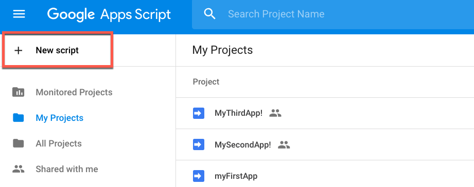

### 8.2托管Web应用程序

有几种方法可以完成此培训并查看您的Web应用程序。

如果您没有自己的Web服务器，则可以使用以下选项之一进行本课程。

#### 本地主机服务器

如果您没有面向外部的服务器，这是一个很好的方法。这是一种创建页面并在本地托管的简单方法。请注意，如果您的服务器仅在本地托管，则无法将数据流用于Google Maps和ESRI功能。在8.3节中将会有一个练习来设置这个。

**1.安装Python**

只需访问以下网站 [https://www.python.org/](https://www.python.org/)，找到下载最新版python的下载链接并安装到您的计算机上。

**2.找到终端（Mac / Linux）或命令提示符（Windows）**

使用命令浏览文件夹，找到文件的存储位置。

以下是有用的命令：

这些命令列在Github [Terminal Mac Cheatsheet](https://github.com/0nn0/terminal-mac-cheatsheet)存储库中。

| 键 | 描述 |
| :--- | :--- |
| CD \[文件夹\] | 更改目录，例如cd Documents |
| CD |  主页目录 |
| ls（Mac）或dir（Windows） | 列出文件 |

 **3.输入Python命令**  


_**对于Python 2.7**_

|  警告 |
| :--- |
|  Python 2.7已从FME产品中弃用。如果您在FME工作空间中使用Python 2.7，请阅读 [Python 2.7 Deprecation](https://knowledge.safe.com/articles/71635/python-27-deprecation.html)。 |

```text
python -m“SimpleHTTPServer”8080
```

请注意，如果由于格式问题而粘贴命令，这可能不起作用。如果键入命令，它将起作用。  
  
 _**对于Python 3.6**_

```text
python -m http.server
```

**4.打开浏览器并输入：** [http：// localhost：8080 /](http://localhost:8080/)

**5.选择您的文件（可选）**

如果您没有直接导航到该文件，则可能必须使用提示选择它。

#### Google Apps脚本

如果您有一个面向外部的服务器但没有预先存在的Web目录结构，这是一个很好的方法。GoogleAppsScript可免费使用，但需要Google登录。

只需转到[https://script.google.com/home](https://script.google.com/home)，然后点击新建脚本即可创建您的网络应用程序。

[](https://github.com/xuhengxx/FMETraining-1/tree/b47e2c2ddcf98cce07f6af233242f0087d2d374d/FMESERVER_RESTAPI8Session2/Images/8.2.1.GoogleAppsScript.png)

删除Code.gs中当前的内容并粘贴：

```text
function doGet() {
  return HtmlService.createHtmlOutputFromFile('index');

}
```

然后，创建一个名为index.html的新HTML文件并开始工作。

创建网页后，您可以通过该应用程序查看它。单击“发布”，然后单击“部署为Web应用程序”。

#### Safe Software如何部署Web应用程序

虽然您不会在课程中部署这样的Web应用程序，但您可能很好奇Safe Software如何部署Web演示。

所有Safe Software的Web演示都以下列方式托管。首先，应用程序文件夹发布到GitHub。GitHub具有版本控制的优势。因此，一旦对代码进行了编辑，它将显示谁进行了更改以及何时进行了更改。

然后，Safe使用部署，当GitHub上的代码更新时，它就会得到通知。然后将应用程序推送到AWS S3 Web服务器。

有关此问题的更多详细信息，请访问在[FME云之上部署Web应用程序](https://knowledge.safe.com/articles/677/deploying-a-web-application-on-top-of-fme-cloud-s3.html)的文章。

