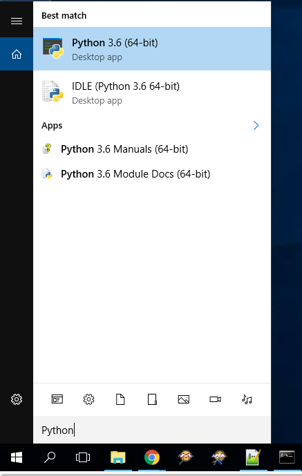
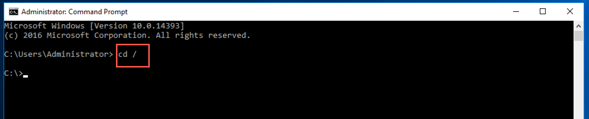
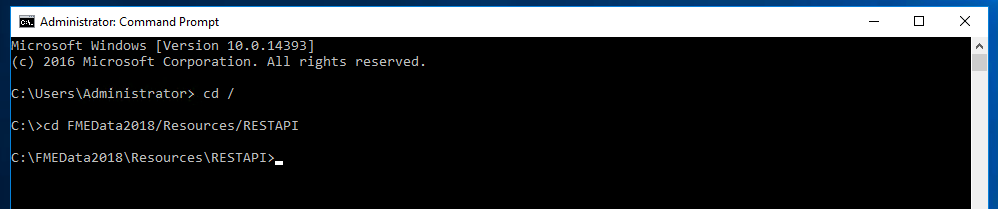
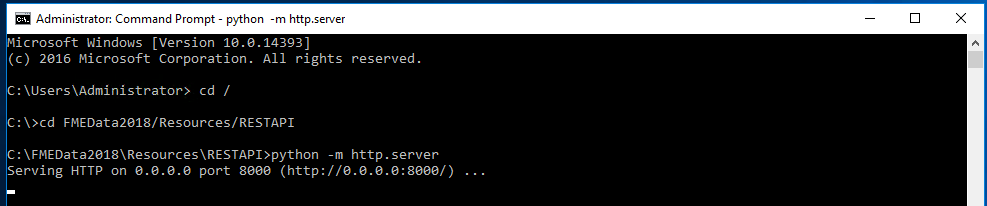
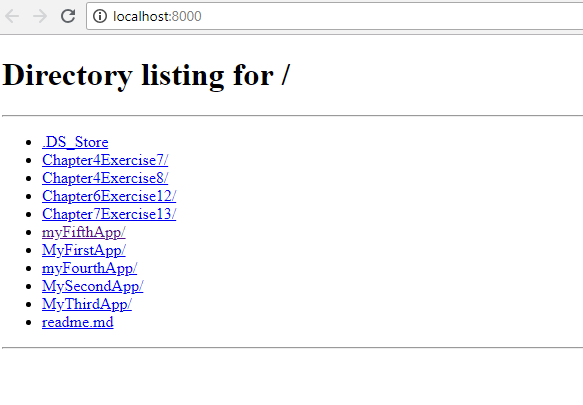
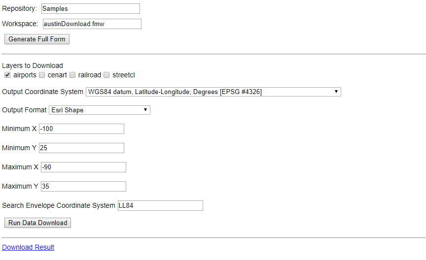

# 8.3练习14-设置Web应用程序

|  练习14 |  设置Web目录 |
| :--- | :--- |
| 数据 | 没有 |
| 总体的目标 |  正确配置桌面以在本地托管Web应用程序 |
| 演示 | 如何使用Python正确设置本地服务器 |

在测试网页时，我们需要创建一个简单的本地HTTP服务器来访问其功能。一旦计算机关闭，这个简单的服务器将被终止。如果您使用的是培训计算机，则这些是具体说明。http server是Python 3.x中的命令。此外，您可能希望根据存储培训数据的位置导航到其他目录。

**可选步骤**

如果您不使用培训计算机，则可能需要下载[Python](https://www.python.org/)。要检查计算机上是否安装了Python，请使用搜索功能并搜索Python。

[](https://github.com/xuhengxx/FMETraining-1/tree/b47e2c2ddcf98cce07f6af233242f0087d2d374d/FMESERVER_RESTAPI8Session2/Images/8.3.0.Python.png)

如果您的计算机上安装了Python3.x，请继续执行步骤1。

  
**1）打开命令提示符**

  
**2）在命令提示符下键入：**

```text
    cd /
```

[](https://github.com/xuhengxx/FMETraining-1/tree/b47e2c2ddcf98cce07f6af233242f0087d2d374d/FMESERVER_RESTAPI8Session2/Images/8.3.1.cd.png)

这会将您引导至C盘。

  
**3）在命令提示符下键入：**

```text
  cd FMEData2018/Resources/RESTAPI
```

[](https://github.com/xuhengxx/FMETraining-1/tree/b47e2c2ddcf98cce07f6af233242f0087d2d374d/FMESERVER_RESTAPI8Session2/Images/8.3.2.resource.png)

  
**4）在命令提示符下键入：**

```text
python -m http.server
```

[](https://github.com/xuhengxx/FMETraining-1/tree/b47e2c2ddcf98cce07f6af233242f0087d2d374d/FMESERVER_RESTAPI8Session2/Images/8.3.3.server.png)

这是启动将在本地托管的服务器的命令。

  
**5）打开浏览器并输入：**[**http：// localhost：8000 /**](http://localhost:8000/) [](https://github.com/xuhengxx/FMETraining-1/tree/b47e2c2ddcf98cce07f6af233242f0087d2d374d/FMESERVER_RESTAPI8Session2/Images/8.3.4.Directory.png)

  
**6）导航到My First App**

选择myFirstApp。然后，选择myFirstApp.html。这是一个功能齐全的Web应用程序，我们将在下一个练习中创建它。

[](https://github.com/xuhengxx/FMETraining-1/tree/b47e2c2ddcf98cce07f6af233242f0087d2d374d/FMESERVER_RESTAPI8Session2/Images/8.3.5.myFirstApp.png)

<table>
  <thead>
    <tr>
      <th style="text-align:left">恭喜</th>
    </tr>
  </thead>
  <tbody>
    <tr>
      <td style="text-align:left">
        <p>通过完成本练习，您已学会如何：
          <br />
        </p>
        <ul>
          <li>使用Python创建一个简单的服务器</li>
        </ul>
      </td>
    </tr>
  </tbody>
</table>