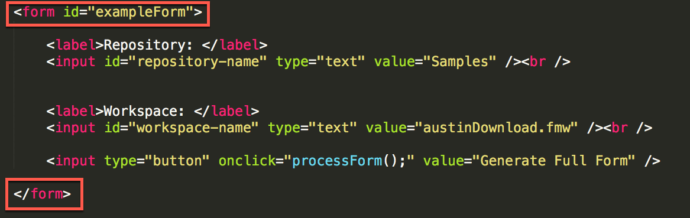
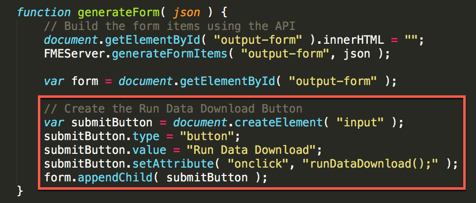
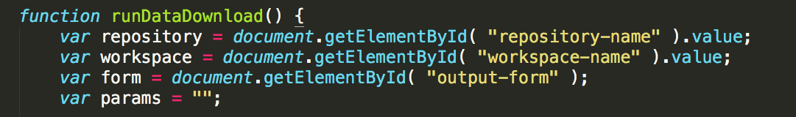
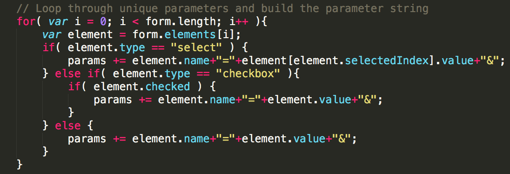
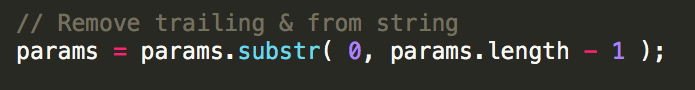
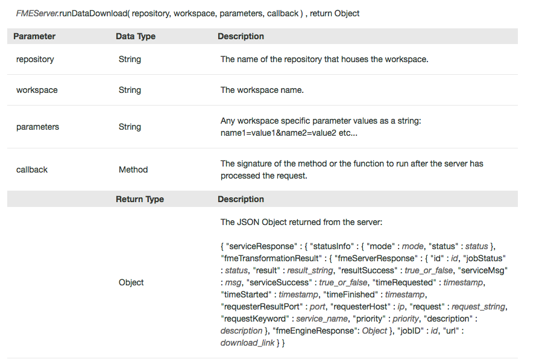
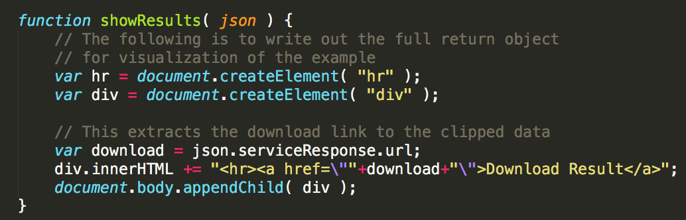

# 9.2练习15-创建动态填充的表单网页

|  练习15 |  使用REST API动态生成表单 |
| :--- | :--- |
| 数据 | 无 |
| 总体目标 | 展示FME Server JavaScript API的功能。此练习允许您根据工作空间中的参数动态生成表单，并让用户填写参数并运行工作空间。 |
| 演示 |  如何使用getWorkspaceParameters，generateFormItems和runDataDownload函数。 |
| 完成的HTML | C:\FMEData2018\Resources\RESTAPI\myFirstApp\myFirstApp.html |

在下一个练习中，我们将创建一个表单，根据用户选择的内容自动更新参数。如果要为客户端创建应用程序以访问数据而不通过FME Server，则可以使用此方法。

|  警告 |
| :--- |
|  要使本练习正常工作，您需要完成 [练习14](https://safe-software.gitbooks.io/fme-server-rest-api-training-2018/content/FMESERVER_RESTAPI8Session2/8.3.Exercise.SettingUp.html)或使用现有的Web服务器进行测试。 |

## 创建表单

  
**1）打开Notepad ++（或其他文本编辑器）**

转到开始菜单并打开Notepad ++。然后，在顶部工具栏中找到语言，找到H，然后选择HTML。通过选择语言，它将打开语法高亮显示。

  
**2）将空白文件另存为myFirstApp.html**

导航到C：/ FMEData2018 / Resources / RESTAPI并将文件另存为myFirstApp.html。

  
**3）复制并粘贴以下代码：** \`\`\`javascriptPopulate Forms \`\`\`

[](https://github.com/xuhengxx/FMETraining-1/tree/b47e2c2ddcf98cce07f6af233242f0087d2d374d/FMESERVER_RESTAPI9CustomApplications/Images/9.1.1.Head.png)

_HTML的头部分_

在页面的头部分，我们链接到外部样式表和  
 FME Server JavaScript API。

接下来，我们将构建HTML的主体。我们需要创建一个表单来  
 显示查找工作空间所需的初始信息。

  
**4）在主体部分粘贴：**

```text
<body>
    <form id="exampleForm">
        <label>Repository: </label>
        <input id="repository-name" type="text" value="Samples"/><br />
        <label>Workspace: </label>
        <input id="workspace-name" type="text" value="austinDownload.fmw" /> <br />
        <input type="button" onclick="processForm();" value="Generate Full Form" />
    </form>
</body>
```

[](https://github.com/xuhengxx/FMETraining-1/tree/b47e2c2ddcf98cce07f6af233242f0087d2d374d/FMESERVER_RESTAPI9CustomApplications/Images/9.1.2a.Form.png)

这两个区域表明我们已经创建了一个被称为“exampleForm”的表单。如果我们需要JavaScript来处理表单  
 ，那么我们将通过id引用它。

[](https://github.com/xuhengxx/FMETraining-1/tree/b47e2c2ddcf98cce07f6af233242f0087d2d374d/FMESERVER_RESTAPI9CustomApplications/Images/9.1.3a.Created.png)

在表单中，我们创建标签和输入。标签名为  
 Repository：它将出现在页面上。然后我们需要给输入一个id，以便稍后调用它。输入类型为text，名称为repository，默认值为Samples。

我们为工作空间重复相同的输入过程。

[](https://github.com/xuhengxx/FMETraining-1/tree/b47e2c2ddcf98cce07f6af233242f0087d2d374d/FMESERVER_RESTAPI9CustomApplications/Images/9.1.4a.Button.png)

  
**5）将此代码粘贴到主体部分中**

现在，我们需要一个区域来创建新表单。因此，我们必须创建一个将由JavaScript修改的空白表单。这将在第一个表格后插入**到主体中**。

```text
<hr />

<form id="output-form"></form>
```

在本节中，我们将创建一个按钮，该按钮将被处理以创建带有参数的表单。

  
**6）测试代码！**

目前，我们的代码应该是这样的！

```javascript
<head>

  <title>Populate Forms</title>

  <!-- Styles for example -->
  <link rel="stylesheet" href="https://playground.fmeserver.com/css/FMEServerExamples.css" type="text/css" />

  <!-- Include FMEServer.js -->
  <script type="text/javascript" src="https://api.fmeserver.com/js/v1.2/FMEServer.js"></script>

  <base target="_top">

</head>

<body>

  <form id="exampleForm">

      <label>Repository: </label>
      <input id="repository-name" type="text" value="Samples" /><br />


      <label>Workspace: </label>
      <input id="workspace-name" type="text" value="austinDownload.fmw" /><br />

      <input type="button" onclick="processForm();" value="Generate Full Form" />

  </form>

  <hr />
  <form id="output-form"></form>

</body>
```

在继续之前，我们应该测试一下页面。您可以通过单击HTML文件来测试您的页面。你应该看到这个。

[](https://github.com/xuhengxx/FMETraining-1/tree/b47e2c2ddcf98cce07f6af233242f0087d2d374d/FMESERVER_RESTAPI9CustomApplications/Images/9.1.5.FinalForm.png)

## 添加JavaScript以填充表单

目前，我们有一个没有功能的页面。所以让我们添加一些  
 JavaScript。

  
**7）将JavaScript标签添加到代码中**

在主体中，我们可以添加脚本标签。这表明下一部分是在JavaScript中。**所有JavaScript都在这些标签内。**

```text
  <script type="text/JavaScript">

  </script>
```

  
**8\) Add the following code within the JavaScript tags**

First, we have to connect to the FME Server to retrieve the information  
 for the repository and the workspace.

```text
window.onload = function() {
    FMEServer.init({
    server : "http://52.xx.xx.xxx",
    token : "568c604bc1f235bbe137c514e7c61a8436043070"
    });
};

```

  
**8）在JavaScript标签中添加以下代码**

首先，我们必须连接到FME Server以检索  
 存储库和工作空间的信息。

```text
window.onload = function() {
    FMEServer.init({
    server : "http://52.xx.xx.xxx",
    token : "568c604bc1f235bbe137c514e7c61a8436043070"
    });
};

```

[](https://github.com/xuhengxx/FMETraining-1/tree/b47e2c2ddcf98cce07f6af233242f0087d2d374d/FMESERVER_RESTAPI9CustomApplications/Images/9.1.6.ServerConnect.png)

  
**9）查找您的公共IP地址**

如果您的FME Server已设置为可从外部访问，则可以在FME Server URL中使用这些详细信息。这些培训机器应面向外部，以便您可以使用它们。如果您的Web服务器（对于Web应用程序）和FME Server位于同一个域或同一台计算机上，则可以使用内部IP地址或主机名来访问FME Server。

但请注意，如果无法从外部访问FME Server，则Google Maps和Esri功能将无法使用。

Google输入 "my IP address"。第一个结果应该是从谷歌显示的您的公共IP地址。

  
**10）更新给你的服务器和令牌**

下一步是将服务器和令牌部分更新为您自己的部分。如果您想再次找到您的令牌。转到此链接：

```text
http://<yourServerHost>/fmetoken/
```

  
**11）插入下面的代码**

接下来，我们可以插入函数processForm。当  
 用户单击“生成完整表单”按钮时，这将被激活。

```javascript
// The process form function that gets the repository and the workspace
function processForm() {
    var repository = document.getElementById( "repository-name" ).value;
    var workspace = document.getElementById( "workspace-name" ).value;

    // Get the workspace parameters from FME Server
    FMEServer.getWorkspaceParameters( repository, workspace, generateForm );
}
```

[](https://github.com/xuhengxx/FMETraining-1/tree/b47e2c2ddcf98cce07f6af233242f0087d2d374d/FMESERVER_RESTAPI9CustomApplications/Images/9.1.7.Repository.png)

在本节中，我们将根据  
 从上一个表单收到的输入创建变量。

[](https://github.com/xuhengxx/FMETraining-1/tree/b47e2c2ddcf98cce07f6af233242f0087d2d374d/FMESERVER_RESTAPI9CustomApplications/Images/9.1.8.workspace.png)

然后我们使用函数FMEServer.getWorkspaceParameters来获取  
 在调用中创建的工作空间参数。

[](https://github.com/xuhengxx/FMETraining-1/tree/b47e2c2ddcf98cce07f6af233242f0087d2d374d/FMESERVER_RESTAPI9CustomApplications/Images/9.1.9.Parameters.png)

  
**12）将此部分粘贴在ProcessForm函数下面。**

```javascript
function generateForm( json ) {

    // Build the form items using the API
    document.getElementById( "output-form" ).innerHTML = "";
    FMEServer.generateFormItems( "output-form", json );

}
```

该函数具有以下参数：

[](https://github.com/xuhengxx/FMETraining-1/tree/b47e2c2ddcf98cce07f6af233242f0087d2d374d/FMESERVER_RESTAPI9CustomApplications/Images/9.1.10.GenerateForm.png)

id是“输出表单”，它是创建的空白表单的id。

  
**13）测试脚本**

目前，脚本应如下所示：

```javascript
<head>

    <title>Populate Forms</title>

    <!-- Styles for example -->
    <link rel="stylesheet" href="https://playground.fmeserver.com/css/FMEServerExamples.css" type="text/css" />

    <!-- Include FMEServer.js -->
    <script type="text/JavaScript" src="https://api.fmeserver.com/js/v1.2/FMEServer.js"></script>

    <base target="_top">


</head>

<body>

    <form id="exampleForm">
        <label>Repository: </label>
        <input id="repository-name" type="text" value="Samples" /><br />
        <label>Workspace: </label>
        <input id="workspace-name" type="text" value="austinDownload.fmw" /> <br />
        <input type="button" onclick="processForm();" value="Generate Full Form" />
    </form>
    <hr />

    <form id="output-form"></form>
    <script type="text/JavaScript">

        window.onload = function() {
                FMEServer.init({
                    server : "http://52.xx.xx.xxx",
                    token : "568c604bc1f235bbe137c514e7c61a8436043070"
                });
            };
         // The process form function that gets the repository and the workspace
                function processForm() {
                var repository = document.getElementById( "repository-name" ).value;
                var workspace = document.getElementById( "workspace-name" ).value;

                // Get the workspace parameters from FME Server
                FMEServer.getWorkspaceParameters( repository, workspace, generateForm );
            }
         function generateForm( json ) {

                // Build the form items using the API
                document.getElementById( "output-form" ).innerHTML = "";
                FMEServer.generateFormItems( "output-form", json );
            }


          </script>


</body>
```

是时候测试脚本了。单击后，生成完整表单，生成的输出  
 应为：

添加Javascript以运行“数据下载”

  
**14）将以下代码添加到generateForm函数**

下一步是添加处理表单所需的脚本。

为此，我们需要在_**generate form**_函数中添加以下代码：

```text
var form = document.getElementById( "output-form" );
// Create the Run Data Download Button
var submitButton = document.createElement( "input" );
submitButton.type = "button";
submitButton.value = "Run Data Download";
submitButton.setAttribute( "onclick", "runDataDownload();" );
form.appendChild( submitButton );
```

[](https://github.com/xuhengxx/FMETraining-1/tree/b47e2c2ddcf98cce07f6af233242f0087d2d374d/FMESERVER_RESTAPI9CustomApplications/Images/9.1.12.Output.png)

在本节中，我们将从现有的空白输出表单创建一个变量。

[](https://github.com/xuhengxx/FMETraining-1/tree/b47e2c2ddcf98cce07f6af233242f0087d2d374d/FMESERVER_RESTAPI9CustomApplications/Images/9.1.13.Download.png)

  
**15）添加以下代码**

在本节中，我们将创建一个按钮，单击该按钮将运行数据下载。

```text
function showResults(json)
{
// The following is to write out the full return object
// for visualization of the example
var hr = document.createElement("hr");
var div = document.createElement("div");

// This extracts the download link to the clipped data
var download = json.serviceResponse.url;
div.innerHTML += " <hr > < a href = \"" + download + "\">Download Result</a>";
document.body.appendChild(div);
}

function runDataDownload()
{
var repository = document.getElementById("repository-name").value;
var workspace = document.getElementById("workspace-name").value;
var form = document.getElementById("output-form");
var params = "";

// Loop through unique parameters and build the parameter string
for (var i = 0; i < form.length; i++)
{
    var element = form.elements[i];
    if (element.type == "select")
    {
        params += element.name + "=" + element[element.selectedIndex].value + " &";
    }
    else if (element.type == "checkbox")
    {
        if (element.checked)
        {
            params += element.name + "=" + element.value + " &";
        }
    }
    else
    {
        params += element.name + "=" + element.value + " &";
    }
}
// Remove trailing & from string
params=params.substr( 0, params.length - 1 );
// Use the FME Server Data Download Service
FMEServer.runDataDownload( repository, workspace, params, showResults );
}
```

接下来的两个函数读取参数并运行数据下载。

[](https://github.com/xuhengxx/FMETraining-1/tree/b47e2c2ddcf98cce07f6af233242f0087d2d374d/FMESERVER_RESTAPI9CustomApplications/Images/9.1.14.FormVariables.png)

在本节中，我们将获取从第一个表单中收集的变量。我们还创建了一个空白变量，用于保存参数。

[](https://github.com/xuhengxx/FMETraining-1/tree/b47e2c2ddcf98cce07f6af233242f0087d2d374d/FMESERVER_RESTAPI9CustomApplications/Images/9.1.15.Parameters.png)

在本节中，我们循环遍历参数以查找其名称和值。我们这样做是因为必须以这种格式编写参数才能使此函数正常工作。

```text
任何工作空间特定的参数值都必须用以下格式写成字符串:
name1=value1&name2=value2 etc\...
```

编译参数后  
 ，字符串末尾会有一个额外的＆符号（＆）。这被以下声明删除，

[](https://github.com/xuhengxx/FMETraining-1/tree/b47e2c2ddcf98cce07f6af233242f0087d2d374d/FMESERVER_RESTAPI9CustomApplications/Images/9.1.16.Remove.png)

最后，我们可以使用runDataDownload函数。

[](https://github.com/xuhengxx/FMETraining-1/tree/b47e2c2ddcf98cce07f6af233242f0087d2d374d/FMESERVER_RESTAPI9CustomApplications/Images/9.1.17.RunDataDownload.png)

[](https://github.com/xuhengxx/FMETraining-1/tree/b47e2c2ddcf98cce07f6af233242f0087d2d374d/FMESERVER_RESTAPI9CustomApplications/Images/9.1.18.DataDownload.png)

这个函数的最后一个参数是我们命名为showResults的回调函数。回调函数是一个函数，它需要另一个函数在它能被使用之前先发生。在这种情况下，我们需要在showResults之前发生runDataDownload函数，从runDataDownload创建的信息将传递给showResults。showResults是显示下载内容的函数。

[](https://github.com/xuhengxx/FMETraining-1/tree/b47e2c2ddcf98cce07f6af233242f0087d2d374d/FMESERVER_RESTAPI9CustomApplications/Images/9.1.19.Results.png)

  
**16）测试最终产品**

再次测试应用程序，它应该已完成！

如果您错过了一个步骤，可以在myFirstApp.HTML下的FMEData2018中找到完整的代码

结果应如下所示：

首先，我们将收到一个页面，您可以在其中输入我们要运行的作业的工作空间和存储库：

[](https://github.com/xuhengxx/FMETraining-1/tree/b47e2c2ddcf98cce07f6af233242f0087d2d374d/FMESERVER_RESTAPI9CustomApplications/Images/9.1.20.GenerateFullForm.png)

然后，我们可以输入我们想要完成的工作的参数。

选择cenart和streetcl，然后单击Run Data Download。

[](https://github.com/xuhengxx/FMETraining-1/tree/b47e2c2ddcf98cce07f6af233242f0087d2d374d/FMESERVER_RESTAPI9CustomApplications/Images/9.1.21.RunDataDownload.png)

在此之后，您将收到一个下载生成的文件的链接。请耐心等待，因为这可能需要一分钟才能完成，具体取决于服务器。

[](https://github.com/xuhengxx/FMETraining-1/tree/b47e2c2ddcf98cce07f6af233242f0087d2d374d/FMESERVER_RESTAPI9CustomApplications/Images/9.1.22.DownloadResult.png)

<table>
  <thead>
    <tr>
      <th style="text-align:left">恭喜</th>
    </tr>
  </thead>
  <tbody>
    <tr>
      <td style="text-align:left">
        <p>通过完成本练习，您已学会如何：
          <br />
        </p>
        <ul>
          <li>使用FME REST API JavaScript库创建应用程序</li>
          <li>使用getWorkspaceParameters，generateFormItems和runDataDownload函数</li>
        </ul>
      </td>
    </tr>
  </tbody>
</table>