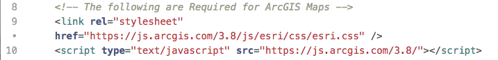
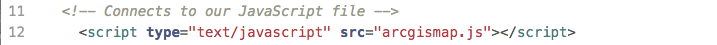
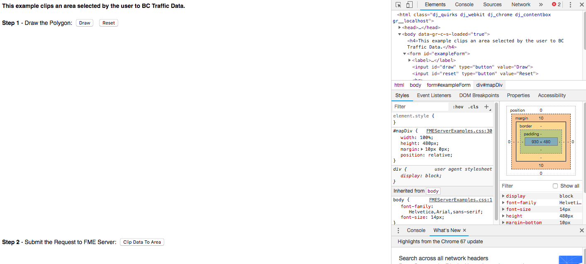
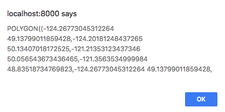
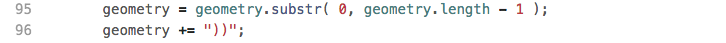
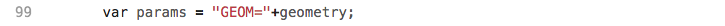
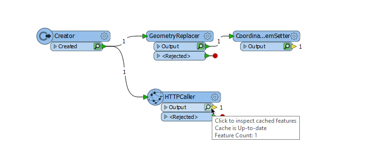
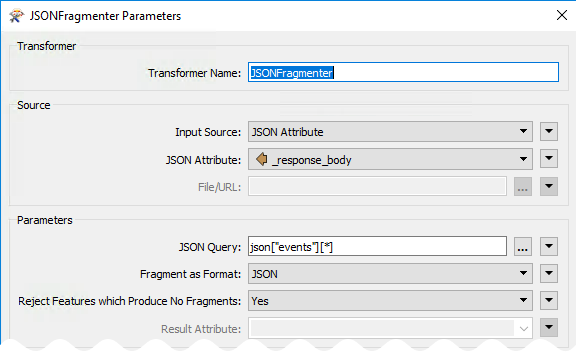
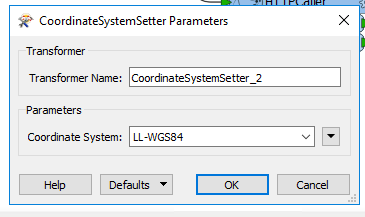
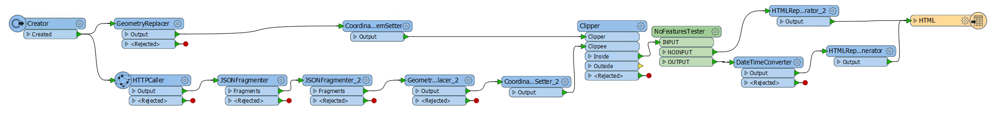

# 9.4练习16-数据分布

|  练习16 |  使用Esri Maps进行数据可视化 |
| :--- | :--- |
| 数据 | 无 |
| 总体目标 |  演示如何将工作空间集成到Web应用程序中，并允许用户根据他们在地图上的选择来设置工作空间中的参数。 |
| 演示 |  Esri Maps集成，DriveBC API，数据流和数据可视化。 |
| 完成的HTML | C:\FMEData2018\Resources\RESTAPI\mySecondApp\www\index.html 在 |
| 完成JavaScript | C:\FMEData2018\Resources\RESTAPI\mySecondApp\www\arcgismap.js |
| 完成的工作区 | C:\FMEData2018\Resources\RESTAPI\mySecondApp\fme\webapp.bcroads.fmw |

在本练习中，我们将创建一个允许用户选择区域的地图。此选择将发送到工作空间。在工作空间中，所选区域将剪切当前的事故。系统会向用户发送带有Google地图的链接，其中包含所选区域内的事故。本练习旨在演示如何在工作空间中使用其他API，如何将从用户选择的坐标引入工作空间，以及如何将数据流回用户。

|  警告 |
| :--- |
|  要使本练习正常工作，您需要完成 [练习14](https://safe-software.gitbooks.io/fme-server-rest-api-training-2018/content/FMESERVER_RESTAPI8Session2/8.3.Exercise.SettingUp.html)或使用现有的Web服务器进行测试。 |

## 设置HTML文件

此应用程序分为几个不同的文档。许多网站分别存储他们的JavaScript，CSS和HTML页面，以促进更清洁的工作流程。

  
**1）创建index.html文档**

创建一个HTML文件并将其另存为index.html。将此文件保存在此处的mySecondApp文件夹中：C：\ FMEData2018 \ Resources \ RESTAPI \ mySecondApp。

  
**2）复制并粘贴HTML文件的头部分**

将以下代码复制并粘贴到index.html文件中：

```text
<html>

<head>
    <title>ArcGIS Maps Example from FME Server Developer Playground</title>
    <!-- Styles for example -->
    <link rel="stylesheet" href="https://playground.fmeserver.com/css/FMEServerExamples.css" type="text/css" />
    <!-- Include FMEServer.js -->
    <script type="text/javascript" src="https://api.fmeserver.com/js/v1.2/FMEServer.js"></script>
    <!-- The following are Required for ArcGIS Maps -->
    <link rel="stylesheet" href="https://js.arcgis.com/3.8/js/esri/css/esri.css" />
    <script type="text/javascript" src="https://js.arcgis.com/3.8/"></script>
    <!-- Connects to our JavaScript file -->
    <script type="text/javascript" src="arcgismap.js"></script>
</head>
<!--PLACE FUTURE CODE HERE-->

</html>
```

这个头部看起来非常类似于上一个练习中的部分。不同之处在于还有一些额外的代码行：

[](https://github.com/xuhengxx/FMETraining-1/tree/b47e2c2ddcf98cce07f6af233242f0087d2d374d/FMESERVER_RESTAPI9CustomApplications/Images/10.2.1.Esri.png)

首先，我们需要这段代码将Esri CSS链接到我们的代码。Esri CSS将样式组件添加到地图中。然后JavaScript链接到Esri制作的JavaScript库。

我们还添加了这行代码：

[](https://github.com/xuhengxx/FMETraining-1/tree/b47e2c2ddcf98cce07f6af233242f0087d2d374d/FMESERVER_RESTAPI9CustomApplications/Images/10.2.2.png)

  
我们将编写一个JavaScript文件来使我们的HTML动态化。最好将JavaScript与HTML分开，以确保每个文件尽可能干净且易于使用。

  
**3）将主体复制并粘贴到索引文件中**

接下来，我们将主体粘贴到index.html文件中。此部分属于这里以后的代码注释：

```text
<!-- PLACE FUTURE CODE HERE-->

<body>
    <h4>This example clips an area selected by the user to BC Traffic Data.</h4>
    <form id="exampleForm">
        <label><b>Step 1</b> - Draw the Polygon: </label>
        <input id="draw" type="button" value="Draw" />
        <input id="reset" type="button" value="Reset" /><br />
        <div id="mapDiv"></div>
        <label><b>Step 2</b> - Submit the Request to FME Server: </label>
        <input type="button" onclick="processClip();" value="Clip Data To Area" />
    </form>
</body>
```

首先，我们有一个非常简单的标题来解释应用程序的目的。然后我们创建一个表单，使用按钮激活JavaScript中的不同函数。

  
**4）检查index.html文件的组件**

转到您的Web目录并导航到您创建文件的位置。在页面上单击鼠标右键，然后选择“检查”。你应该看到这个：

[](https://github.com/xuhengxx/FMETraining-1/tree/b47e2c2ddcf98cce07f6af233242f0087d2d374d/FMESERVER_RESTAPI9CustomApplications/Images/10.1.1.file.png)

左侧是页面的外观，右侧是HTML文件。

当您将光标悬停在页面上时，它将在页面上选择不同的元素并突出显示它们存在的位置。它还会显示我们可能遇到的任何错误。我们目前有错误，因为我们没有初始化地图所需的代码。

为了使这个页面有效，我们需要代码：

* 初始化地图
* 绘制多边形
* 重置多边形
* 将请求提交给FME服务器

我们现在可以启动JavaScript来创建这些功能！

  
**5）创建一个新的JavaScript文件**

现在，我们可以创建一个新的JavaScript文件，标题为arcgismap.js并将其保存在与index.html相同的文件夹中。

  
**6）添加代码以初始化地图**

将以下代码粘贴到我们刚刚创建的JavaScript文件中。确保更改您的服务器和令牌。

```text
var map, toolbar, clippingGeometry;

   window.onload = function()
   {
       require([
           "esri/map", "esri/toolbars/draw",
           "esri/graphic", "esri/geometry/webMercatorUtils",
           "esri/symbols/SimpleLineSymbol", "esri/symbols/SimpleFillSymbol",
           "dojo/_base/Color", "dojo/dom", "dojo/on", "dojo/domReady!"
       ], function(
           Map, Draw,
           Graphic, webMercatorUtils,
           SimpleLineSymbol, SimpleFillSymbol,
           Color, dom, on
       )
       {
           map = new Map("mapDiv",
           {
               basemap: "streets",
               center: [-123.114166, 49.27],
               zoom: 7,
               minZoom: 4,
               smartNavigation: false
           });

           map.on("load", function()
           {
               toolbar = new Draw(map);

               dojo.connect(toolbar, "onDrawEnd", addToMap);

               on(dom.byId("draw"), "click", drawPolygon);
               on(dom.byId("reset"), "click", drawReset);
           });

           function addToMap(geometry)
           {
               var symbol = new SimpleFillSymbol(
                   SimpleFillSymbol.STYLE_SOLID,
                   new SimpleLineSymbol(
                       SimpleLineSymbol.STYLE_DASHDOT,
                       new Color([255, 0, 0]), 2
                   ),
                   new Color([255, 255, 0, 0.25])
               );
               geometry = webMercatorUtils.webMercatorToGeographic(geometry);
               var graphic = new Graphic(geometry, symbol);
               map.graphics.clear();
               map.graphics.add(graphic);
               toolbar.deactivate(Draw.POLYGON);
               clippingGeometry = geometry.rings[0];
           }

           function drawPolygon()
           {
               drawReset();
               toolbar.activate(esri.toolbars.Draw.POLYGON);
           }

           function drawReset()
           {
               toolbar.deactivate(esri.toolbars.Draw.POLYGON);
               map.graphics.clear();
           }
       });
       FMEServer.init(
       {
           server: "https://demos-safe-software.fmecloud.com", //Update to your FME Server hostname - on FME training machines this is http://fmetraining
           token: "568c604bc1f235bbe137c514e7c61a8436043070" //Update to your fmetoken
       });
   };
```

**7）刷新index.html页面并测试它**

[](https://github.com/xuhengxx/FMETraining-1/tree/b47e2c2ddcf98cce07f6af233242f0087d2d374d/FMESERVER_RESTAPI9CustomApplications/Images/10.1.2.mapin.png)

此代码使用Esri JavaScript API在页面上显示地图并激活绘图和重置功能。如果您在其他应用程序中使用此代码，则大部分代码都可以保持不变。但是，您可能希望更新下面显示的地图设置：

[](https://github.com/xuhengxx/FMETraining-1/tree/b47e2c2ddcf98cce07f6af233242f0087d2d374d/FMESERVER_RESTAPI9CustomApplications/Images/10.2.3.map.png)

在这里，您可以调整地图的中心（地图所在的位置），缩放和最小缩放。

或者，您可以更改存储用户指定的几何图形的变量。

[](https://github.com/xuhengxx/FMETraining-1/tree/b47e2c2ddcf98cce07f6af233242f0087d2d374d/FMESERVER_RESTAPI9CustomApplications/Images/10.2.4.clippinggeo.png)

这里我们说明第一个几何环将在剪切几何。如果您愿意，我们可以用这行代码向用户显示坐标:

```text
    alert(JSON.stringify(clippingGeometry));
```

  
**8）将以下函数添加到JavaScript文件中。**

在我们插入的第一个函数下面，我们需要再插入两个。这些函数运行数据下载服务并显示FME Server返回的结果。

```text
function showResults(json)
{
    // The following is to write out the full return object
    // for visualization of the example
    var hr = document.createElement("hr");
    var div = document.createElement("div");

    // This extracts the download link to the clipped data
    var download = json.serviceResponse.url;


    div.innerHTML += "<hr><a href=\"" + download + "\">Download Result</a>";
    document.body.appendChild(hr);
    document.body.appendChild(div);
}

function processClip()
{
    var repository = "RESTTraining";
    var workspace = "webapp.bcroads.fmw";

    // Process the clippingGeometry into a WKT Polygon string
    var geometry = "POLYGON((";

    for (var i = 0; i < clippingGeometry.length; i++)
    {
        var lat = clippingGeometry[i][1];
        var lng = clippingGeometry[i][0];
        geometry += lng + " " + lat + ",";
    }

    // Remove trailing , from string
    geometry = geometry.substr(0, geometry.length - 1);
    geometry += "))";

    var params = "GEOM=" + geometry;

    // Use the FME Server Data Download Service
    FMEServer.runDataDownload(repository, workspace, params, showResults);
}
```

首先，我们还没有将工作空间上传到我们的服务器，因此它们目前无法工作，但让我们讨论如何重新创建这些函数。我们使用processClip函数的目标是使用runDataDownload函数。在[ArcGIS的地图集成](https://playground.fmeserver.com/javascript/data-delivery/arcgis-maps-integration/)文档可以在 FME Server Playground被找到。

[](https://github.com/xuhengxx/FMETraining-1/tree/b47e2c2ddcf98cce07f6af233242f0087d2d374d/FMESERVER_RESTAPI9CustomApplications/Images/10.1.3.DataDownload.png)

要使用此函数，我们需要以下变量：

* 存储库
* 工作空间
* 参数
* 回调

要使用此函数，我们必须在代码中包含此函数：

[](https://github.com/xuhengxx/FMETraining-1/tree/b47e2c2ddcf98cce07f6af233242f0087d2d374d/FMESERVER_RESTAPI9CustomApplications/Images/10.2.5.DataDownload.png)

然后我们可以开始指定变量，第一个也是最简单的是存储库和工作空间。

[](https://github.com/xuhengxx/FMETraining-1/tree/b47e2c2ddcf98cce07f6af233242f0087d2d374d/FMESERVER_RESTAPI9CustomApplications/Images/10.2.6.workspace.png)

接下来，我们可以创建参数变量。通过工作空间，我们将创建我们需要知道所有高级参数，以便能够使用这个调用。因此，如果您在实际情况下使用此调用，则最好先创建工作空间。但是，工作空间中唯一的参数是GEOM，它将接受来自我们应用程序的Well Known Text（WKT）。

Well Known Text是一种格式，可以创建如下所示的字符串：

```text
POLYGON((-123.31968482260129 49.05758039932133,-123.64927466635129 50.269944861577876,-119.33714087728879 50.34712582770931))
```

在JavaScript中，我们可以将一些字符串添加到一起以创建完整参数，例如我们可以创建一个函数：

```text
    a="app";
    b="le";
    apple= a+b;
```

apple将​​等于字符串“apple”。

这也可以通过以下语句完成：&lt;

```text
    a= "The REST API is ";
    a += "fun";
```

a将等于“The REST API is fun”。

我们将使用此方法来创建此调用运行所需的参数字符串。

首先，我们从声明输入将是Polygon（多边形）开始。

[](https://github.com/xuhengxx/FMETraining-1/tree/b47e2c2ddcf98cce07f6af233242f0087d2d374d/FMESERVER_RESTAPI9CustomApplications/Images/10.2.7.geometry.png)

现在，我们需要输入用户选择的坐标。在程序的早期，我们指定clippingGeometry将包含用户选择的几何图形。

我们需要一个函数来对clippingGeometry变量中的所有数据进行排序。为此，我们将使用for循环。当没有剩余数据时，此循环将结束。

[](https://github.com/xuhengxx/FMETraining-1/tree/b47e2c2ddcf98cce07f6af233242f0087d2d374d/FMESERVER_RESTAPI9CustomApplications/Images/10.2.8.clippingloop.png)

重要的是要注意JavaScript中数组中元素的索引从0开始而不是1，lng\(经度），我们分配第一个坐标读取，然后lat（纬度）位于第二个位置。然后通过以下语句添加几何字符串：

[](https://github.com/xuhengxx/FMETraining-1/tree/b47e2c2ddcf98cce07f6af233242f0087d2d374d/FMESERVER_RESTAPI9CustomApplications/Images/10.2.9.addinggeom.png)

这将给我们留下以下声明：

[](https://github.com/xuhengxx/FMETraining-1/tree/b47e2c2ddcf98cce07f6af233242f0087d2d374d/FMESERVER_RESTAPI9CustomApplications/Images/10.1.4.incompletestring.png)

要完成几何字符串，我们需要删除结尾的逗号并关闭括号。

[](https://github.com/xuhengxx/FMETraining-1/tree/b47e2c2ddcf98cce07f6af233242f0087d2d374d/FMESERVER_RESTAPI9CustomApplications/Images/10.2.10.shortenstring.png)

我们现在已经为参数创建了语句。

您创建的每个参数都将具有与之关联的名称。在我们的例子中，我们的参数名称将是GEOM。

[](https://github.com/xuhengxx/FMETraining-1/tree/b47e2c2ddcf98cce07f6af233242f0087d2d374d/FMESERVER_RESTAPI9CustomApplications/Images/10.2.11.params.png)

最后，我们已经完成了运行DataDownload函数所需的参数。我们只需要一个函数来接受DataDownload函数生成的json，所以我们使用showResults函数。

再次使用该文档，我们可以从FME Server查看JSON的外观：

[](https://github.com/xuhengxx/FMETraining-1/tree/b47e2c2ddcf98cce07f6af233242f0087d2d374d/FMESERVER_RESTAPI9CustomApplications/Images/10.1.3.DataDownload.png)

要查找下载链接，我们使用以下语句：

[](https://github.com/xuhengxx/FMETraining-1/tree/b47e2c2ddcf98cce07f6af233242f0087d2d374d/FMESERVER_RESTAPI9CustomApplications/Images/10.2.12.vardownload.png)

这说明了URL下载链接的位置，它位于JSON内，serviceResponse里以及URL下面。你可以在这里找到这个：

[](https://github.com/xuhengxx/FMETraining-1/tree/b47e2c2ddcf98cce07f6af233242f0087d2d374d/FMESERVER_RESTAPI9CustomApplications/Images/10.1.5.URL.png)

现在我们有了URL，我们可以在这里的链接中显示URL：

```text
div.innerHTML += "<hr><a href=\""+download+"\">Download Result</a>";
```

我们现在有一个应用程序将接受用户选择的坐标，然后使用DataDownload服务返回该区域中的函数。现在我们可以创建一个工作空间来使用。

## 创建工作空间

  
**9）在FME Workbench中打开一个空白工作空间，并将Creator 转换器添加到工作空间**

  
**10）添加GeometryReplacer**

第一步是从Web应用程序获取用户输入。如果您查看代码的这一部分，您可以看到我们设置的代码是从用户输入接受一个well-known文本字符串并将其放在一个名为GEOM的参数中。

```text
var params = "GEOM=" + wktString;
```

因此，要将此信息引入工作空间，我们将使用GeometryReplacer。在GeometryReplacer中填写以下参数：

[](https://github.com/xuhengxx/FMETraining-1/tree/b47e2c2ddcf98cce07f6af233242f0087d2d374d/FMESERVER_RESTAPI9CustomApplications/Images/10.1.6.GeoReplace.png)

几何编码是OGC Well Known Text。几何源是将创建的用户参数。在几何编码上单击下拉列表，找到用户参数，然后单击“创建用户参数”。

打开的对话框允许我们创建一个新的参数。使用以下参数创建一个：

**Name（名称）:** GEOM

**Published（已发布）:** Yes

**Optional（可选）:** No

**Prompt（提示）:** Area of Interest（感兴趣的区域）

**Default Value（默认值）:** POLYGON\(\(-123.31968482260129 49.05758039932133,-123.64927466635129 50.269944861577876,-119.33714087728879 50.34712582770931\)\)

[](https://github.com/xuhengxx/FMETraining-1/tree/b47e2c2ddcf98cce07f6af233242f0087d2d374d/FMESERVER_RESTAPI9CustomApplications/Images/10.1.7.GeomParam.png)

  
**11）添加CoordinateSystemSetter**

在工作空间的这一点上，我们将坐标系统放入系统，并将其转换为几何要素。但是，FME无法知道坐标系是什么。所以我们将它设置为LL84。将CoordinateSystemSetter连接到GeometryReplacer的Output端口。

[](https://github.com/xuhengxx/FMETraining-1/tree/b47e2c2ddcf98cce07f6af233242f0087d2d374d/FMESERVER_RESTAPI9CustomApplications/Images/10.1.5.Workspace.png)

  
**12）添加HTTPCaller**

将HTTPCaller添加到画布并将其附加到Creator。

在本节中，我们使用的是Drive BC API。Drive BC API检索最新的交通信息，并将其转发到您的地图。如果您想了解更多信息，请访问[Drive BC API网站](https://catalogue.data.gov.bc.ca/dataset/open511-drivebc-api)。

接下来，我们需要添加HTTPCaller以联系Drive BC API。Drive BC API向公众开放，因此无需授权或身份验证。在请求URL下：

```text
http://api.open511.gov.bc.ca/events?format=json&status=ACTIVE
```

HTTP方法是GET

HTTPCaller参数应如下所示：

[](https://github.com/xuhengxx/FMETraining-1/tree/b47e2c2ddcf98cce07f6af233242f0087d2d374d/FMESERVER_RESTAPI9CustomApplications/Images/10.1.9.HTTPCaller.png)

  
**13）使用要素缓存运行**

现在，我们将测试工作空间。这将确保工作空间连接到DriveBC API。这也将让我们检查API返回的内容。

首先，将工作空间保存为mySecondApp文件夹中的webapp.bcroads.fmw。要使用要素缓存，请单击工具栏中的“运行”。然后单击使用要素缓存运行。

然后，选择play按钮来运行。

单击HTTPCaller上的放大镜，检查REST API的输出。API返回的JSON存储在response\_body中。

[](https://github.com/xuhengxx/FMETraining-1/tree/b47e2c2ddcf98cce07f6af233242f0087d2d374d/FMESERVER_RESTAPI9CustomApplications/Images/10.1.9.Feature.png)

在response\_body中，您应该看到的结构应该与下面的结构相似。

```text
  {
    "events": [
        {
            "jurisdiction_url": "http://api.open511.gov.bc.ca/jurisdiction",
            "url": "http://api.open511.gov.bc.ca/events/drivebc.ca/DBC-1301",
            "id": "drivebc.ca/DBC-1301",
            "headline": "CONSTRUCTION",
            "status": "ACTIVE",
            "created": "2018-09-04T13:18:13-07:00",
            "updated": "2018-09-04T13:18:13-07:00",
            "description": "Highway 1, westbound. Paving operations planned between Exit 146 and Exit 135: Highway 9 for 11.0 km (Chilliwack). Starting today at 9:00 PM PDT until tomorrow at about 6:30 AM PDT. 28 km west of Hope between Herrling Island and Hwy 9. Last updated today at 1:18 PM PDT. (DBC-1301)",
            "+ivr_message": "Highway 1, westbound. Paving operations planned between Exit 146 and Exit 135: Highway 9 for 11.0 km (Chilliwack). Starting Tuesday, September 4 at 9:00 PM until tomorrow at about 6:30 AM. Last updated Tuesday, September 4 at 1:18 PM.",
            "schedule": {
    "intervals": [
        "2018-09-05T04:00/2018-09-05T13:30"
    ]
},
            "event_type": "CONSTRUCTION",
            "event_subtypes": [
                "ROAD_MAINTENANCE"
            ],
            "severity": "MINOR",
            "geography": {
                "type": "LineString",
                "coordinates": [                    
                    [
                        -121.760359,
                        49.181117
                    ],  
```

  
**14）添加JSONFragmenter**

在画布上添加JSONFragmenter并将其附加到HTTPCaller。

响应主体将以JSON的长段形式返回。我们需要将其分解并暴露所需的属性。此JSONFragmenter将用于暴露在上面的代码中"events"下列出的属性。

在Source下填写参数：

**输入源：** JSON属性

**JSON属性：** response\_body

接下来转到参数部分。

所有重要信息都存储在"事件"类别中，以便在如下的JSON查询下能够访问它：

```text
json["events"][*]
```

**片段格式：** JSON

**拒绝不产生片段的要素：**是的

[](https://github.com/xuhengxx/FMETraining-1/tree/b47e2c2ddcf98cce07f6af233242f0087d2d374d/FMESERVER_RESTAPI9CustomApplications/Images/10.1.11.JSONFra.png)

现在我们可以对JSON进行展平来生成表所需的属性。

_在“要暴露的属性”部分中，写入以下属性：状态，标题，说明，已创建和已更新。_

展平参数应如下所示：

[](https://github.com/xuhengxx/FMETraining-1/tree/b47e2c2ddcf98cce07f6af233242f0087d2d374d/FMESERVER_RESTAPI9CustomApplications/Images/10.1.12.JSONF.png)

  
**15）添加另一个JSONFragmenter**

将另一个JSONFragmenter添加到画布并将其附加到以前的JSONFragmenter。现在，我们需要暴露Geography组件来创建要素。

填写以下参数：

**源**

输入源：JSON属性

JSON属性：response\_body

**参数**

JSON查询：json \[“geography”\]

片段格式：JSON

拒绝不产生片段的要素：是的

**展平参数**

将查询结果展平为属性：否

[](https://github.com/xuhengxx/FMETraining-1/tree/b47e2c2ddcf98cce07f6af233242f0087d2d374d/FMESERVER_RESTAPI9CustomApplications/Images/10.1.13.NewJ.png)

  
**16）添加GeometryReplacer**

添加GeometeryReplacer并将其附加到第二个JSONFragmenter。

GeometeryReplacer是一个神奇的变压器。它可以从Response Body读取JSON，并自动创建与之关联的几何图形。

填写以下参数：

**几何编码：** GeoJSON

**几何来源：** response\_body

**删除属性：**是

[](https://github.com/xuhengxx/FMETraining-1/tree/b47e2c2ddcf98cce07f6af233242f0087d2d374d/FMESERVER_RESTAPI9CustomApplications/Images/10.1.14.GeoReplace.png)

  
**17）添加CoordinateSystemSetter**

添加CoordinateSystemSetter并将其附加到GeometryReplacer。

现在，我们需要设置使用的坐标系。坐标系在调用返回的URL中引用。所以我们可以将它设置为LL-WGS84。

[](https://github.com/xuhengxx/FMETraining-1/tree/b47e2c2ddcf98cce07f6af233242f0087d2d374d/FMESERVER_RESTAPI9CustomApplications/Images/10.1.15.SystemSet.png)

目前，工作空间应如下所示：

[](https://github.com/xuhengxx/FMETraining-1/tree/b47e2c2ddcf98cce07f6af233242f0087d2d374d/FMESERVER_RESTAPI9CustomApplications/Images/10.1.16.Current.png)

  
**18）添加Clipper转换**

将Clipper Transformer添加到画布并接受当前默认值。

现在我们将使用限幅器变换器来剪切选定区域。限幅器是用户选择的区域，限幅器是BC Drive API的几何形状。

工作空间应如下所示：

[](https://github.com/xuhengxx/FMETraining-1/tree/b47e2c2ddcf98cce07f6af233242f0087d2d374d/FMESERVER_RESTAPI9CustomApplications/Images/10.1.17.Clipper.png)

  
**19）使用要素缓存运行**

现在，我们将测试工作空间。这将确保工作空间正常工作并剪切正确的区域。

选择播放按钮来运行。

单击clipper上“Inside”端口上的放大镜，查看所选区域。

这将打开FME Data Inspector。

FME Data Inspector将显示创建的点和线。要显示背景地图，请转到顶部菜单栏。查找工具，选择FME选项。这将打开FME选项窗口。

背景格式应从None更改为Stamen Maps。然后，选择参数...

选择，地形图列表。选择确定。然后，在FME选项窗口中选择确定。这将激活背景地图。

所有结果都应该在BC。在探索返回的要素后，关闭 Data Inspector。然后，返回FME Workbench。

  
**20）添加NoFeaturesTester**

在FME Workbench中开始键入NoFeaturesTester并选择自定义转换器。NoFeaturesTester应该附加到Clipper的Inside端口。该转换将测试是否有输出。如果没有输入，则表示所有要素都在外面或被拒绝。

  
**20）添加DateTimeConverter**

添加DateTimeConverter并将其附加到NoFeaturesTester的OUTPUT端口。DateTimeConverter用于更新时间和日期，因此对用户来说更具可读性。

填写以下参数：

**日期时间属性：**已更新已创建

**输入格式：**自动检测FME和ISO格式

**输出格式：**％Y：％m：％d％H：％M：％S

**修复溢出：**没有

[](https://github.com/xuhengxx/FMETraining-1/tree/b47e2c2ddcf98cce07f6af233242f0087d2d374d/FMESERVER_RESTAPI9CustomApplications/Images/10.1.17.DateTimeConverter.png)

  
**21）添加HTMLReportGenerator**

添加HTMLReportGenerator并将其附加到DateTimeConverter。现在，我们已准备好创建包含以下信息的网页。我们需要三个部分，标题，地图和表格。

在页面设置下，找到页面标题框。页面标题应为Drive BC API。

然后，创建标题。在页面内容下选择自定义HTML。在内容设置下，复制并粘贴以下内容：

```text
<h1> Drive BC Road and Weather Conditions </h1>
```

[](https://github.com/xuhengxx/FMETraining-1/tree/b47e2c2ddcf98cce07f6af233242f0087d2d374d/FMESERVER_RESTAPI9CustomApplications/Images/10.1.18.ht.png)

接下来，我们将添加一个地图组件\(Map Component\)。页面内容应为Map（Google）。然后，内容设置应设置如下：

**标签属性：**描述

**图层颜色：** 255,55,5

**API密钥：** &lt;&lt;空白&gt;&gt;

目前，我们不打算填写API密钥。由于这是出于开发目的，这是可以的。如果要在生产设置中使用它，则需要API密钥。

如果您希望获得API密钥，请访问此网站[Google API密钥](https://developers.google.com/maps/documentation/javascript/get-api-key#quick-guide-to-getting-a-key)

[](https://github.com/xuhengxx/FMETraining-1/tree/b47e2c2ddcf98cce07f6af233242f0087d2d374d/FMESERVER_RESTAPI9CustomApplications/Images/10.1.19.Map.png)

接下来，创建一个表,包含状态，已创建，已更新，描述和标题列。

[](https://github.com/xuhengxx/FMETraining-1/tree/b47e2c2ddcf98cce07f6af233242f0087d2d374d/FMESERVER_RESTAPI9CustomApplications/Images/10.1.20.CustomTable.png)

  
**22）添加另一个HTMLReportGenerator**

添加另一个HTMLReportGenerator并将其附加到NoFeaturesTester的NOINPUT端口。

在页面标题框中写入：

Drive BC API

在页面内容下选择标题。然后，在“内容设置”下写入：

在你选择的区域没有发生事故。\(There are no incidents in the area you selected.\)

  
**23）添加HTML写模块**

最后，添加HTML写模块以写入您选择的文件。将HTML写模块附加到HTMLReportGenerators。

[](https://github.com/xuhengxx/FMETraining-1/tree/b47e2c2ddcf98cce07f6af233242f0087d2d374d/FMESERVER_RESTAPI9CustomApplications/Images/10.1.17.HTML.png)

完整工作空间应如下所示：

[](https://github.com/xuhengxx/FMETraining-1/tree/b47e2c2ddcf98cce07f6af233242f0087d2d374d/FMESERVER_RESTAPI9CustomApplications/Images/10.1.21.Final.png)

  
**24）保存并运行工作空间**

现在，我们可以保存并运行工作空间以确保一切正常。由于我们没有API密钥，因此我们会收到一条消息，指出这仅用于开发目的。如果我们添加了密钥，我们就会有一个更复杂的页面。

[](https://github.com/xuhengxx/FMETraining-1/tree/b47e2c2ddcf98cce07f6af233242f0087d2d374d/FMESERVER_RESTAPI9CustomApplications/Images/10.1.22.GoogleMaps.png)

  
**25）将工作空间上传到您的服务器。**

将工作空间发布到FME Server。上传到RESTTraining存储库并将工作空间保存为webapp.bcroads.fmw。使用数据下载服务注册工作空间。

## 测试应用程序

步骤1.绘制区域（双击以关闭多边形）

步骤2.选择“剪切数据到区域\( Clip Data to Area\)”

[](https://github.com/xuhengxx/FMETraining-1/tree/b47e2c2ddcf98cce07f6af233242f0087d2d374d/FMESERVER_RESTAPI9CustomApplications/Images/10.1.22.step1and2.png)

步骤3.下载DataDownload

[](https://github.com/xuhengxx/FMETraining-1/tree/b47e2c2ddcf98cce07f6af233242f0087d2d374d/FMESERVER_RESTAPI9CustomApplications/Images/10.1.23.step3.png)

步骤4.查看文件

[](https://github.com/xuhengxx/FMETraining-1/tree/b47e2c2ddcf98cce07f6af233242f0087d2d374d/FMESERVER_RESTAPI9CustomApplications/Images/10.1.24.step4.png)

<table>
  <thead>
    <tr>
      <th style="text-align:left">恭喜</th>
    </tr>
  </thead>
  <tbody>
    <tr>
      <td style="text-align:left">
        <p>通过完成本练习，您已学会如何：
          <br />
        </p>
        <ul>
          <li>使用ArcGIS地图将坐标发送到工作空间</li>
          <li>在工作空间使用中在线资源的坐标</li>
          <li>使用FME Server JavaScript API中的DataDownload函数</li>
          <li>在工作空间中使用外部API</li>
        </ul>
      </td>
    </tr>
  </tbody>
</table>