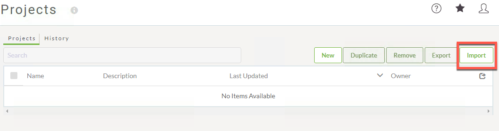
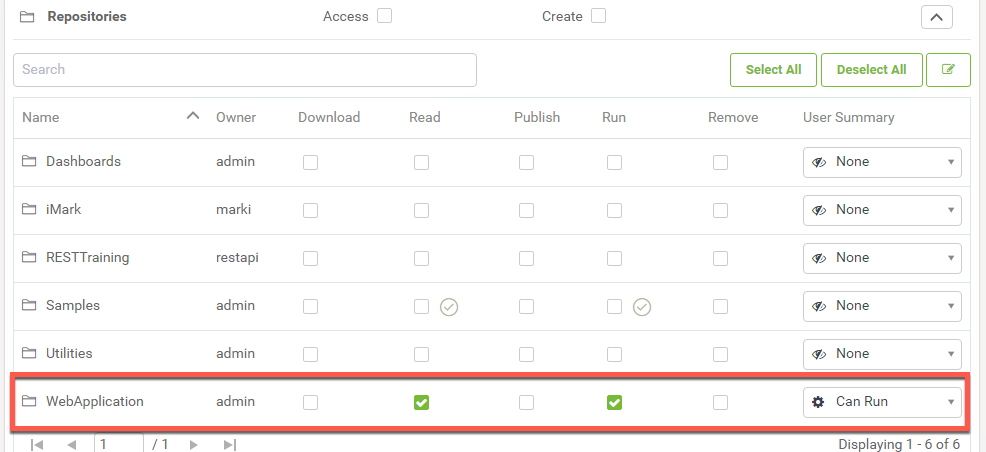
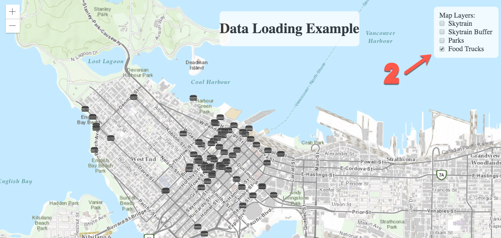
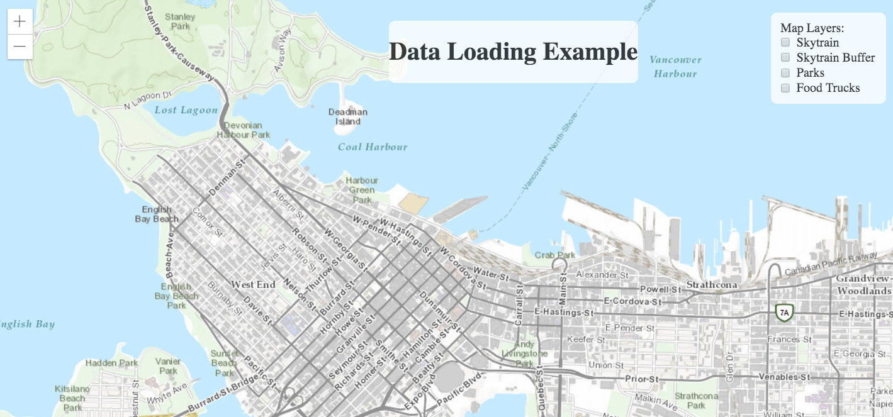

|  练习17 |  数据可视化 |
| :--- | :--- |
| 数据 | 无 |
| 总体目标 | 使用Esri JavaScript和Power of FME创建易于使用且有趣的地图与实时数据。 |
| 演示 | 如何在工作空间中使用Esri JavaScript，数据流直接URL和在线资源。 |
| 完成的HTML | C:\FMEData2018\Resources\RESTAPI\myThirdApp\myThirdApp.html |
|  项目 | C:\FMEData2018\Resources\RESTAPI\myThirdApp\WebApplication.fsproject |

本练习旨在演示如何将从工作空间生成的KML图层流式传输到在线地图。此方法可用于每次激活该层时都持续更新的数据，该工作空间将运行并生成新的KML。

|  警告 |
| :--- |
|  要使本练习正常工作，您需要完成 [练习14](../8.0.introduction/8.3.exercise.settingup.md)或使用现有的Web服务器进行测试。 |

  
**1）在文本编辑器中创建一个新文件**

在文本编辑器中创建一个新文件，并将其另存为myThirdApp.html。将其保存在此处的REST API文件夹中：FMEData2018 / Resources / RESTAPI。

  
**2）将以下头代码粘贴到新文件中** \`\`\`JavaScriptData Loading Example \`\`\`

这是访问ESRI JavaScript所需的代码，我们将使用它来托管通过FME Server流式传输到应用程序的KML图层。

  
**3）将以下主体粘贴到HTML页面中** \`\`\`JavaScript

##  Data Loading Example

 Map Layers:  Skytrain  
  Skytrain Buffer  
  Parks  
  Food Trucks \`\`\`

上面的代码在网页上创建了标题和复选框列表。这些复选框将代表地图的图层。激活复选框后; 这将触发启用数据流的函数。

  
**4）在body标签下面粘贴以下样式组件**

|  技巧 |
| :--- |
|  \*以下CSS源自 [ArcGIS图层简介](https://developers.arcgis.com/javascript/latest/sample-code/intro-layers/index.html) \* |

 \`\`\`CSS  
/\* CSS from https://developers.arcgis.com/javascript/latest/sample-code/intro-layers/index.html\*/  
  
\#heading {  
    position: absolute;  
    text-align: center;  
    z-index: 99;  
    background-color: white;  
    border-radius: 8px;  
    margin: 0 auto;  
    max-width: 700px;  
    left: 500px;  
    top: 30px;  
    opacity: 0.75;  
}  
  
html,  
body,  
\#viewDiv {  
    padding: 0;  
    margin: 0;  
    height: 100%;  
    width: 100%;  
}  
  
\#layerToggle {  
    top: 20px;  
    right: 20px;  
    position: absolute;  
    z-index: 99;  
    background-color: white;  
    border-radius: 8px;  
    padding: 10px;  
    opacity: 0.75;  
}  
 \`\`\`

  
**5）导航到FME Server中的项目**

访问localhost / fmeserver打开FME Server。接下来，查看左侧面板，然后单击“项目”。

  
**6）导入项目文件夹**

单击“导入”按钮。

下一步是上传包含此Web应用程序所需的存储库和工作空间的项目文件夹。

转到文件资源管理器窗口。导航FMEData2018文件夹，单击“资源”，选择“REST API”，然后选择“myThirdApp”。

在此文件夹中，有两个.fsproject文件。WebApplication项目包含Web应用程序所需的工作空间和存储库。

另外，上传BestPracticeAnalysis.fsproject文件。此项目文件夹包含用于KMLStyler的其他图像。这允许用户在创建KML时具有更多符号化选项。

将每个文件拖放到“删除要上传的文件\(Drop file to upload\)”区域，一次一个。然后，单击“导入”。

  
**7）授予Guest帐户访问WebApplication存储库的权限**

要授予存储库Guest权限，您必须访问FME Server。首先，查看FME Server的左侧面板。查找安全性，然后查找用户。

进入“用户”页面后，**单击“Guest”**

向下滚动到权限并展开存储库选项卡。然后检查读取和运行权限。

  
**8）将restapi帐户访问权限提供给WebApplication存储库（如果您在课程前面创建了此用户）**

restapi用户是在课程[练习1](../1.0.chapteroverview/1.5.usercreation.md)中创建的，以减少与使用管理令牌相关的任何安全风险。

在同一个用户页面上，**单击restapi。**

向下滚动到权限并展开存储库选项卡。然后，检查读取和运行权限。即使restapi帐户导入了项目，也无法保证会自动授予用户访问文件的权限。

  
**9）在CSS上面添加以下代码，但要在主体内** \`\`\`JavaScript  
    require\(\[  
            "esri/Map",  
            "esri/views/MapView",  
            "esri/layers/KMLLayer",  
            "dojo/dom",  
            "dojo/on",  
            "dojo/domReady!"  
        \],  
        function\(  
            Map, MapView, KMLLayer, dom, on  
        \)  
        {  
            // ALL Future Code Placed Here  
        }\); // End of JavaScript  
 \`\`\`

此部分导入此Web应用程序运行所需的ESRI组件。其余代码将需要存在于ALL Future Code Placed here的方括号内。

  
**10）在这里放置的ALL Future代码注释之后添加以下代码**  

_将IP地址更新为您自己的IP地址_ \`\`\`JavaScript var transportationLyr = new KMLLayer\( { url: "http://52.xx.xxx.xxx/fmedatastreaming/WebApplication/webapp.skytrains.fmw?SourceDataset\_ESRISHAPE=ftp%3A%2F%2Fwebftp.vancouver.ca%2FOpenData%2Fshape%2Fshape\_rapid\_transit.zip", // Skytrain Layer id: "skytrainlayer", visible: false }\); var skytrainbufferLyr = new KMLLayer\( { url: "http://52.xx.xxx.xxx/fmedatastreaming/WebApplication/webapp.skytrainbuffer.fmw?", // Skytrain Buffer Layer id: "skytrainbufferlayer", visible: false }\); var parksLyr = new KMLLayer\( { url: "http://52.xx.xxx.xxx/fmedatastreaming/WebApplication/webapp.parks.fmw?SourceDataset\_ESRISHAPE=ftp%3A%2F%2Fwebftp.vancouver.ca%2FOpenData%2Fshape%2Fpark\_polygons\_shp.zip&DestDataset\_OGCKML=C%3A%5CUsers%5CAdministrator%5CDocuments%5CFME%5CWorkspaces%5Coutput.kml", // Parks Layer id: "parkslayer", visible: false }\); var foodLyr = new KMLLayer\( { url: "http://52.xx.xxx.xxx/fmedatastreaming/WebApplication/webapp.foodTrucks.fmw?DestDataset\_OGCKML=%24\(FME\_SHAREDRESOURCE\_DATA\)%2FSienna%2FOutput%2FfoodTrucks.kml", // Food Truck Layer id: "foodlayer", visible: false }\); \`\`\`

_确保使用您的公共IP地址更新直接URL_

此代码用于地图的图层。在这里，我们使用ESRI函数KMLLayer，这将从服务器的直接URL创建一个层。对于每个图层，都需要一个id。此外，可见性（ visibility）最初应设置为false。

  
**11）添加以下代码以初始化底图**

此代码应直接添加到数据流链接下方。 \`\`\`JavaScript /\*\*\*\*\*\*\*\*\*\*\*\*\*\*\*\*\*\*\*\*\*\*\*\*\*\*\*\*\*\*\*\*\*\*\*\*\*\*\*\*\*\*\*\*\*\*\*\*\*\*\*\*\*\*\*\*\*\*\*\*\*\*\*\*\* \* Initialize the basemap \*\*\*\*\*\*\*\*\*\*\*\*\*\*\*\*\*\*\*\*\*\*\*\*\*\*\*\*\*\*\*\*\*\*\*\*\*\*\*\*\*\*\*\*\*\*\*\*\*\*\*\*\*\*\*\*\*\*\*\*\*\*\*\*\*/ var map = new Map\( { basemap: "topo" }\); \`\`\`

  
**12）添加代码以将图层添加到地图中** \`\`\`JavaScript /\*\*\*\*\*\*\*\*\*\*\*\*\*\*\*\*\*\*\*\*\*\*\*\*\*\*\*\*\*\*\*\*\*\*\*\*\*\*\*\*\*\*\*\*\*\*\*\*\*\*\*\*\*\*\*\*\*\*\*\*\*\*\*\*\* \* Add the layers to the map \*\*\*\*\*\*\*\*\*\*\*\*\*\*\*\*\*\*\*\*\*\*\*\*\*\*\*\*\*\*\*\*\*\*\*\*\*\*\*\*\*\*\*\*\*\*\*\*\*\*\*\*\*\*\*\*\*\*\*\*\*\*\*\*\*/ map.add\(transportationLyr\); map.add\(skytrainbufferLyr\); map.add\(parksLyr\); map.add\(foodLyr\); \`\`\`

  
**13）添加代码以调整底图的视图** \`\`\`JavaScript /\*\*\*\*\*\*\*\*\*\*\*\*\*\*\*\*\*\*\*\*\*\*\*\*\*\*\*\*\*\*\*\*\*\*\*\*\*\*\*\*\*\*\*\*\*\*\*\*\*\*\*\*\*\*\*\*\*\*\*\*\*\*\*\*\* \* Creates the view for the basemap, adjusts the center and the zoom level. \*\*\*\*\*\*\*\*\*\*\*\*\*\*\*\*\*\*\*\*\*\*\*\*\*\*\*\*\*\*\*\*\*\*\*\*\*\*\*\*\*\*\*\*\*\*\*\*\*\*\*\*\*\*\*\*\*\*\*\*\*\*\*\*\*/ var view = new MapView\( { container: "viewDiv", map: map, center: \[-123.10, 49.268\], zoom: 14 }\); \`\`\`

  
**14）添加代码以创建切换变量** \`\`\`JavaScript /\*\*\*\*\*\*\*\*\*\*\*\*\*\*\*\*\*\*\*\*\*\*\*\*\*\*\*\*\*\*\*\*\*\*\*\*\*\*\*\*\*\*\*\*\*\*\*\*\*\*\*\*\*\*\*\*\*\*\*\*\*\*\*\*\* \* Variables are created for the Toggles, these \* toggles are attached to the ids assigned to the checkboxes \*\*\*\*\*\*\*\*\*\*\*\*\*\*\*\*\*\*\*\*\*\*\*\*\*\*\*\*\*\*\*\*\*\*\*\*\*\*\*\*\*\*\*\*\*\*\*\*\*\*\*\*\*\*\*\*\*\*\*\*\*\*\*\*\*/ var streetsLyrToggle = dom.byId\("streetsLyr"\); var skytrainbufferLyrToggle = dom.byId\("skytrainbufferLyr"\); var parksLyrToggle = dom.byId\("parksLyr"\); var foodLyrToggle = dom.byId\("foodLyr"\); \`\`\`

  
**15）添加代码以切换图层的可见性** \`\`\`JavaScript /\*\*\*\*\*\*\*\*\*\*\*\*\*\*\*\*\*\*\*\*\*\*\*\*\*\*\*\*\*\*\*\*\*\*\*\*\*\*\*\*\*\*\*\*\*\*\*\*\*\*\*\*\*\*\*\*\*\*\*\*\*\*\*\*\* \* The following code manipulates the visibility of the layer. \* When the layer is checked then the layer becomes visible. \*\*\*\*\*\*\*\*\*\*\*\*\*\*\*\*\*\*\*\*\*\*\*\*\*\*\*\*\*\*\*\*\*\*\*\*\*\*\*\*\*\*\*\*\*\*\*\*\*\*\*\*\*\*\*\*\*\*\*\*\*\*\*\*\*\*\*/ on\(streetsLyrToggle, "change", function\(\) { transportationLyr.visible = streetsLyrToggle.checked; }\); on\(skytrainbufferLyrToggle, "change", function\(\) { skytrainbufferLyr.visible = skytrainbufferLyrToggle.checked; }\); on\(parksLyrToggle, "change", function\(\) { parksLyr.visible = parksLyrToggle.checked; }\); on\(foodLyrToggle, "change", function\(\) { foodLyr.visible = foodLyrToggle.checked; }\) \`\`\`

  
**16）测试页面！**

当您测试页面时，您应该能够选择和取消选择不同的图层。每个层在您的FME Server上运行一个工作空间。

<table>
  <thead>
    <tr>
      <th style="text-align:left">恭喜</th>
    </tr>
  </thead>
  <tbody>
    <tr>
      <td style="text-align:left">
        
通过完成本练习，您已学会如何：
           
        

        <ul>
          <li>使用Esri JavaScript API创建Web应用程序</li>
          <li>使用工作空间生成KMLLayer</li>
          <li>使用directURL在地图上生成图层</li>
        </ul>
      </td>
    </tr>
  </tbody>
</table>
