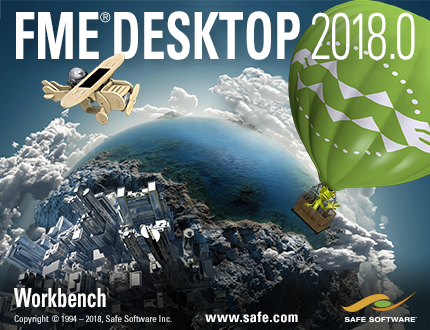

# 简介

这是Safe Software的FME Desktop应用程序的高级培训课程手册。

此培训建立在基本培训的基础上，涵盖了对希望将技能提升到新水平的所有FME用户都很重要的功能

## 课程结构

全部课程由五个主要部分组成。这些部分是：

* 高级属性处理
* 高级工作空间设计
* 高级读取/写入
* 高级参数使用
* 自定义转换器

## 当前状态

本手册的当前状态是： **完整**: 本手册可用于培训，辅之以小的、最后的修改和幻灯片的创建。

它适用于 **FME2018.0**

每章的状态是：

* 第0章：完整内容和练习
* 第1章：完整内容和练习
* 第2章：完整内容和练习
* 第3章：完整内容和练习
* 第4章：完整内容和练习
* 第5章：完整内容和练习
* 第6章：完整内容，没有练习
* 幻灯片：完整
* FMEData：完整
* 课程大纲：完整

_**注意:**_ _即使是完整的内容，Safe Software Inc.也不对本文档中的任何错误或其后果承担任何责任，并保留对本文档进行改进和更改的权利，恕不另行通知。有关详细信息，请参阅完整许可协议。_

